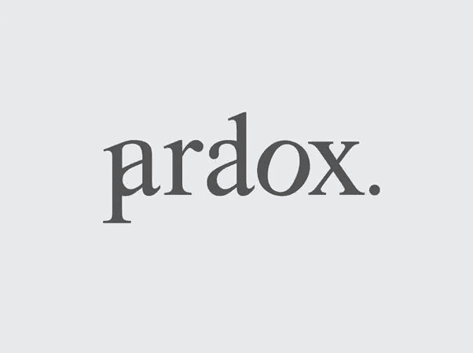

# 慈善悖论

> 原文：<https://medium.datadriveninvestor.com/the-charity-paradox-f94580880412?source=collection_archive---------25----------------------->

## 每日博客#14

我的团队最近完成了一个项目的洞察阶段，该项目着眼于渴望他们的捐款留在英国的观众的希望和需求。

虽然他们是细分的观众，有许多令人难以置信的有趣和独特的希望和需求，但有一点非常强烈。在我运行的每一个 insight 项目中，都不同程度地出现了这一观点:

> 慈善机构的“管理”成本越小，慈善机构就越好，越值得捐款。

一个极端是那些只给志愿者管理的慈善机构捐款的人。我们遇到了一个坚信这一点的人，他在当地做了大量令人惊叹的慈善工作。如果他没有得到报酬，其他人为什么要得到呢？

另一方面，有些人明白，要运营一个大型慈善机构，你需要专业的支持职能来做好它。他们只是希望这些功能只占他们体重的很小一部分。

两种观点都完全可以理解。为什么我不应该把更多的钱捐给慈善事业，而不是“日常开支”呢？

一些非营利组织，如美国的 Charity:Water，甚至通过 100%的模式(由富有的捐赠者资助“管理费用”)含蓄地认可了这一立场。

媒体也很热衷于打击 CEO 薪酬，以及他们有多可怕。

这整个背景助长了许多问题的延续。

第一个是这个观点是完全错误的。

第二，慈善机构没有信心(也许是明智地)揭露第一个问题。

有些奇怪的是，许多慈善机构在他们的年度报告中自豪地谈论他们是如何降低管理费用的，声称“现在有更多的钱投入到这项事业中”。

在这些报告中很少提到许多被削减的管理费用的巨大价值。像那些:

*   投资了筹款。如果做得好，会让小钱变成更多的钱。当然，这意味着比第一次捐赠 100%的钱要多得多。简而言之，这就是众所周知的馅饼是如何变大的。
*   支付重要的支持功能。比如财务治理、数据管理和人力资源。这些不是最好的，而是必须的。
*   支付才华横溢的员工的工资，他们筹集捐款，提供服务和管理志愿者。而且几乎在所有情况下，他们的收入都比在私营部门低得多。

毫无疑问，捐赠者希望他们捐赠的每一英镑都能产生更大的影响。不仅仅是更小的开销。

或许这个行业需要一次重组。如果正是这些管理费用推动了收入和影响力的增长，那么管理费用百分比就不是必然的坏事。

也许是时候让我们再看一遍丹·帕洛塔的 TED 演讲了？

这是我已经开始的[每日博客](https://link.medium.com/XSj8qnOxGR)探险的一部分。请在媒体或[推特](http:// https://twitter.com/cohenburg)上关注。

我们也非常欢迎任何反馈:)