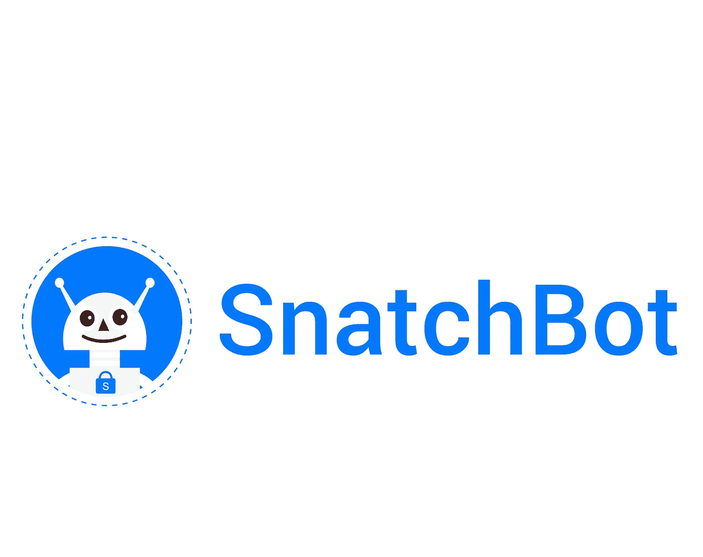

# 聊天机器人的格局在 2019 年再次发生变化

> 原文：<https://medium.datadriveninvestor.com/the-chatbot-landscape-shifts-again-in-2019-1faeba21ea1c?source=collection_archive---------8----------------------->

随着技术和市场格局的快速变化，看看过去 12 个月发生了什么变化似乎是一个好主意。对于那些寻求通过使用人工智能和聊天机器人来改善业务的人来说，2019 年及以后会有什么？

去年这个时候，我们看到越来越多的机器人被采用；对人工智能和自然语言处理的推动；以及对用户需求的日益关注，因为企业不再只盯着自己能从使用机器人中得到什么。

所有这些在 2019 年都是真实的，特别是向人工智能和自然语言处理的转移。但是，对于聊天机器人供应商、需要机器人的企业和使用机器人的客户来说，未来有自己的一系列机遇和挑战。

# 2019 年就是数据

2018 年，每天都有一系列关于机器人的新闻稿，预示着大大小小的公司都会推出新的产品。接近年底时，随着仪表盘亮起，我们看到这些公司发布的统计数据突显了其机器人的成功。随着我们获得更多关于成本节约、生产率、客户满意度和其他好处的硬数据，这将鼓励那些落后者加入聊天机器人的行列。

虽然他们可能需要一些时间来实现我们正在看到的结果，但更多数据进入公共领域，而不是藏在私人简报或无人阅读的白皮书中，进一步采用将带来更多数据，等等。

# 艾是新的国王

近年来，人们一直在谈论人工智能，这项技术终于开始在广泛的商业用例中发挥作用，超出了通常被引用的网飞和亚马逊的案例。如果哈雷戴维森经销商能够[使用人工智能工具将销售额提高近 3000%](https://hbr.org/2017/05/how-harley-davidson-used-predictive-analytics-to-increase-new-york-sales-leads-by-2930) ，世界其他地方将会注意到这一点。

虽然任何企业都可以使用人工智能工具，但成功的关键是拥有正确的数据来分析，并提出正确的问题来询问您的企业采用的任何人工智能服务。这意味着早期的失望率很高，但就聊天机器人而言，人工智能是一个坚实而成熟的用例，通过自然语言处理(NLP)、机器学习和分析用户意图和意义的更深入的服务。

如果你的团队或部门想向董事会或项目审批者证明人工智能的价值，人工智能机器人可能是最有可能实现结果的方式。当涉及到医疗保健等一些领域时，在采用的道路上还有其他几个障碍，2019 年将是解决这些问题的一年，并通过谨慎的发展和法律考虑准备好前景。

# 政府关闭和英国退出欧盟推动机器人的采用

跳过政治雷区，美国政府的关闭让数百万公民在当地政府办公室关闭时转向在线资源寻找信息。我们看到[聊天机器人承受了很大的压力](https://fedtechmagazine.com/article/2019/01/government-shutdown-how-cloud-impacts-affected-agencies)，甚至在一些网站关闭时也通过云运行。

其他政府和企业将注意到这一坏消息泥潭中的亮点，并将寻求为其关键信息服务启用机器人。英国和英国退出欧盟也是如此。无论发生什么，当英国政府努力摆脱与欧盟伙伴数十年的进展时，机器人可以提供有价值的信息，而不需要大量投资。

聊天机器人可以在政府部门和贸易机构受到重创或过于忙于试图解决他们如何在任何商业和监管环境下运作的时候提供信息。机器人将能够为人们提供最新的新闻、建议和信息，而不会打扰那些超负荷工作的员工。

称之为灾难资本主义、创伤后经济学或其他什么，但机器人正在这个雷区证明自己是人们可以依赖的有用资源。如果政府和企业不能在下一轮混乱中，或者在基于产品的、地方性的技术或自然灾害来袭时，提供最低水平的信息，它们将受到严厉批评。

聊天机器人的地平线上的云？

如果聊天机器人的成功是急剧上升的，不是每个人都相信图表曲线。Forrester 预测，在客户体验方面，聊天机器人将会受到强烈反对。他们有一个观点，即许多企业，尤其是中小企业，可以采用一种漫不经心的方法来部署聊天机器人:让它变得快速，扔掉它，一举解决通信问题。不可避免的是，今年将会有很多机器人问世，简而言之，它们都不是很好。机器人让客户无动于衷，没有他们一直在寻找的答案。即便如此，总体而言，我们可以预计满意度将像 2018 年一样上升，如果不是更快的话。为什么？因为尽管聊天机器人有很多缺点，但它的即时反应比长时间等待电话要好得多。此外，我们所有人都越来越意识到机器人的好处(我的孩子喜欢问 Siri 笑话)，并意识到它们的局限性(同样，他们喜欢难倒 Siri)。其他研究，如来自[的研究，福布斯继续预测人工智能和聊天机器人](https://www.forbes.com/sites/forbesagencycouncil/2018/12/05/five-digital-marketing-trends-to-watch-in-2019/#5f7d43cf5468)将在 2019 年推动营销，而甲骨文认为聊天机器人在 2019 年将[每年为企业节省超过 80 亿美元](https://twitter.com/OracleSolution7/status/1072442704154542080)。

一言以蔽之 2019

2019 年，我们将看到更多聊天机器人在市场上证明自己的价值。不断增长的需求将促使像 SnatchBot 这样的供应商扩展他们的产品以满足客户需求。通过这一切，最终用户消费者和客户将越来越习惯聊天机器人成为他们生活的一部分，容忍它们成为做生意的成本，或者接受那些为他们的生活带来价值的东西。

在这一点上，每个企业都需要决定他们的下一个机器人是仅仅是机器中的一个齿轮，还是能够为交互增加更多价值的更有价值的工具。那些选择后者的人将成为 2019 年及以后的巨大成功，也许是最值得学习的一课。

康纳·科斯蒂克是聊天机器人杂志 的编辑。

康纳居住在爱尔兰都柏林，除了写聊天机器人，他还是一名历史学家和幻想 LitRPG 作家。

推特:@conor_kostick

https://www.facebook.com/conorsreaders/