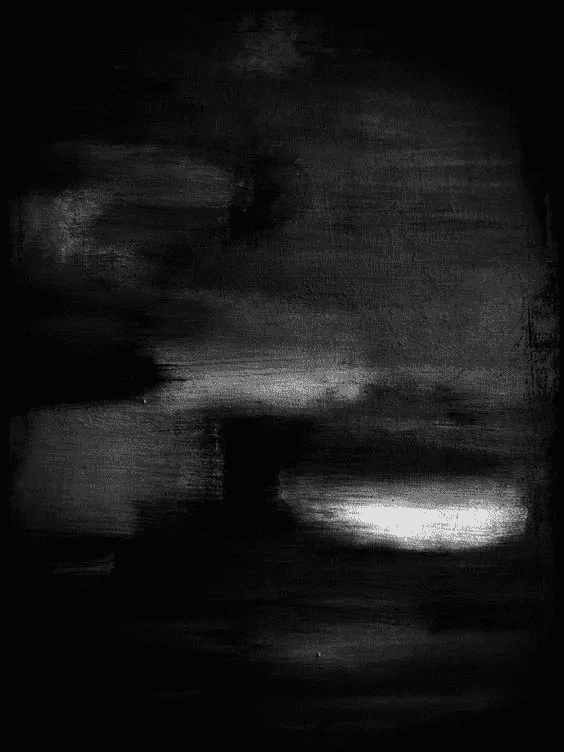

# 探索的选择

> 原文：<https://medium.datadriveninvestor.com/the-choice-to-explore-60db09dd6284?source=collection_archive---------10----------------------->

好奇和无知的区别在于探索的选择。

你看到一个不熟悉的物体会排斥它还是拥抱它？

如果这个实体让你害怕，如果它是无形的呢？

如果是一个你没有完全理解的复杂想法呢？

‘Balance #8’ by Jeremy Blake

如果我们面对一些不熟悉的东西，那会令人不安——会令人困惑。

未知永远地杀死了我们，或者推动我们走向伟大(在这两者之间是整个光谱)——对未知的恐惧，连接着发现。我们解决情感不和谐的勇气有时是推动我们走向成功或失败——喜悦或死亡——的唯一因素。

“神奇发生在你的舒适区之外”，但“好奇害死猫”。

智慧来自于知道什么时候该听从什么建议——如果以前没有做过错误的建议，就不可能知道该往哪里走。

我们向周围的人寻求克服这一困境的指导，并从我们有资源接触的人那里聚集导师。

但是，这个聚类样本未能提供一个全面的视角，让我们得以进步——做出决定。

是的，有些人可能会一头扎进他们认为是真理的碎片化信息中，而另一些人则会回避，害怕一个结果——要么选择静止不动，要么选择完全忽略决定，不作为就是行动。

但是寻求完全知情就像获取全部知识一样不可能——事实上这是同样的追求。

所以我们*必须*搬家。我们*必须*迈步——坠入未知。这是我们真正做的事情，一头扎进未来——被近视镜片弄得残废。

那些我们选择探索或忽视的，有时超越人性并挑战我们的对抗思想，那些测试我们的科学、宗教和其他工具的思想，为我们提供了一个机会。

它们让我们有能力去尝试征服未知，因为它们让工具本身变得清晰。

通过重新审视我们最害怕的问题，我们可以重新校准社会、经济、政治和科学假设。他们是塑造了社会的人——有时，他们的指导只不过是一个众所周知的苹果砸到头上或溢出的浴缸里。我们世界的大部分是由我们塑造的——一个失控的陪审团。

我们的环境起源于我们之前人们的思想。随着时间的滚雪球，混乱随之而来。

但真相必然会出现。它总是在足够长的时间线上发生。

认识到这一点迫使我们的想法去适应，在模型中建立谦逊，经得起事实考验，并建立诚实的自省。当我们的模型失败时，我们可以接受它们的结局，重建新的模型。

我恳求你们不顾恐惧去探索，去质疑伟人的思想，去检验他人的基础，并尝试打破自己的基础。他们会重建，变得更加强大。

用事实建立你自己的结论，让虚构在你的想象中驰骋。后者是灵感的所在，在你头脑的无限世界中。

带着表达自己想法的信心走进未来，但要有勇气和谦卑去接受他们的缺点。

直面让你害怕的想法。

选择探索。