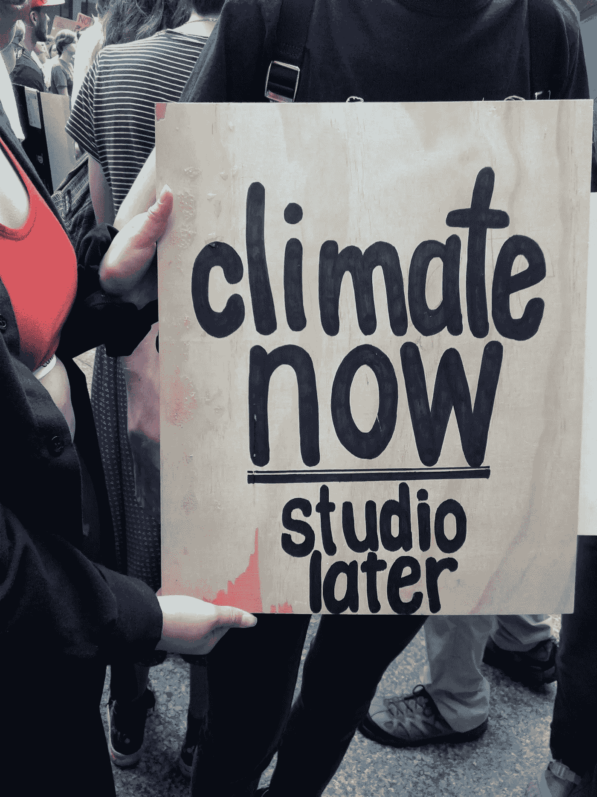
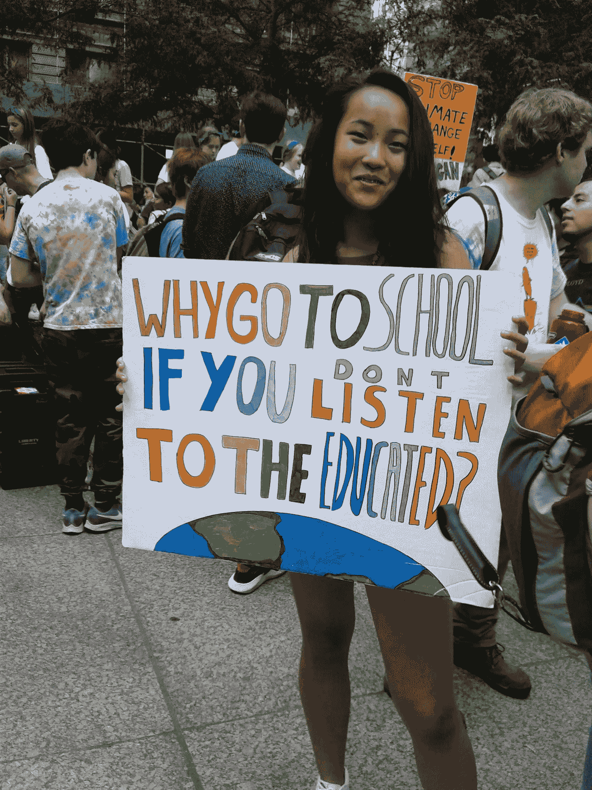
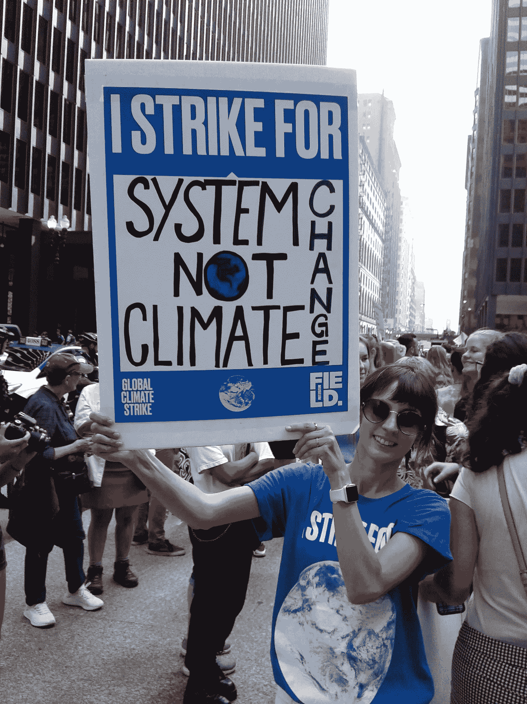
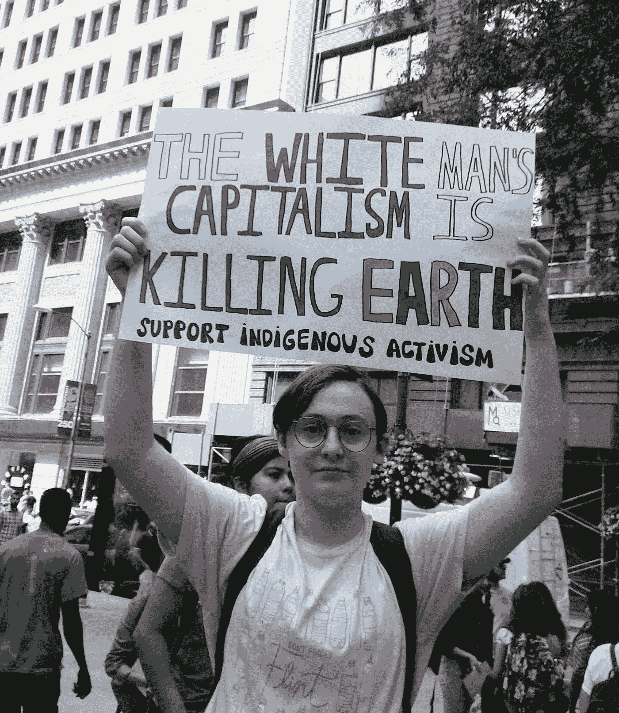
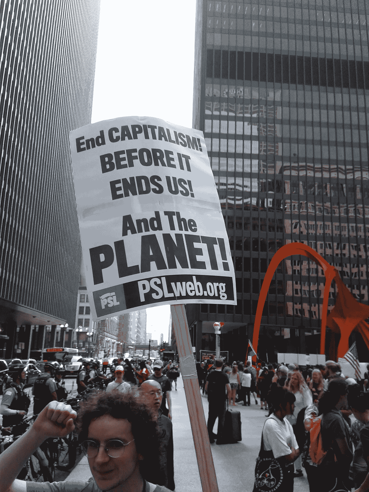
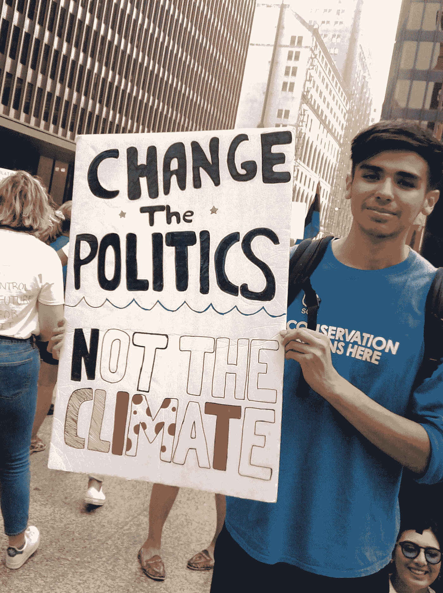
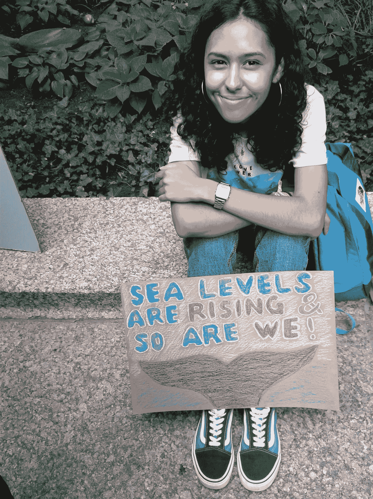

# 资本主义的气候正在改变

> 原文：<https://medium.datadriveninvestor.com/the-climate-is-changing-for-capitalism-1ac5dff2c49e?source=collection_archive---------9----------------------->

Photo by author.

自 2019 年 9 月 20 日全球青年气候罢工以来，已经过去了几个星期，但我仍然无法忘记我在芝加哥集会上的经历。不是因为我同意与会者的议程。恰恰相反，正如我[在](https://medium.com/discourse/the-swindle-of-the-century-e6bf2ef81f4f?source=friends_link&sk=d5e27349e41cb35013e8fa9f4b182d5d)之前表达的；比起气候变化本身，我更关心气候变化的政治。从这个意义上说，上图无意中解释了我在那里的存在。

开车去参加活动时，我听了芝加哥公共广播电台 WBEZ 的[现场报道](https://www.wbez.org/shows/worldview-podcast/4fe38399-fbff-4160-a304-57ae27213a8c)，主持人是杰罗姆·麦克唐奈。出于对这一事件的热情，他采访了一些青少年。尽管他们很年轻，他的对话者已经掌握了气候变化的废话。社区对话、环境正义、立法行动、绿色工业革命和气候正义只是他们在政治游说中使用的冠冕堂皇的词语的例子。在他们这个年龄，我在写作中也有类似的倾向，但我的文学老师用红笔划掉了所有的泡沫实例。时代变了；他们的老师把他们带到集会上。他们没有在学校学习，而是教我们其他人学习是不必要的，正如下面的图片所证明的那样。

Photo by author.

Photo by author.

当我在格里塔·图恩伯格这个年龄时，我在某处读到一句讽刺的评论，说人类思维发展的高峰一定是在 5 岁到 18 岁之间，因为一个年轻人在 5 岁时有所有的问题，但在 18 岁时有所有的答案。这个评论是在 20 世纪 60 年代震撼美国和许多其他西方国家的青年起义的边缘。对我个人来说，这提醒了我，在我之前，几千年来，人们一直在解决像我们这样的问题。了解这些以往的经验应该是就我们所面临的挑战进行任何明智对话的先决条件。

 [## 气候变化、ESG 和对更好数据的追求|数据驱动的投资者

### 在地球上许多地方经历了另一个令人难以置信的炎热夏季后，来自 S&P 的最新发现…

www.datadriveninvestor.com](https://www.datadriveninvestor.com/2018/08/24/climate-change-esg-and-the-quest-for-better-data/) 

集会中的年轻人不这么看。在他们看来，成年人不听受过教育的人的话；因此，教育是不需要的，因为——在科学技术彻底改变我们生活的方方面面的时代——政治仍然是通过大喊大叫和扭胳膊来进行的，就像我们石器时代的祖先所做的那样。下图完美地反映了气候变化辩论中的这一趋势。

Photo by author.

这位年轻的女士还不知道受过教育的人会倾听别人的意见，不管他们受过多少教育，但是他们会质疑他们所听到的，正是因为他们受过教育。她还不知道科学不是宗教；人们可以有合法的理由表达不同的观点。带着傲慢的自信，她可能没有听说过一个古代哲学家谦虚地注意到“我知道我什么都不知道。”她还没有在学校花足够的时间来学习，她可以享受我们文明的所有奇迹，只是因为每一个进步都是由于有人挑战那些自称更有知识的人而发生的。当一个高中生称“没受过教育”的人，如诺贝尔物理学奖得主伊瓦尔·贾埃弗教授(T2)时，这听起来很滑稽。然而，当这种方法被认真对待并可能塑造我们的未来时，这并不可笑。

年轻人挑战当权派是很自然的。你可以像史蒂夫·乔布斯那样做，努力证明当权派是错的；做别人“知道”不可能做的事。另一种选择是向当权者施加政治压力，让他们在我们不做任何实际工作的情况下为我们做些事情。下图告诉我们 9 月 20 日全球气候罢工背后的想法。

Photo by author.

从杰罗姆·麦克唐奈在他的电台节目中与集会组织者的谈话中，我们知道这场运动背后人们心中的制度变革是什么样的。

来自塞拉俱乐部的基拉·伍兹热情地谈论着他们采取的整体方法,“促进市政行动以转变我们的能源经济”他们“设想在城市中实现 100%的清洁、可再生能源经济。”他们“要求大大小小的市政当局支持这一努力。”所有这些听起来都很崇高。但对于一个受过教育的人来说，这听起来很危险，因为这意味着拒绝美国政治制度的基本原则，即个人而不是政府管理经济。基拉森林并不致力于开发更好的太阳能电池板技术，使使用太阳能电池板有利可图。她不呼吁她的同胞购买混合动力汽车，因为与传统汽车相比，混合动力汽车可以节省大约一半的汽油。她和她来自塞拉俱乐部的同事武断地决定，他们 2020-2035 年的目标是让所有建筑 100%使用清洁能源，到 2040 年，甚至更早，拥有电动公交车。这一政治议程完全脱离了经济现实，因为我们应该把“地球置于利润之上”。杰罗姆·麦克唐奈发现了一个声称这一点的横幅，但我找不到它来拍照。

[集会组织者之一、来自人民游说团的凯拉·约翰逊](https://www.thepeopleslobbyusa.org/our-staff/)更直接地向 WBEZ 听众解释说，他们“从不同角度攻击气候危机等问题，但总是试图找到根本原因，比如资本主义、企业贪婪和化石燃料行业。”对她的小组来说，气候变化政治“是这么多代人认识到我们将利益置于社区福祉之上有多长时间的机会。”有迹象表明这种想法。

Photo by author.

Photo by author.

来自 WBEZ 的杰罗姆·麦克唐纳毫不犹豫地接受了这种社会主义宣传。在另一个例子中，他对“气候变化创伤的负担将由来自边缘化社区的人来承担”的评论表示赞同。年轻的活动家可能还不知道，但他应该知道，对于穷人来说，祸不单行。因此，解决办法不在于制度化的慈善，不在于向富人征税，让政府帮助穷人。解决办法是发展经济，这样穷人就会减少。

半个世纪前，大多数中国人的生活并不比他们的朝鲜邻居好多少。大约 40 年前，中国采用了纯粹的资本主义、以利润为导向的经济模式，让大约 10 亿人摆脱了贫困。在此之前，资本主义给欧洲和北美带来了繁荣。问反对资本主义的年轻人，他们是否知道任何其他方法来创造一个繁荣的社会，这难道不是合乎逻辑的吗？

迷恋社会主义思想的 WBEZ 记者无法承认追逐利润是推动我们文明进步的引擎。因此，在与集会参与者和组织者交谈时，他承受不起哪怕是一丁点的怀疑。如果不是这只是气候变化问题在所有 WBEZ 项目中出现的一个例子，我会听之任之。在另一个黄金时段的政治节目中，“几个月前，乔舒亚·约翰逊征求了关于气候变化的不同意见。我给他发了一些电子邮件，但甚至没有收到回复，也没有在他的节目中听到任何不同的声音。

下面的标志意在表达不同的意思，它证实了整个关于气候的喧嚣只是为了获得政治上的改变。

Photo by author.

在街头，人们可以表达他们对现状的不满。当人们坐在餐桌旁时，实际的变化就发生了。政治是妥协的艺术。意识到这一点需要时间和经验。认识到无论我们想做什么，我们都需要钱，这需要一定的现实。没有利润，就没有钱做任何事情。在追逐利润的时候，并不是所有的人都取得了同样程度的成功，这需要一些成熟来接受。这需要对人类行为有所了解，这样才能知道，如果我们授权政府从那些更成功的人身上获取利润，以满足不幸者的愿望，我们就会破坏推动我们进步的机制。最后，尽管全球变暖的挑战与我们祖先应对的挑战不同，但这并不是人类面临的第一个严峻挑战。

在街头的喧嚣过后，年轻人可以通过加深对气候变化的了解来做出改变，包括了解持反对意见的人的观点。在我们两极分化的现实中，年轻人最大的机会是摆脱成年人的偏见。这种方法对年轻人来说是很自然的，对权势集团的不信任是一种财富。就像以前发生过很多次一样，解决一个重大挑战可能会成为这一代人的标志。可悲的是，这不是我所看到的情况；我看到年轻人被权势集团所操纵。

在集会的气氛中，我感觉到了与 20 世纪 60 年代青年反叛的相似之处，纪念口号是“[不要相信任何超过 30 岁的人](https://www.berkeleydailyplanet.com/issue/2000-04-06/article/759)”今天，这个年龄似乎已经降低，杰罗姆·麦克唐奈(Jerome McDonnell)傲慢地说，“年轻人用道德权威说话”，凯拉·约翰逊(Kyla Johnson)附议说，他们有“新的道德愿景”。在集会上与我交谈的几位老人告诉我要倾听年轻人的声音。事实是，他们仍然像孩子一样天真，没有受过教育，就像我们在他们这个年龄时一样。毕竟大部分还没有高中毕业。

Adults manipulate kids into politics kids cannot understand. Photo by author.

杰罗姆·麦克唐奈(Jerome McDonnell)无意中把这场集会的想法变成了漫画，当时他真诚地与一名举着写有“气候变化不好”的牌子的 9 岁男孩交谈。我可以接受一个 16 岁的孩子可能对这件事有自己的看法，不管它可能多么幼稚或无知。一个 9 岁的孩子只能重复他被灌输的东西。在这方面，气候变化危言耸听者需要让孩子们参加他们的集会，这是一个好迹象；说明成年人并不买账。我们只能希望成熟的年轻人也会变得更加怀疑。