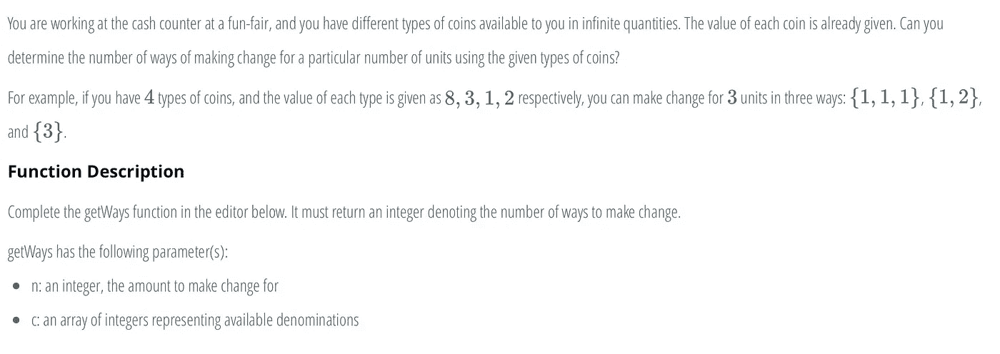
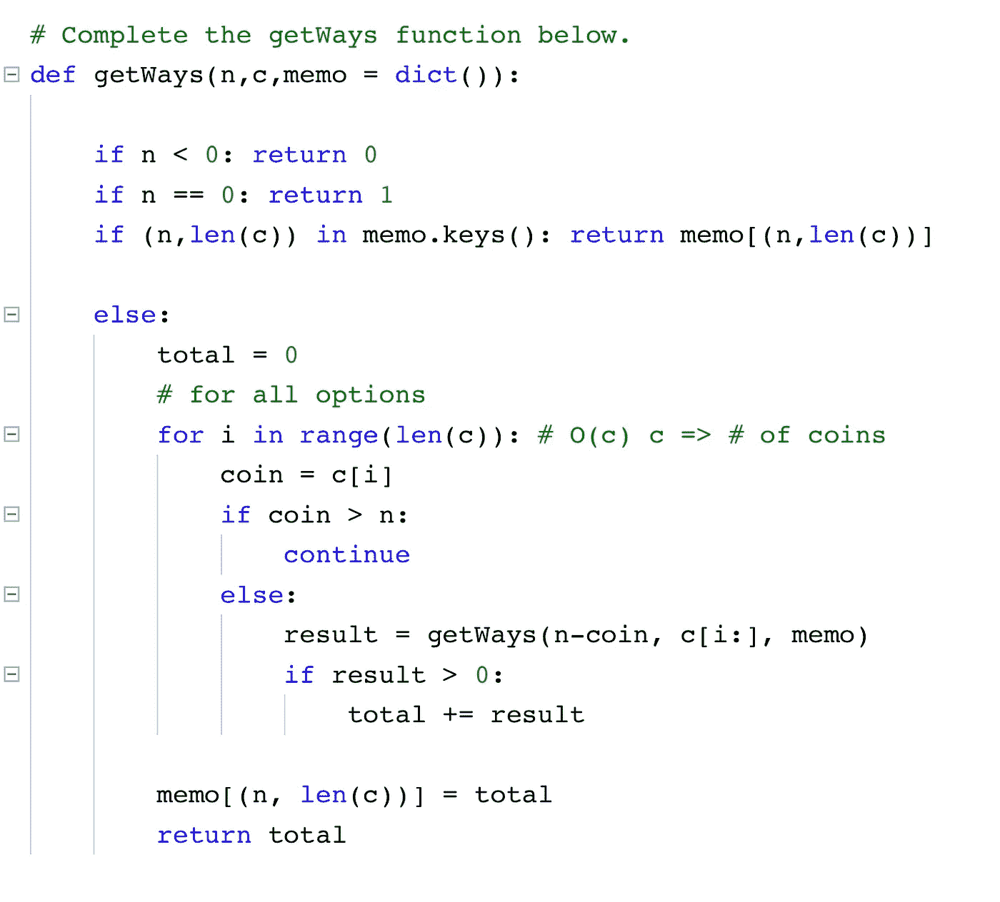

# 硬币兑换问题(记忆和递归)

> 原文：<https://medium.datadriveninvestor.com/the-coin-change-problem-memoization-and-recursion-d6ea2786c3f3?source=collection_archive---------0----------------------->

# 问题是

[链接到原问题](https://www.hackerrank.com/challenges/coin-change/problem)

# 解决方案

我对这个问题采取了递归的方法。所以我们知道 n 是我们试图达到的总和，c 是我们可以使用的硬币值的数组。

对于我们的基本情况，我们考虑我们应该处于什么状态来达成一个潜在的解决方案。我们知道，如果我们的 n 小于 0，我们检查了我们的总和。因此，我们返回 0 并在此结束。如果我们的 n 等于 0，那么我们达到了我们的总和。这是因为在我们的方法中，我们将在每次迭代中从 n 中减去一个硬币的价值。

对于递归的例子，我们将遍历所有选项，然后一次处理一个选项。我们的总数是我们检查所有选项时找到的方法的数量。我们设定硬币的价值等于该指数下硬币的价值。如果这个硬币的价值大于我们试图达到的总数，我们知道不值得检查它。所以，我们跳过这个值。

如果它小于或等于我们试图达到的总和，我们就进入递归的情况。假设我们的函数将为我们找到结果，我们设置 result 等于我们的递归调用，其中我们从 n 中减去我们的硬币，我们裁剪硬币列表以排除该硬币。这仅在函数调用参数中完成，因为我们希望它仅适用于递归情况，这样我们可以获得所有可能的选项。如果我们的结果是有效的(大于 0)，那么我们把我们的结果加到总数中。在函数结束时，我们返回总数。

当然，上述算法对于大值来说不够快。因此，正如你在解决方案中看到的，我添加了记忆化。记忆化是一种允许你的算法记住以前的工作的方法，这样它就不必重复已经完成的工作。

我意识到，对于特定的 n 值和特定大小的硬币阵列，我们总是可以得到相同数量的选项(你可以在一张纸上试一下，自己看看)。因此，我使用字典(memo)将 n 和硬币数组的长度存储为一个元组，以表示密钥和我们获得的选项总数。就在我们返回结果之前，我们将这些值添加到备忘录中。

现在，在我们的基本情况下，我们可以检查是否达到了 n 和 c 的长度，如果达到了，我们可以返回已经计算过的总数，避免重复。

我希望这有意义。如果您有任何问题，请随时使用评论部分。

点击这里订阅英特尔[。](https://ddintel.datadriveninvestor.com/)

请访问我们的网站:https://www.datadriveninvestor.com

在这里加入我们的网络:[https://datadriveninvestor.com/collaborate](https://datadriveninvestor.com/collaborate)