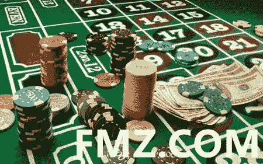

# 一个 20 岁期货交易者的理解

> 原文：<https://medium.datadriveninvestor.com/the-comprehension-of-a-twenty-year-old-futures-trader-917d7953938f?source=collection_archive---------20----------------------->

[www.fmz.com](http://www.fmz.com)

一个专业的证券投资者，一定要像和尚一样。在年复一年的冒险生涯中，在一次又一次的诱惑中，他总是需要大力克制人类与生俱来的恐惧和贪婪，以防稍有不慎，就会铸成大错。

投机交易从来都是在天堂和地狱之间。请记住一位老期货交易员的八点真知灼见:

1.如果持仓一周后没有盈利，很明显投机是错误的。时间是最好的见证。请立即平仓。

2.从事任何生意，首先要做好最坏的打算。第一，你必须立于不败之地。第二，随时随地可以脱离危险。

3.交易策略应该注意:

(1)要通过趋势进行交易，市场趋势表明可靠的趋势是前提；

(2)坚持原则；

(3)无论作为交易依据的分析系统是什么，你都必须跟随市场的趋势。换句话说，你必须确保你是顺着水的方向推船，而不是逆着水。

4.基础分析不足以克敌制胜，图表分析可以提高入市时间的准确性，两者应该相辅相成。

5.风险管理尤为重要，可以说是取胜的先决条件，切不可只为一枪而孤注一掷！

6.小利难富:一是分散投资；第二，趋势交易；第三，控制风险，长期作战稳中求胜。

7.要认真计算赔率是否划算，至少得“一赔三”赔率才算理想。

8.为了在投机市场中取得成功，必须满足几个条件:

(1)一套完整的交易方法。

(2)要严守纪律，遵循既定策略。

(3)谨慎管理资金。

(4)亏损时不能加仓。

(5)找顶找底游戏非常危险，对身心有害。

(6)买卖前，一定要确定自己愿意接受的风险程度，做好最坏的打算。

(7)勤奋和奉献是必要的；这种演奏没什么帮助。

(8)抛弃你的自尊，最重要的是打胜仗。

(9)承认自己会犯错，万一犯错就交出止损，把损失降到最低。

(10)大胆求胜，入市时，随波逐流，不要急于平仓，要调整止损，以跟随价格变化，保护既得利益，实现利润最大化。