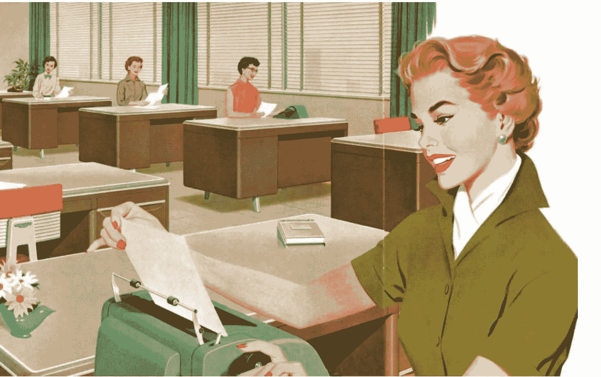

# 计算机行业停滞在 20 世纪 50 年代

> 原文：<https://medium.datadriveninvestor.com/the-computer-industry-is-stuck-in-the-1950s-c2aebd3be0e0?source=collection_archive---------1----------------------->

随着计算机行业的爆炸式发展，随着亿万富翁的涌现，随着计算机改变了地球的面貌，新发明在哪里？我保留了一本在犹他大学时艾迪生·威利写的书《电子数字系统》。那本由 R. K. Richards 所著的 20 世纪 50 年代的旧的、蓝色的、布满灰尘的精装书包含了地球上所有计算机技术的总和。从那时起，计算机科学的基础没有任何改变…没有。

计算机更小、更快、更便宜，并且联网。我们的计算机语言在改进，但基本技术与真正的发明家在 20 世纪 40 年代和 50 年代首次发明的技术是一样的。人工智能在当时只是一个白日梦，他们知道这一点。随着计算机技术的发展，当有人宣布他或她的新的人工智能进展时，这是很有趣的。

这些死路一条的解决方案，就像内燃机一样，只不过是人类赖以依靠的拐杖，像脖子上的球和链条一样束缚着它。许多投资者足够聪明，也足够有经验，知道这是真的——他们在人工智能初创企业的失败上花了一大笔钱。

跳出框框思考已经成为一个问题。新的真正的发明家在哪里？也许他们在某个地方无家可归，因为没有人会听他们的想法。那些像发明家一样的 50 后哪里敢知道？

理查德·费曼认为有两种物理学家，希腊人和巴比伦人。我们变成了希腊人。我在找巴比伦人。

费曼就是那个在挑战者听证会上当着委员会的面把一块火箭助推器的 O 型圈浸入一杯冰水中的家伙。他无法直接回答 O 型圈材料在低温下如何反应。所以费曼用实验来教他们。

希腊人是著名的物理学家。数学的发明者之一欧几里得就是一个例子。希腊人发明了定理和证明的概念。他们更关心公理和假设的系统。这就是今天的我们，我们已经成为了希腊人。

另一方面，巴比伦人感兴趣的是最终能够工作并描述真实世界的方法。换句话说，希腊人认为万事万物都需要一个公式，而巴比伦人只关注眼前的问题。

我们有伟大的数学家和计算机科学家，那么为什么要用巴比伦的方法呢？好吧，让希腊人跟进，试着把我们的解决方案包装成某种优秀的逻辑体系。然而，真正的改变来自梦想家，巴比伦人。巴比伦人的方法是想象力、本能和直觉的方法之一。只要行得通，他们不在乎是否违反规则。

当费曼把那片 O 型圈丢进冰水里时，他是在告诉委员会一件非常重要的事情。他不关心工程师们使用的数学；他想知道为什么有人没有对材料进行适当的测试。此外，如果有，结果在哪里？费曼是巴比伦人。

我们没有一千年，或者一百年，甚至几十年。我们现在必须寻求人工智能的新方法。另外，我们怎么会失败呢？如果费曼是对的，任何问题都有无限多种解决方案，那么我们只需要找到一种。

机器学习看起来像巴比伦的方法。我们有实验者。纠缠和叠加的量子计算，这是梦想家们可以做的事情。也许这就是一个突破的地方，一个全新的发明。