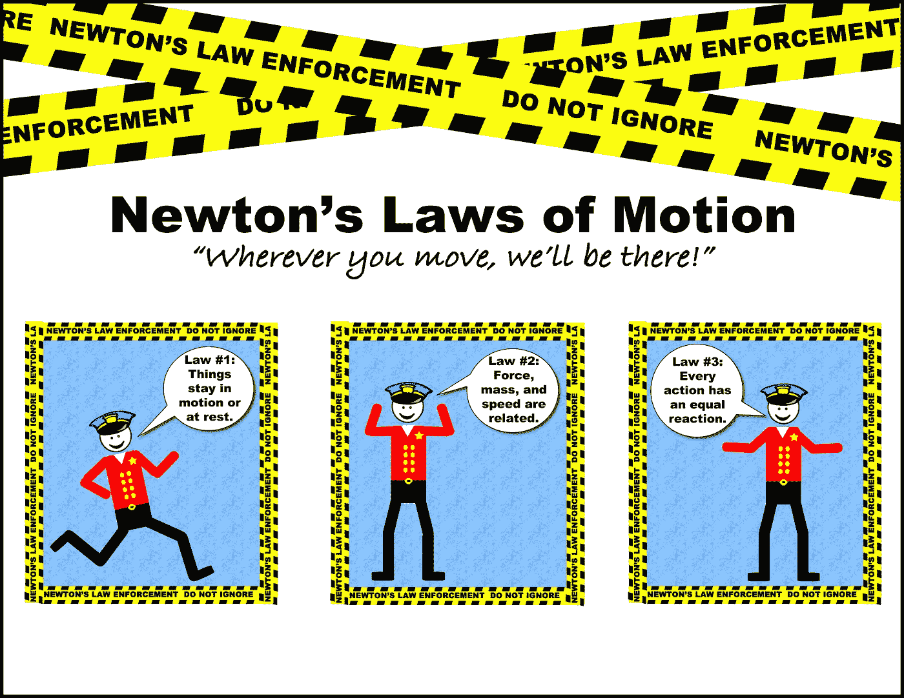
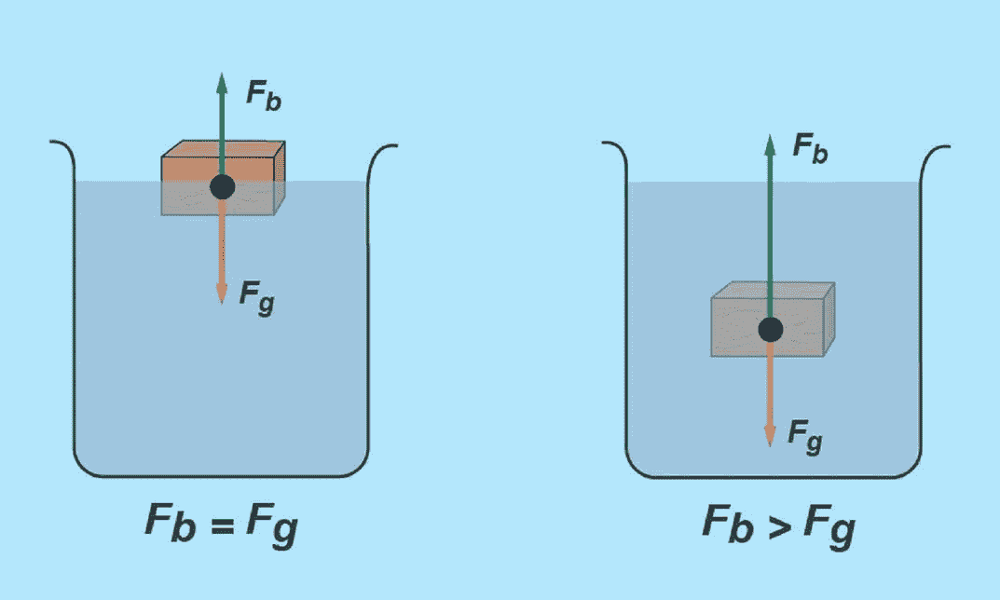
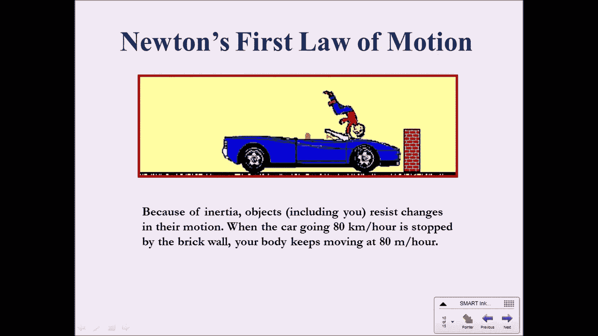
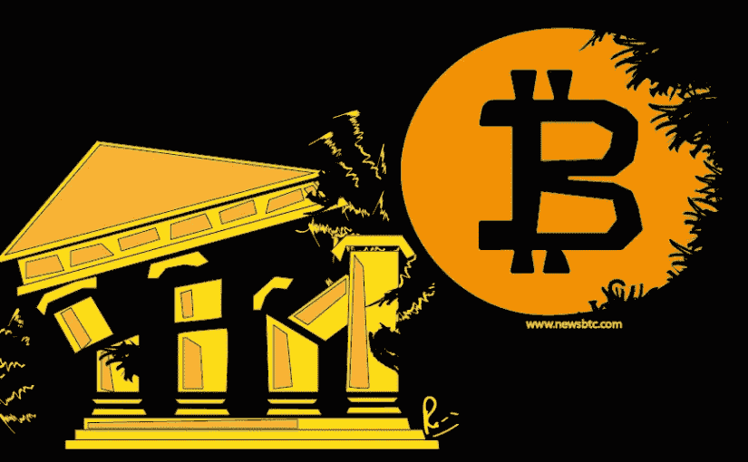
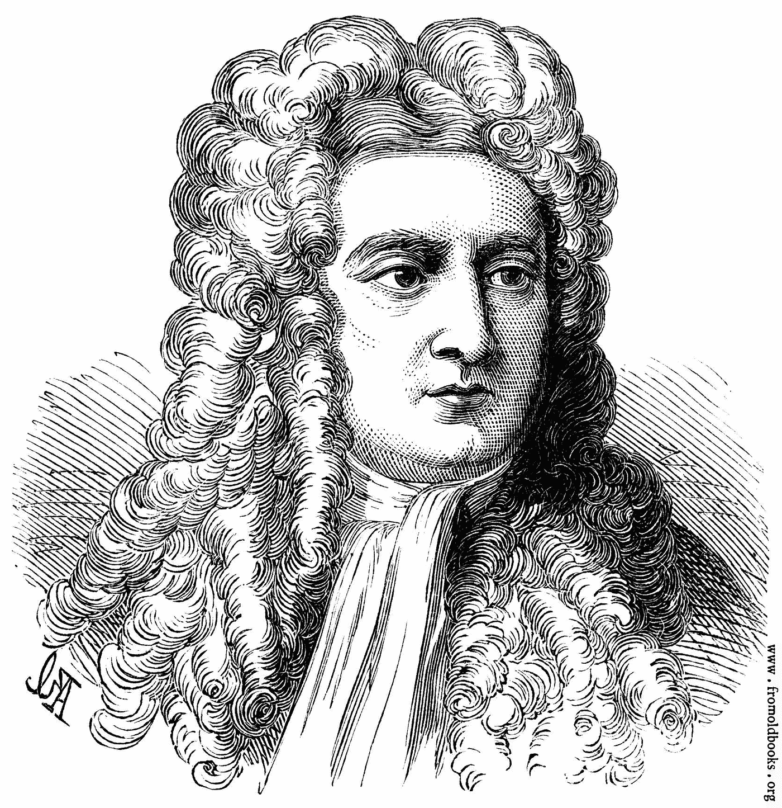
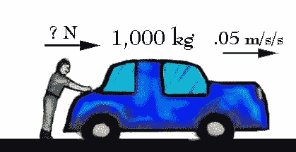
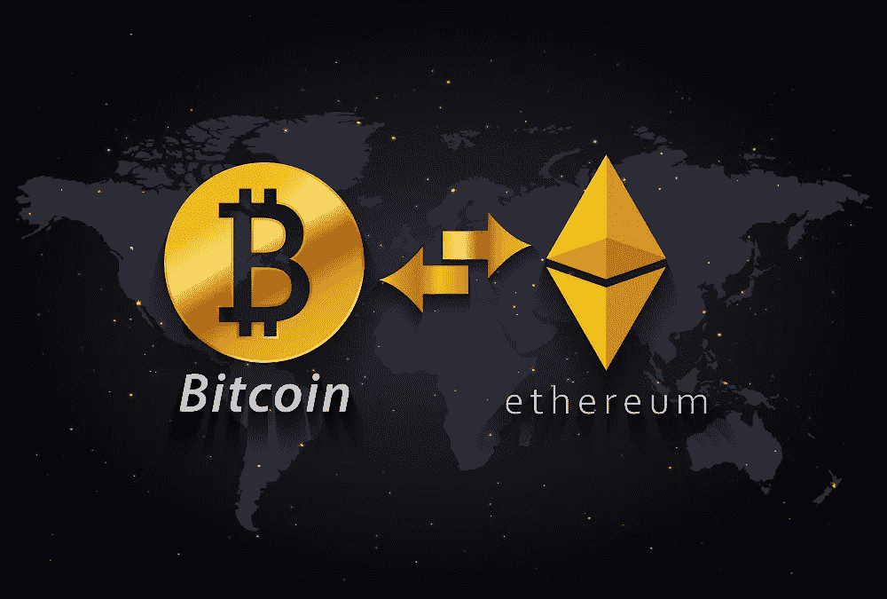

# 区块链的概念从出发解释，参考牛顿运动定律

> 原文：<https://medium.datadriveninvestor.com/the-concept-of-blockchain-explained-from-starting-with-reference-to-newtons-laws-of-motion-6746925cc5e0?source=collection_archive---------0----------------------->

区块链，对于我们中的一些人来说，仍然是一个非常无聊的话题。不是吗？尤其是对于理科学者来说。他们的信念和“不感兴趣”的分类背后有一个简单的基本原则。他们更相信“实际的”和“可触摸的”。然而，在我看来，很大一部分“进步”的人最近已经改变了这个定义。

曾经有一段时间，为了更好地理解物理定律，我从“校外”生活中，从一些我可爱的老师那里获取例子。正如我的物理老师在解释“阿基米德定律”时所说，他实际上是将一个小铁球放入水中，来解释它是如何下沉的，而一艘重达数吨的船却不会，因为水的质量被物体溺水的部分所取代，物体的重量必须大于整个物体的重量，才能使它浮在水面上。我们像理解任何简单的事情一样理解它，并且仍然记得它。在这篇文章的帮助下，我正试图通过将区块链与牛顿运动定律联系起来，让科学学者很好地理解它是什么，以及它的历史迄今为止是如何影响世界的。

从牛顿第一定律开始。“惯性定律”。它指出，任何物体在运动时都会保持运动状态，或者在受到外力阻止或使其运动之前，保持静止或稳定状态。我们今天如何理解它，将会有点有趣。

当中本聪想到从“恐龙时代”就存在的密码学时...考虑到“区块链时代”和进化的速度，确实如此。他从各种来源收集参考资料，集中在一个地方，为计算机科学和交易领域的一些新事件重新发明和设计概念。如果你稍微看一下他的参考文献，就会发现这些参考文献是疯狂的，而且几乎互不相关。随便看看他们:

参考文献:

【1】w .戴，《b-money》，【http://www.weidai.com/bmoney.txt】，1998。
[2] H. Massias，X.S. Avila 和 J.-J. Quisquater，“具有最低信任要求的安全时间戳服务的设计”，1999 年 5 月在比荷卢举行的第 20 届信息理论研讨会。
[3] S. Haber，W.S. Stornetta，“如何给数字文档加时间戳”，载于《密码学杂志》，第 3 卷，第 2 期，第 99–111 页，1991 年。
[4] D. Bayer，S. Haber，W.S. Stornetta，“提高数字时间戳的效率和可靠性”，载于《序列 II:通信、安全和计算机科学中的方法》，第 329-334 页，1993 年。
[5] S. Haber，W.S. Stornetta，“位串的安全名称”，第四届 ACM 计算机和通信安全会议论文集，第 28–35 页，1997 年 4 月。
【6】a . Back，“Hashcash —一种拒绝服务的反制措施”，[http://www.hashcash.org/papers/hashcash.pdf](http://www.hashcash.org/papers/hashcash.pdf)，2002 年。
[7] R.C. Merkle，“公钥密码系统的协议”，正在进行中。1980 年安全和隐私研讨会，IEEE 计算机学会，122-133 页，1980 年 4 月。
[8] W. Feller，《概率论及其应用导论》，1957 年。

现在，在“比特币白皮书”出现之前，世界正以稳定、不受干扰和专注的速度前进，如果中本聪没有引入推动它的“外力”，没有添加“快速国际交易”(至少与当时的情况相比)的基本原则，即由非中央权力机构控制的点对点、分散式分类账，世界将保持这种速度。所有这些措施和参数将银行、交易和计算世界推向了一个新的步伐，与区块链和密码学相结合的相关技术的“速度”提升到了新的、无法想象的高度。这就是牛顿第一定律如何进入理解区块链初始阶段的画面。

这是一个有点棘手的解释三大定律，作为一个“序列”的区块链事件。现在，这将是比较概念中唯一不相关的和“游戏”的部分。我肯定有一些原因，为什么我们称这些运动定律为“第一、第二和第三”，但是相信我，即使他们在列表中的位置互换了，我也会找到一些或其他方式将这些“互换的定律”与区块链发生的序列联系起来。一旦你以正确的方式理解了区块链，你可以在以后探索这些不同的方式和可能的解释。对于那些了解区块链及其内外一切的人来说，他们可以继续只是为了一种新的视角和享受。在第二运动定律中，请接受我的道歉，我没有包括“变质量系统”，因为我们只是在谈论牛顿所说的。在不久的一篇文章中，我将在不同的尺度上比较物理学的相关理论，最终，我也将转向化学。我已经在我早期的一篇文章中谈到了“物种起源”,尽管如此，我还是想用区块链建立和展示更多生物学理论和应用之间的相关原理。

牛顿定律适用于质量不变的地方。然而，这里有一个“微分”，常数因子规则出现在图片中。关于“匀速圆周运动”，和“动量守恒”，连同“冲量”因素，影响，重新定义和阐述“牛顿第三定律”到更多和多才多艺的情况，我们当然会讨论所有这些运动的第二定律的范例。变质量系统，以及它如何不遵守伽利略不变性。一个人如何能推导出一个变质量系统的运动方程，以及关于“齐奥尔科夫斯基火箭方程”的问题。

牛顿第二运动定律指出，物体动量的变化率与所施加的力成正比，并且动量的变化发生在所施加的力的方向上。用简单而全面的语言，它陈述了运动物体上的力是其质量和加速度的乘积。比特币交易商和矿工的共同贡献(大众=矿工，加速度=交易商)给出了整体的思想和想法，一种想象的力量，与加密货币的加速和多用途的广泛传播想法一起移动和工作。到目前为止，两个运动定律已经表明，区块链不仅仅是一个需要讨论的问题，它具有改变世界的潜在能力，以及世界上“史前”缓慢而昂贵的银行系统。

第三个运动定律是“作用-反作用”定律。正如人们所熟知的那样。因此，如果我们谈论区块链，人们知道“比特币”代表着“区块链”，这种情况一直持续到“以太坊”出现。因此,“运动第三定律”指出，每一个物体对另一个物体施加一个力，这个物体就会反过来施加同样强度的力。这个“大小相等方向相反”的力的概念，如果我们用这些术语来定义，在这里有两种不同的方式。

1)对于比特币——当比特币挑战古老的银行系统，展示该系统在功能和效用方面有多低时，世界最终开始接受它，来自世界不同角落的平等和相反的力量开始认为比特币是另一个骗局和侥幸，认为它只是一种非常不稳定的东西，而不是“永远”。它有太多的缺陷，永远不可能成为银行系统的替代品，也永远不会被认为是一种货币。然而，所有这些“相反的力量”实际上都被忽略了，对“美丽新世界”来说也无关紧要。

2)对于区块链——当“比特币”对区块链施加了很大的压力，比特币的使用量像“九头蛇”一样增长时，几乎很快，来自区块链的“大小相等、方向相反”的力量就发挥出来了,“以太坊”就出现了。这种新的力量很快显示出它有潜力克服早期版本的所有“缺失和缺点”。它也打开了一个全新的维度，人们不知道的大门。

我们生活在这个“正常世界”里。有这样一个“另一个”世界，由“勇敢”的人和“非凡的人”组成。他们并不总是领导者，但当他们中的一个人决定并采取行动带领我们进入那些“新维度”时，我们就开始了解一些可能是“改变人生”的事件或一系列这样的事件。

无论是牛顿、中本聪还是维塔利克，我个人的看法是，他们都来自那个“不那么明显”并讨论了“美丽新世界”。他们做出决定并采取行动，我们喜欢谈论他们，当我们谈论他们并谈论他们做了什么以及如何做时，总是会创造一种新的“学习体验”。在我的下一个努力中，那肯定会以同样的事情为目标，“试图将区块链的概念与任何人和每个人联系起来”，我可能会再次谈论物理和生物。

谢谢，能被阅读真是太好了。