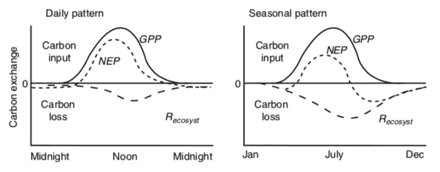

# 微积分的概念是基本的

> 原文：<https://medium.datadriveninvestor.com/the-concepts-of-calculus-are-essential-5e82fb10dd08?source=collection_archive---------2----------------------->

随着学位项目寻求简化和提高毕业率，微积分成了砧板上的肉。即使在大学 STEM 专业也是如此。这是被误导的，会对我们的学生造成极大的伤害。

像哲学一样，微积分教我们如何思考。大多数 STEM 教育者都受益于微积分。那些支持取消微积分作为必修课的人应该批判性地反思，如果没有微积分知识，他们将如何或者能够理解这个世界。对我来说，这太陌生了，很难理解。

作为我们生物学学位定量训练的支持者，最近有人问我是否要求在考试中进行计算，是否要求学生使用微积分。假设是，如果连我都不要求学生使用微积分的“数学”，那么我们就不应该要求我们的学位使用微积分。

我认为这是一个错误的想法，原因有几个。尤其是微积分教会我们如何思考。它不仅仅是衍生和整合的详细规则。对我来说，微积分是关于比率，比率的变化，以及如何将这些比率相加来预测数量。这些直觉对我如何概念化充满速率的生物世界有着深远的影响。

一个影响深远的例子来自气候变化科学和政治。有一句话经常被引用，那就是我们必须“降低二氧化碳的排放速度”。速率是随时间的变化。显然，降低二氧化碳的排放速度对于抵御大气中二氧化碳含量上升的负面影响至关重要。

然而，当研究气候政策和计划的细节时，通常是为了“限制二氧化碳排放的增长率”。保持增长率不变。事实上，这是“一切照旧”的场景。与之形成对比的是更可怕的二氧化碳增长速度，这是自工业革命以来人类历史的典型特征。

同样，一些任务是在人均基础上将二氧化碳排放量减少到 1992 年的水平。因为人口增长，今天的二氧化碳排放量将比 1992 年的排放量大得多。1992 年一切照旧不会减少大气中的二氧化碳含量。

二氧化碳排放率曲线下的面积是在任何时间内排放到大气中的二氧化碳量。对我们许多人来说，这似乎很直观。如果不是，你应该考微积分。

这是微积分重要性的另一个例子，来自我的另一门课，生态系统生态学。净生态系统生产力(NEP)是一个系统在一年中所保留的生物量。新经济政策有两个组成部分。总初级生产力(GPP)和生态系统呼吸(ER)。GPP 创造生物量，ER 将生物量以 CO2 的形式返回大气。原谅我这个简单的等式:NEP=GPP-ER。

下图显示了温带森林中新经济政策、GPP 和环境风险的日变化和季节变化(Chapin，Matson 和 Vitousek，2011 年)。

我的生态系统生态学学生必须看着这些图表，告诉我这个系统是在一天内还是在一个季节内储存了碳。在一段时间内，正的经济效益总和代表碳储量。应该清楚的是，该系统在一天中储存了碳，但不清楚全年是否有净收益。如果这对你来说很直观，那可能是因为你学过微积分。

此外，该图中还有许多其他微积分概念来说明生物现象。例如，GPP 随时间和季节呈线性上升，直到某一点。换句话说，有一个拐点。为什么？

就一天中的时间而言，它代表所有叶子开始有足够的光来饱和光合作用速率时的光量。更多的光不会导致更多的光合作用。

在一年中 GPP 下降线性上升的时间的情况下，它代表系统的叶面积已经饱和的时间。越来越多的叶面积不会增加更多的 GPP。

我可以花整整一个小时的时间来讲从这些曲线中可以推导出的生物学推论。它们都与微积分中的概念有关。认为微积分的详细“数学”总是需要的想法是错误的。但是微积分的概念是必要的。