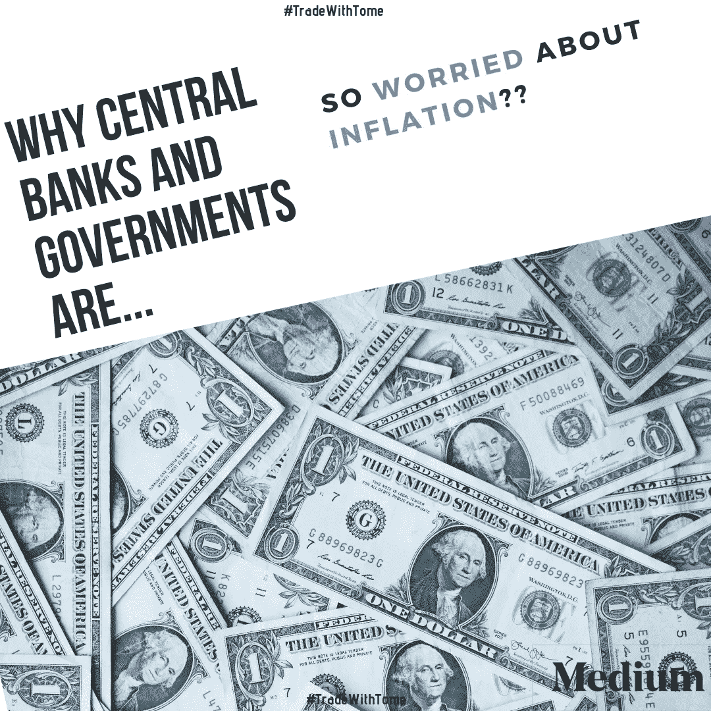
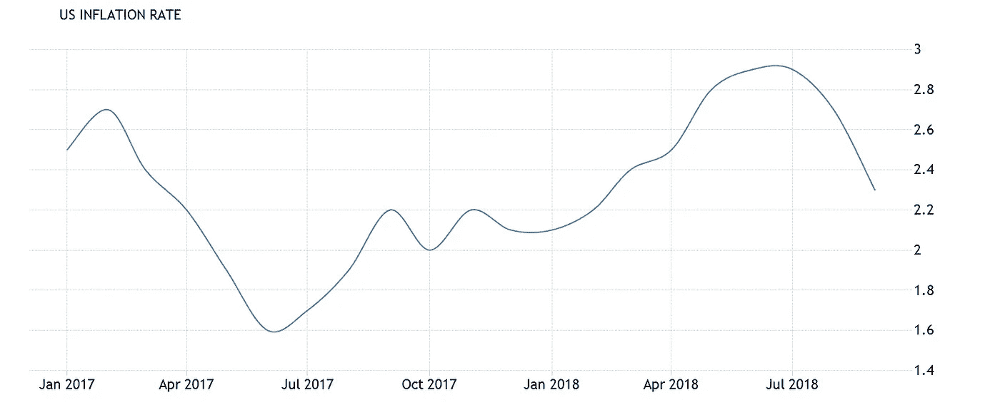
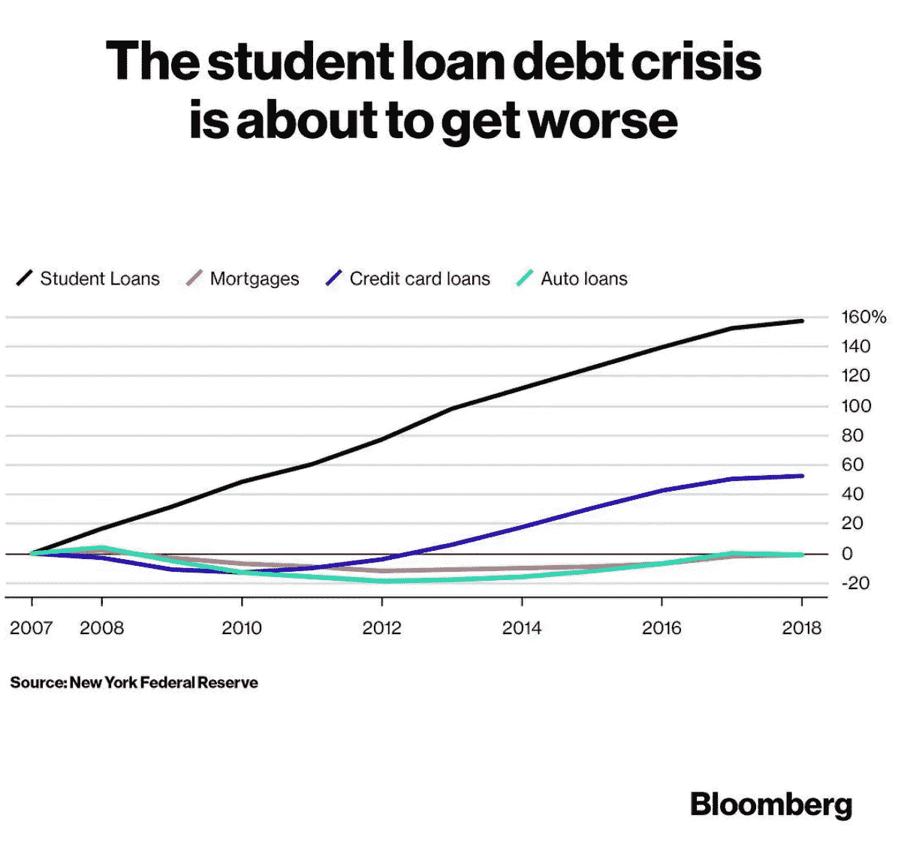

# 对通货膨胀的担忧—今年最后一个季度

> 原文：<https://medium.datadriveninvestor.com/the-concerns-about-inflation-last-quarter-of-the-year-b902f3881ab5?source=collection_archive---------21----------------------->

自今年年初以来，全球经济(尤其是美国)在这几个月里一直在增长，然而，我们从报纸和新闻中听到，通货膨胀(CPI)已经引起了一些中央银行或联邦银行的关注，因为它没有跟随经济增长。

你可能已经注意到，分析师、政府和央行(联邦银行)总是在关注这些指标——利率、通胀和经济增长。

中央银行通常以这种方式应对通货膨胀/通货紧缩。

中央银行对经济过热(通货膨胀)做出反应，经济过热使银行储备低于正常水平，并导致通货紧缩，导致货币价值上升。(反之亦然)

你可能已经注意到，有很多关于利率、通货膨胀和经济增长的谈论

高通胀时期的实际成本是什么？

通货膨胀率高时，社会往往会遭殃。看看这几个例子，你会很容易明白我为什么这么说…

即:

一个有固定养老金的退休工人，如果不与通货膨胀挂钩，将会遭受通货膨胀的增加。尽管他的收入保持不变，但由于价格上涨，他的购买力下降了。

当通货膨胀上升时，以固定利率贷款给客户的银行也会亏损。

如果通货膨胀上升，拥有可变利率住房贷款的人也会遭受损失。如果通货膨胀率上升，利率也可能上升。

**那么，为什么政府和央行如此担心这一指标呢？**

正如你们大多数人已经知道的，我们用 CPI 来衡量经济中的通货膨胀。

CPI 是通过对各种 it 产品的价格进行加权平均而缩减的，这些产品被分配了权重，对其在组内的重要性进行了重新定价。

CPI 通货膨胀/通货紧缩的变化对我们分析美国和货币购买力很重要。

这张图表向我们展示了美国自 2017 年 1 月以来的通胀演变。

即使在最后一周，10 月份的 CPI 报告也显示通胀压力仍然温和……疲弱的通胀数据并没有阻止美联储加息，而是将加息步伐放缓至渐进。

当一个经济体面临极端的通货膨胀/通货紧缩时期时，这个同步指标对中央银行(联邦银行)非常重要。

你可能还记得，在 20 世纪 70 年代，通货膨胀率几乎达到了 15%。

**是什么让通货膨胀率变得如此之高？**

**石油输出国组织** —油价上涨 **(CPI 与油价高度相关)**导致高通胀时期。

美联储错误地制定了货币政策——他们过早地印钱。

这两个因素大大增加了通货膨胀。

如今，情况大不相同，因为经济在增长，但通货膨胀并没有随之增长，联邦银行正在强行提高利率，在我看来，这将导致新的问题——自 2008 年上次危机以来一直没有解决的问题。

最近，彭博在社交媒体上发布了一张关于“学生贷款”的图片。这可能是美国可能面临的少数问题之一:学生贷款/房屋抵押贷款。请看下图，它向我们展示了学生贷款是美国家庭债务中增长最快的部分，如果美联储提高利率，情况会比现在更糟。

