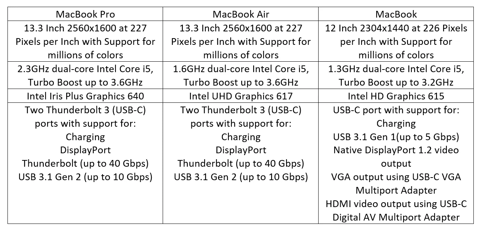

# 苹果令人困惑的未来

> 原文：<https://medium.datadriveninvestor.com/the-confusing-future-of-apple-8f1e9bb45910?source=collection_archive---------11----------------------->

## 凌乱的产品线都来自 MacBook Air

Source: [Pixabay](https://www.pexels.com/@pixabay) / [Pexels](https://www.pexels.com/photo/abstract-apple-art-black-and-white-434346/)

在 2018 年改变游戏规则的 MacBook Air 问世后，又有了新的 MacBook Air，它奇怪地适应了当前的阵容。当第一台 MacBook Air 推出时，它震惊了世界。事实证明，这不仅仅是苹果的未来，也是整个超极本类别的发展方向，这是采用优质铝饰面的轻薄笔记本电脑。从那以后，苹果的设计语言变得单薄而高端，激发了它自己产品的伟大设计，当然也激发了其他公司的许多其他产品。

苹果坚持自己的设计理念到了一个错误，可能走得太远了，经常为了更薄更干净的设计而牺牲性能和功能。近年来的一些主要批评是取消耳机插孔，这使整个智能手机市场朝着无线耳机的方向发展，以及取消 MacBooks 上的所有其他端口，支持雷电 3 和加密狗。但当其他品牌如谷歌和一加时，谁又能责怪苹果呢？嘲笑苹果取消耳机插孔的人也纷纷效仿，推出了自己的手机。但现在，苹果无疑被困在了一个陌生的地方，未来可能充满问题。

# 越瘦越瘦？

Source: [Pixabay](https://www.pexels.com/@pixabay) / [Pexels](https://www.pexels.com/photo/apple-artwork-business-color-459719/)

看看现在的 MacBooks 阵容，看起来都差不多。薄而漂亮的铝制机器，背面有闪亮的金属苹果标志。它们是:MacBook Pro，一款轻薄的超极本，内部至少有一个英特尔酷睿 i5，周围有 2 或 4 个 USB-C 端口；MacBook，最薄最轻的笔记本电脑，内置英特尔酷睿 i5 处理器和 USB-C 端口；还有 MacBook Air，比 MacBook Pro 薄得多但不是 MacBook，比 MacBook Pro 略轻但不是 MacBook，还有一个*(你猜对了)*英特尔酷睿 i5 处理器和 2 个 USB-C 端口。*嗯嗯*，我想你明白我的意思了。在追求这种轻薄理念的过程中，苹果有三款*【不同】*笔记本电脑很容易让普通消费者混淆。

苹果网站上的技术规格没有一点帮助，看看我从网站上画的这张表。MacBook Pro 是基本款，MacBook 是高端款。

MacBook Pro 和 MacBook Air 在规格上看起来非常相似，屏幕相同(？？)处理器和具有相同 RAM 和存储选项的相同端口。如果我不了解的话，MacBook Pro 和 MacBook Air 似乎可以通过相同的 Turbo Boost 以相同的速度运行，但日常性能可能会稍慢一些？那么 MacBook Air 和 MacBook Pro 额外的 100 美元差价是为了一个稍微好一点的处理器吗？

# 收缩的产品线

MacBook 阵容的这一细分只是对苹果未来潜在问题的一点窥视。随着每种产品越来越接近彼此，他们的许多设备可以解决相同的使用案例，而针对不同人群的设备很少。他们忽视了 iMac Pro 和 MacBook Pro 15 英寸 i9 的专业人员，这两款产品都因轻薄而存在散热问题，忽视了适当的散热管理，导致这两款产品都没有充分利用处理器的能力。随着新 iPad Pro 也声称比 92%的便携式电脑性能更好，苹果公司积极推动它作为笔记本电脑的替代品，而不是平板电脑，用户只需要一台 iPad Pro 吗？或者 MacBook Air？还是 MacBook Pro？

我相信苹果有许多伟大的产品，但由于他们的目标是用户友好和“它只是工作”的心态，感觉他们的许多产品是有限的和*“愚笨”*。iPad Pros 拥有所有这些性能，但却停留在 iOS 应用程序上。与 iPhone 6 和 7 一样老的 iPhone 在大多数情况下仍然表现流畅，那么 iPhone XS Max extra performance 在做什么呢？而为什么苹果在没有其他手机做的情况下强行限制性能？

随着苹果不再发布产品销售数据，这是销售和信心下降的迹象吗？我希望苹果继续创新，不要害怕进入新的市场或新的形式因素，继续推动消费市场进入一个新的更高的标准。

如果你有兴趣购买任何苹果产品，请考虑使用[我的亚马逊附属链接这里](https://www.amazon.com/l/2528944011?&_encoding=UTF8&tag=eugeneteoyuji-20&linkCode=ur2&linkId=e01e09967709e950d6bf7dc87b6021ca&camp=1789&creative=9325)到亚马逊苹果商店！如果你正在考虑新的 MacBook Air，我推荐 [MacBook Pro 13 英寸](https://www.amazon.com/Apple-MacBook-Display-MPXQ2LL-Version/dp/B071WLXKB2/ref=sr_1_3?s=electronics&amp;ie=UTF8&amp;qid=1541265595&amp;sr=1-3&amp;keywords=macbook+pro&_encoding=UTF8&tag=eugeneteoyuji-20&linkCode=ur2&linkId=1259989396d37c9a91a84e0c181ea09c&camp=1789&creative=9325)，以低至 999 美元的翻新价格(便宜 200 美元)获得更好的性能，并且在便携性方面没有太大损失。