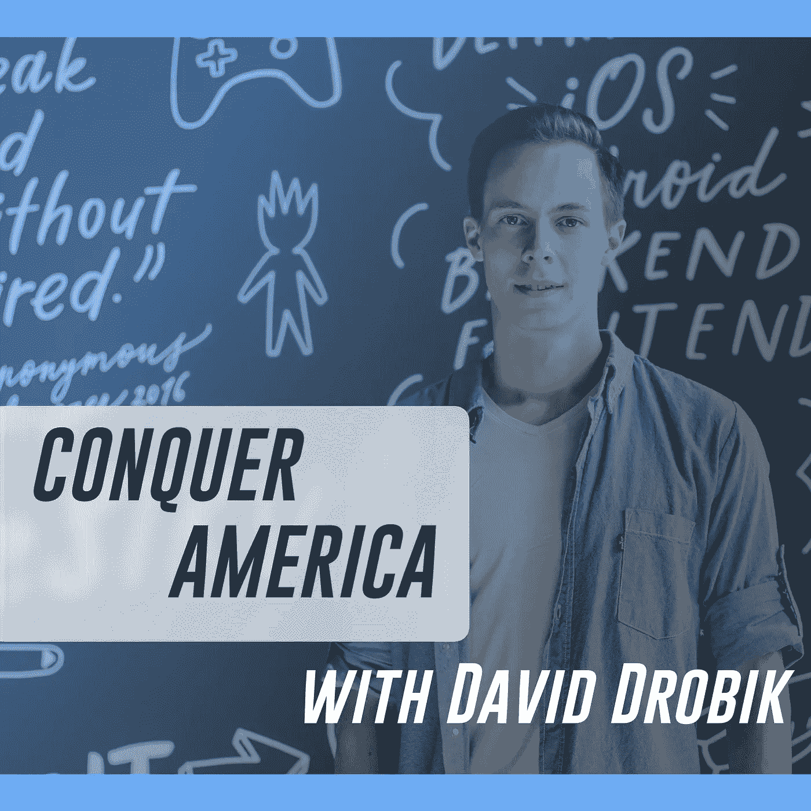
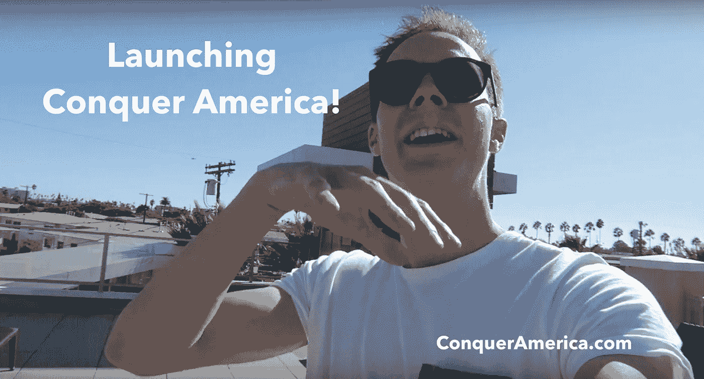

# 征服美国播客

> 原文：<https://medium.datadriveninvestor.com/the-conquer-america-podcast-442b3e5642d5?source=collection_archive---------47----------------------->

我决定为希望在美国获得成功的欧洲创业者推出一个播客！

Introducing Conquer America!

## 背景故事

2015 年 12 月 4 日，我抵达旧金山，此后一直在硅谷忙碌(我最近搬到了洛杉矶，但那是另一回事了)。

每次我回到我的祖国捷克共和国，都会有当地的企业家来找我，希望将他们的业务拓展到强大的美国市场。

我经常会被问到这样的问题，“我应该怎么做才能让我的产品进入美国，我应该如何找到合作伙伴、投资者或第一个客户？”

由于我接触到一些顶级企业家，他们正是这样做的——来自国外，在美国这里取得了巨大成功——我决定让他们回答这些常见的问题，希望能帮助你们中的许多人成功地扩展到美国！

我采访过全明星企业家，比如 [Shazam](https://medium.com/u/cb2a0fe3db56?source=post_page-----442b3e5642d5--------------------------------) 创始人克里斯·巴顿、Prezi 创始人[彼得·阿瓦伊](https://medium.com/u/42cfc23173e0?source=post_page-----442b3e5642d5--------------------------------)、[图罗](https://medium.com/u/fe2b8fd18bc?source=post_page-----442b3e5642d5--------------------------------)首席执行官[安德烈·哈达德](https://medium.com/u/d3fecedd6d04?source=post_page-----442b3e5642d5--------------------------------)或[亚历克斯·伊康](https://medium.com/u/e75ab2f825be?source=post_page-----442b3e5642d5--------------------------------)，LuxyHair 创始人。

尽管这些企业家在国外创办或建立了自己的公司，但他们在美国有着成功的记录。

## 是给谁的

因此，如果你是一个雄心勃勃的欧洲企业家或骗子，希望在这个广阔、多样但无情的市场中做大，无论你是希望扩大现有产品还是重新定位并从头开始， [**征服美国**](http://www.conqueramerica.com) **都适合你！**

现在可以在: [iTunes](https://itunes.apple.com/us/podcast/about-conquer-america-podcast-for-european-founders/id1405756355?i=1000414926652) 、 [Spotify](https://open.spotify.com/show/4mkwrhPh7WjL26Lh12KOnO?si=i1R0UXKVTaKTP84XpdSmrA) 或 [Stitcher](https://www.stitcher.com/podcast/david-drobik/conquer-america-with-david-drobik) 上下载。

## 了解更多:[ConquerAmerica.com](http://www.conqueramerica.com)

在 insta gram[上关注我的旅程](http://instagram.com/daviddrobik)。

