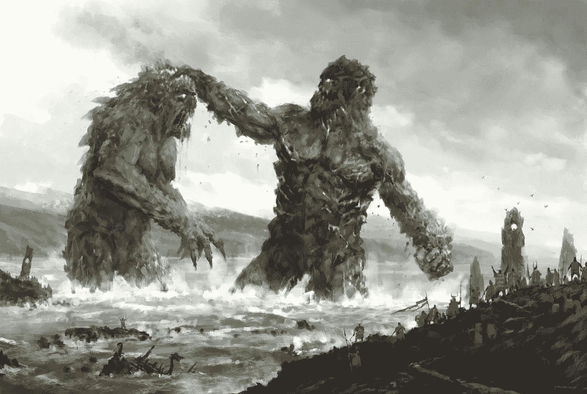

# 内容战争:巨人的游戏

> 原文：<https://medium.datadriveninvestor.com/the-content-wars-a-game-of-giants-ca8cc9344683?source=collection_archive---------10----------------------->

内容创作成本高昂——据报道，仅《权力的游戏》第八季就花费了 HBO 9000 万美元。肯定有初创公司试图推进内容的前沿，无论是虚拟现实等技术还是印度等新兴市场。但总的来说，这是一场巨人的游戏，他们正在激烈地战斗。这篇文章将强调新兴技术公司和传统媒体之间的三个关键趋势。

**后来者**

排名不分先后的四大巨头是网飞、谷歌、苹果和亚马逊。这里的三个趋势是**钱，钱，钱。**

 [## 苹果会成为新的网飞吗？-数据驱动型投资者

### 有可能。然而，该公司肯定会与大公司竞争。许多人不得不看到这一天的到来…

www.datadriveninvestor.com](https://www.datadriveninvestor.com/2019/02/15/will-apple-be-the-new-netflix/) 

后来者中的王者可以说是网飞，它在 2018 年花费了 120 亿美元，预计在 2019 年达到 150 亿美元。考虑到这家 1650 亿美元的公司在 2018 年有 150 亿美元的收入和 34 亿美元的自由现金，这是一笔巨大的支出。这里的答案是杠杆，即公司通过债务为自己融资，期望这种投资在长期内会有回报。

谷歌已经从单纯的音乐视频转向所有视频并制作原创内容，同时重塑品牌并整合 Youtube Premium 下的所有内容。该公司更大的争论仍然是是否押注于基于订阅还是免费广告驱动的内容。

苹果公司的计划已经成型，而且对该公司来说不同寻常的是，这些计划被公开披露。目前估计的预算是 100 万美元的 2B，大约有 20 集将于 2019 年完成拍摄。

亚马逊像其他后来者一样许可和制作内容，但越来越关注流媒体直播电视。根据其最新提交的文件，该公司今年将支出 70 亿美元。

**现任者**

传统媒体一直在积极应对，三个趋势是更多的数字倡议、石墙和整合。

Hulu 是数字计划的一个典型例子，迪斯尼拥有 60%的股份，康卡斯特拥有 30%的股份，还有 10%的股份在出售后尚未分配。还有许多其他类似的财团，尽管结果喜忧参半。

石墙保护包括阻止电影和电视权利，但不止于此。例如，正如最近的[网飞争议所显示的](https://deadline.com/2019/03/steven-spielberg-criticized-for-plan-to-block-netflix-oscars-1202568520/)，好莱坞一直在允许后来者进入奥斯卡之间摇摆不定。

迪士尼是**整合**的典型，例如[以 713 亿美元收购福克斯](https://techcrunch.com/2019/03/20/disney-closes-it-71-3b-fox-acquisition/)。这增加了他们不断增加的投资组合，包括皮克斯和卢卡斯艺术，这就是我们如何得到一系列星球大战电影的原因。谈到并购，业内其他公司也纷纷效仿。

那么谁赢了？这些战争会导致内容寡头垄断还是围绕发行的规模经济使天平向一边倾斜？喜欢并评论离开。

*这些都是专注于实践见解的短文(我称之为 GL；dr —良好的长度；确实读过)。如果它们能让人们对某个话题产生足够的兴趣，从而进行更深入的探索，我会感到非常兴奋。这里表达的所有观点都是我自己的。如果这篇文章有对你有用的见解，请给个赞，任何想法请留言。*