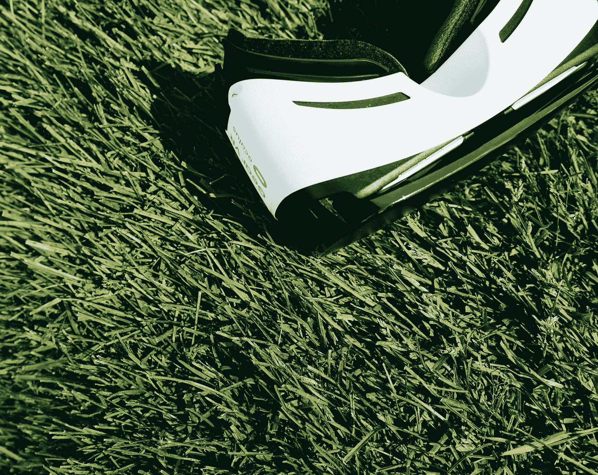

# 人工智能和虚拟现实的融合——你能期待什么

> 原文：<https://medium.datadriveninvestor.com/the-convergence-of-ai-rv-what-you-can-expect-849c8f435eda?source=collection_archive---------27----------------------->

在技术领域，融合是合乎逻辑的一步。就在几十年前，你可能需要一个专用的寻呼机、电话、摄像机、相机、手持游戏设备、GPS 追踪器和随身听来做智能手机单独做的事情。我们开发技术只是为了以后能更好更大的成果。

当我们谈论现代创新时，有两项技术非常突出——虚拟现实(VR)和人工智能(AI)。一个目标是为我们创造另一个现实，另一个则试图让计算机拥有感知和洞察力。近年来，我们已经采取了巨大的步骤来完善这两者，人们不能忽视将两者结合起来以揭示无限可能性的想法。

融合人工智能和虚拟现实可以创造一些令人难以置信的环境。

# 增强型虚拟购物

如果你一直生活在岩石下，你可能不知道虚拟购物已经是一件你可以在下订单之前在虚拟环境中试用产品的事情。凯迪拉克的虚拟现实展厅和[在混合现实](https://www.standard.co.uk/tech/new-vr-headset-that-lets-you-shop-clothes-in-mixedreality-stores-to-frame-future-of-fashion-a3857586.html)的帮助下购买衣服已经成为现实。

8 号店的团队展示了一款虚拟现实移动应用程序，让购物者能够在虚拟的约塞米蒂体验露营装备。该公司的创新创始人凯蒂·芬尼根说:

> “你可以在你将要使用的环境中看到帐篷，”她说。“你可以拉开拉链，进去，躺在地上说，‘你知道吗？“这太紧了，”然后用手滑动试试另一个帐篷。”

你觉得这很棒，是吗？现在想象一下，引入一个从客户行为、需求和习惯中学习的人工智能。随着足够的和管理良好的人工智能的注入，虚拟现实环境将变得更具交互性和功能性。品牌和零售店可以引入人工智能驱动的虚拟销售人员，他们可以提出建议，听取客户反馈，甚至进行销售。

这不仅有利于客户，也有利于企业。他们将获得一个巨大的机会，在集体和个人层面上了解客户的态度、模式和行为。这将使他们能够为虚拟现实环境带来更高水平的个性化，为客户提供方便和高效的服务。作为回报，顾客会更有可能把钱给那个只为他量身定制体验的品牌。

# 旅游业的革命

技术和旅游业是相辅相成的，如果有任何行业能够通过充分利用人工智能和虚拟现实实现巨大飞跃，那就是旅游业。一些公司已经拥抱了未来，正在使用虚拟现实让他们的潜在客户一瞥他们所能提供的和可以亲身体验的东西。

当谈到旅游或度假时，它不是关于小的部分，而是整个体验。AI 和 VR 在这里的智能结合可以让一个已经很棒的假期变成一个难忘的假期。人工智能可以用于涉及决策的所有方面，而虚拟现实可以复制环境，给人们一个未来的视觉想法。

Booking.com 全球客户服务总监 James Waters 认为，他们 80%的客户更喜欢自己获取旅行信息，而不是直接与预订助理、销售人员等合作。因此，Booking.com 开发了一个人工智能后端，可以帮助个人完成搜索和预订，而不需要中介。像[航班预订、机票处理和酒店预订](https://www.forbes.com/sites/kathleenchaykowski/2018/04/10/the-vacation-predictor-how-the-fastest-growing-flight-booking-app-is-using-ai-to-transform-travel-hopper/)这样的事情可以由人工智能软件处理，使整个过程变得方便高效。

另一方面，虚拟现实可以被旅游公司用来在潜在顾客真正去某个地方之前将他们带到那里。技术融合最大的好处是它带来了互利。这是双赢的局面。图片不错，视频更好，但模拟现实的虚拟环境是最接近真实体验的。

# 游戏和娱乐

毫无疑问，赋予虚拟现实新生命的行业是游戏。生活在游戏中而不是玩游戏的可能性是令人兴奋的，游戏社区愿意为此花钱。 [Oculus Rift 就是后来被脸书收购的](https://www.theverge.com/2018/8/28/17792166/oculus-vr-rift-go-headsets-education-classrooms-taiwan-japan-seattle)的成果。

虽然随着进步和持续的发展，VR 已经摆脱了游戏的阴影，但 VR 的主要份额来自于几乎十年前支持它的同一行业。很多头戴设备如索尼 PSVR、HTC Vive、Oculus Rift、谷歌 Cardboard 等已经可供消费者使用，并且为这些耳机开发的应用程序的很大一部分是游戏。

游戏中的 VR 已经蓬勃发展，但我们应该感到兴奋的是将 AI 引入游戏领域。有趣的是，[视频游戏也被用来训练人工智能](https://www.forbes.com/sites/bernardmarr/2018/06/13/artificial-intelligence-the-clever-ways-video-games-are-used-to-train-ais/#1f1e24b94743)。如果你玩过电子游戏，不管是哪种媒介，你都会知道唯一有能力做出决定的智慧生物就是你。无论你玩的是第一人称射击游戏，开放世界游戏，还是角色扮演游戏，非玩家角色或 NPC 一直都是机械的。

它们本身没有任何问题。然而，它们只是不能根据玩家的动作来行动，而是遵循开发者已经编写好的硬编码算法。随着 AI 在游戏中的引入，我们将能够让非玩家角色更加智能，他们将有足够的能力做出自己的决定，使游戏更加互动和有趣。在吸引玩家方面，人工智能可以不断提高游戏的质量。

“white and black VR Box headset on green grass field” by [Scott Webb](https://unsplash.com/@scottwebb?utm_source=medium&utm_medium=referral) on [Unsplash](https://unsplash.com?utm_source=medium&utm_medium=referral)

# 结论

人工智能和虚拟现实本身都是伟大的技术。然而，进一步的伟大在于趋同。如果不同的行业可以走到一起，他们可以将人工智能驱动的虚拟环境缝合在一起，这与现实不会有太大差异。难怪我们已经称之为扩展现实(er)。VR 是服务内容的视觉媒介。然而，虽然它是一个非常现实的，但它仍然是一个媒介。通过人工智能引入感知将赋予它所需的人情味，并将帮助它为企业和消费者打开成千上万新机会的大门。

*原载于 2018 年 8 月 30 日*[*【www.datadriveninvestor.com*](http://www.datadriveninvestor.com/2018/08/30/the-convergence-of-ai-rv-what-you-can-expect/)*。*