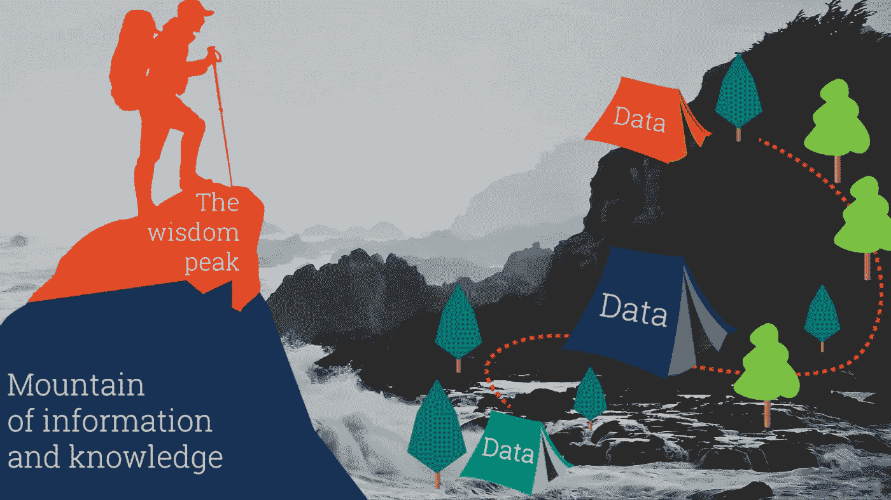
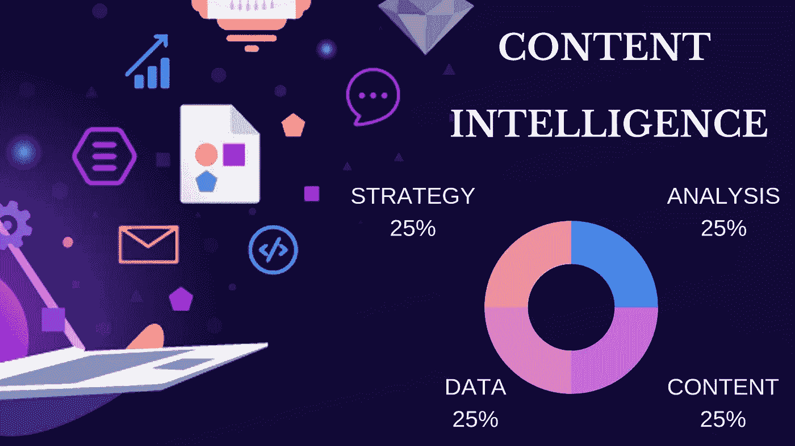

# 数据和内容之间的关联—为什么它很重要

> 原文：<https://medium.datadriveninvestor.com/the-correlation-between-data-and-content-why-it-matters-b7161f11d59f?source=collection_archive---------9----------------------->

“内容为王”这句话，你可能已经听过一百遍了。但是皇室的其他成员是谁呢？让我们对此进行挖掘和深入研究。

如果说当前数字化时代内容为王，那么数据绝对是女王。内容作为一个国王，是解释所有这些数据并将其转化为信息，最终转化为知识和智慧的直接渠道。信息就像一个失去控制的雄心勃勃的孩子——一个环境王子。尽管知识来源于信息如何通过不同的多尺度系统进行处理、链接和存储，但它就像所有这些术语的教母一样，等同于目的和意义。教父的头衔属于智慧——它支配所有的意义并赋予最终的目的。

 [## 数据科学和软件工程哪个更有前途？数据驱动的投资者

### 大约一个月前，当我坐在咖啡馆里为一个客户开发网站时，我发现了这个女人…

www.datadriveninvestor.com](https://www.datadriveninvestor.com/2019/01/23/which-is-more-promising-data-science-or-software-engineering/) 

在当今时代，技术进步和万维网已经重塑了全球在线市场，并引起了企业管理系统的剧变。这就是为什么要了解广域网本身的动态，就必须了解什么是数据和内容，以及它们如何相互作用以帮助人们和信息系统共存。

计算机主要是为处理和操作数据而设计的。今天，人们使用计算机来处理、制作和调查内容。反过来，数据是具有固定值、严格模式和可测量意义的信息位的组合。像数据一样，内容也是信息，但在不同的上下文中有不同的含义。

数据和内容当然有鲜明的特点，但它们的不同并不意味着它们没有关联。在暴露给最终用户之前，它们被链接在一起，并且可以以多个明确定义的系统可访问的方式存储。

内容是包装在简单数据中的信息。捕获、积累和分析数据在创建引人注目的相关内容方面发挥着重要作用。数据本身并不意味着什么，它只有一种解释，并倾向于执行编程或基于代码的决策。数据应该为内容服务，为用户提供高质量的内容。然而，为了定义在用户旅程的每一点上什么内容表现最好，数据就来了。而数据和内容之间的协同效应叫做[内容智能](http://www.curata.com/blog/content-intelligence/) (CI)。

CI 是营销人员用来收集数据并从中获得经验的技术。内容智能意味着理解每一条内容，它如何与多个受众交流，它如何有效地实现某些目标，或者它唤起了什么样的情感。它有助于充分利用数据的潜力，从而使品牌和消费者之间的互动非常有效。

总而言之，我们该如何处理这些无穷无尽的数据和信息呢？理论上，有些系统或技术可以管理任何任务，收集、存储和处理数据——这就是今天一些最引人入胜的进步正在发生的地方。

毫无疑问，人工智能(AI)、[、机器学习(ML)](https://developers.google.com/machine-learning/guides/rules-of-ml/) 、[和深度学习(DL)](https://medium.com/iotforall/the-difference-between-artificial-intelligence-machine-learning-and-deep-learning-3aa67bff5991) 的发展正在将技术革命带到一个全新的水平..事实上，开发人工智能和神经网络的人是我们。我们正在教计算机像人类一样思考、检查和理解世界，但方式更快、更精确。只有人类才能引导人工智能走向成熟——这是我们的选择。