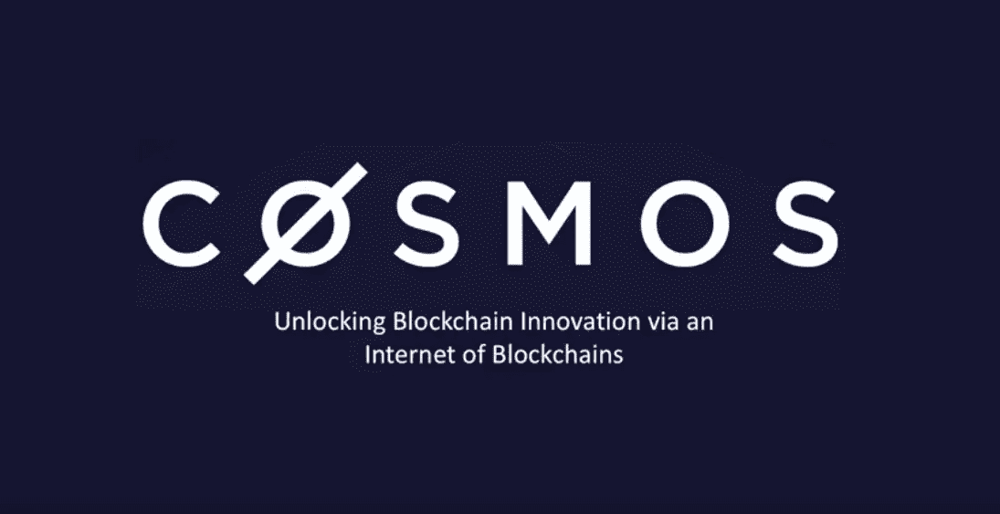
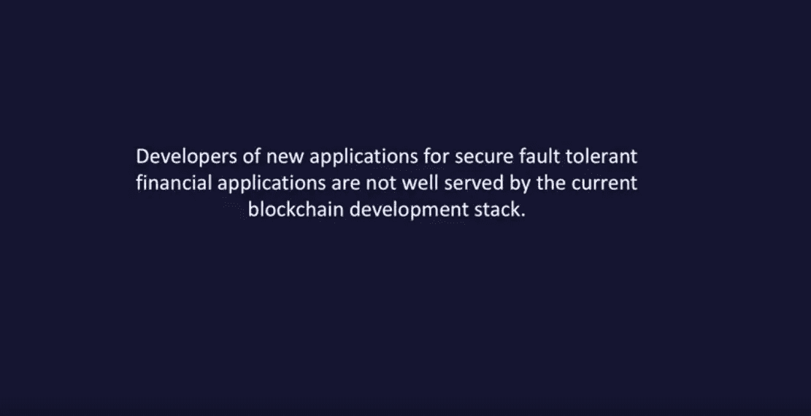
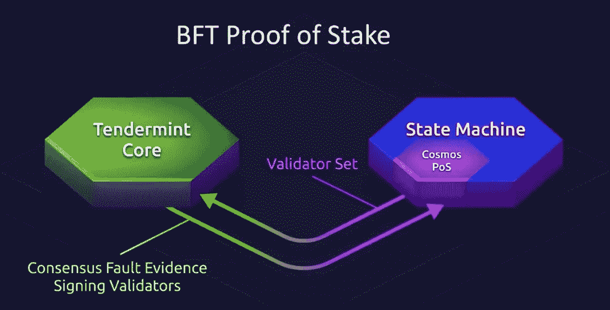
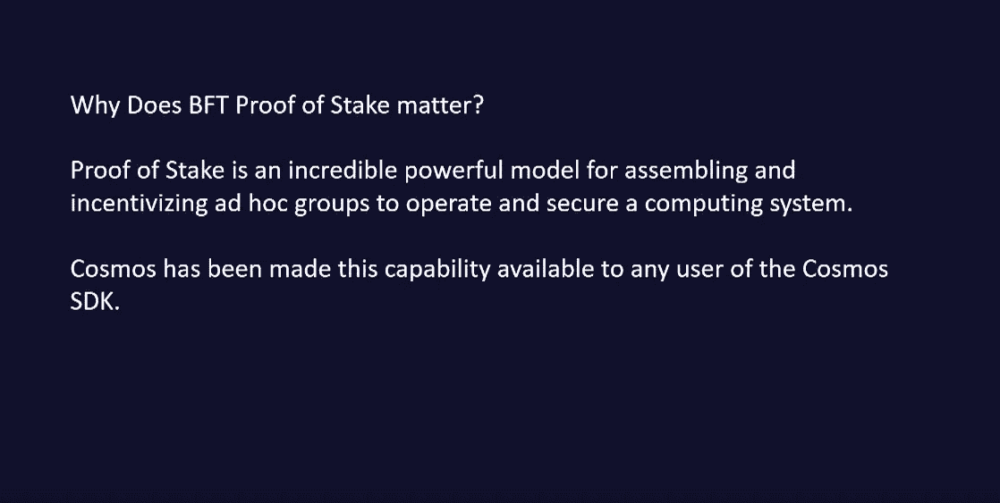
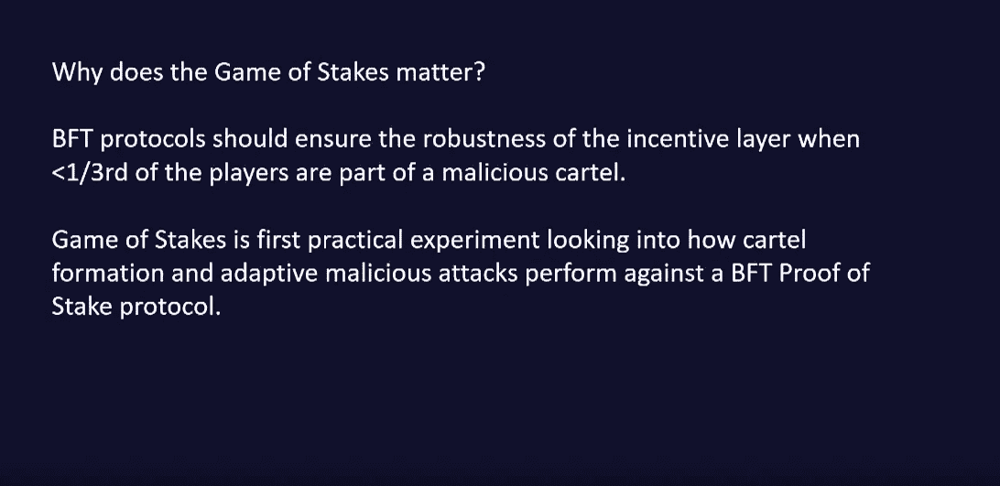
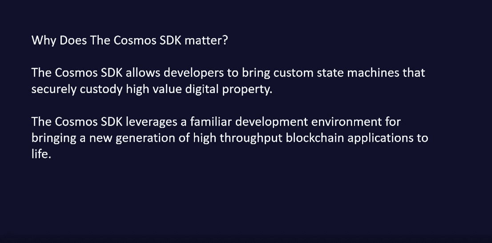
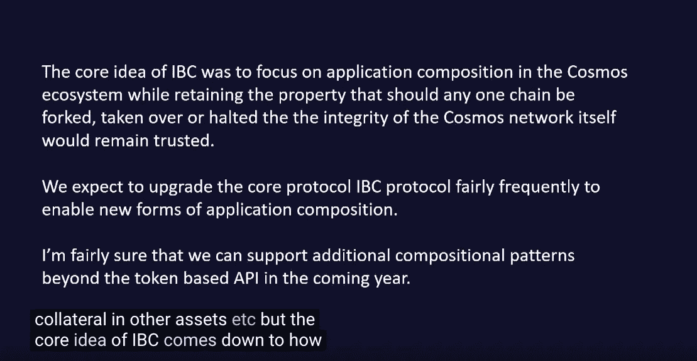

# 宇宙堆栈和 Web3 的速度

> 原文：<https://medium.datadriveninvestor.com/the-cosmos-stack-and-the-velocity-of-web3-61f0ccbe730a?source=collection_archive---------24----------------------->

Zaki of Tendermint/Cosmos

以下是 10 月 23 日星期二在柏林举行的 Cosmos web 3 峰会的 Zaki Maian 演示的幻灯片。

## 建设新区块链的自然需要:

*   新的密码原语
*   新的一致性算法
*   新的设计目标:证据与数据

## 嫩薄荷

*   将 BFT 共识研究成果引入工程界
*   Idea 是 2014 年冒出来的，2015 年成熟
*   一个成功的测试网:盖亚测试网

## 宇宙是如何形成的？

*   Cosmos-SDK: Tendermint 作为一个强大的共识引擎
*   快速终结，这导致真正高效的轻客户端协议
*   区块链间通信协议:区块链之间的安全数据传输
*   经济主权:利用自己独立的 PoS 系统

## 博弈论实验

*   人们如何利用宇宙激励层:安全偏好，BFT 部分同步系统
*   攻击系统:Tendermint 足够健壮吗？
*   结果不会阻止 mainnet 的启动

## 构建 Cosmos-SDK 的漫长道路

*   现有模块:治理，账户，赌注，削减，奖励和费用，IBC
*   构建任意的加密经济协议:定制的经济层，带有打桩和切割模块
*   构建分散的应用程序:客户规模的高吞吐量

## 宇宙的核心愿景

*   IBC 区块链通信层:横向可扩展的生态系统，无损耗连接的生态系统
*   使用令牌接口相互交互
*   传输令牌>>数据传输

## 使用案例:

*   零售数字资产
*   分散交易所
*   稳定的硬币

## 可扩展的区块链系统

*   如何处理区块链失败:道硬叉
*   如何处理恶意验证器集
*   维护安全属性:没有随机验证器选举，也没有渔夫