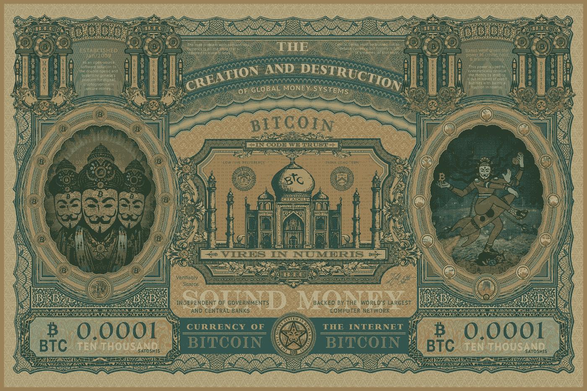
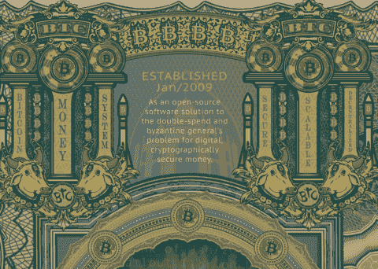
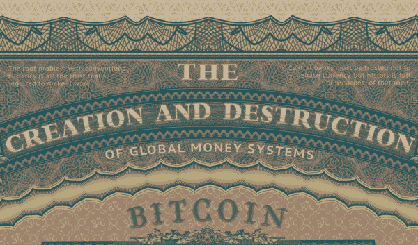
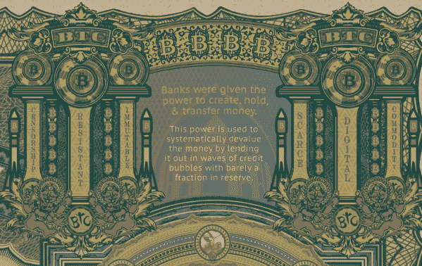
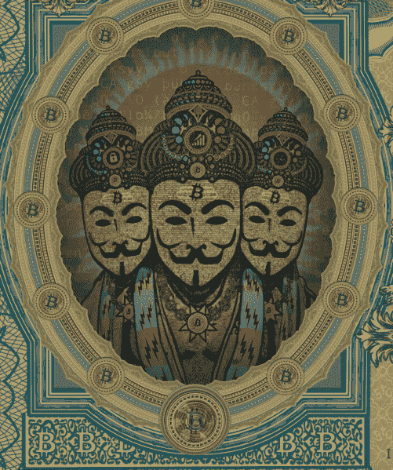
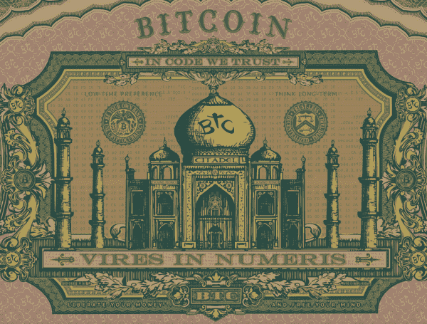
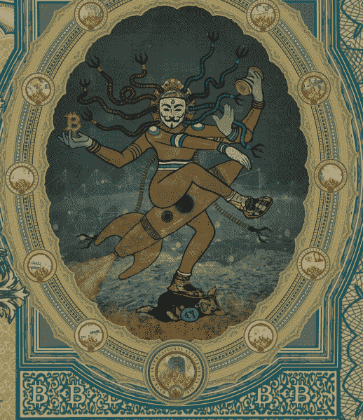

# 全球货币体系的建立和毁灭

> 原文：<https://medium.datadriveninvestor.com/the-creation-and-destruction-of-global-money-systems-8a04f96b09e2?source=collection_archive---------6----------------------->

这件名为“创造与毁灭”的艺术作品结合了纸币和数字绘画风格，展现了比特币激增及其内在双重性的新观点，代表了全球货币体系的创造和毁灭。

该图像讲述了一个视觉故事，其中包含大量的细节和信息。例如，右手边的每个小圆圈包含一幅被火焰吞没的法币拼贴画。如果你仔细观察，你会发现更多。

 [## 区块链会引发全球金融体系的动摇吗？数据驱动的投资者

### 2008 年的金融危机表明(对一些人来说),大型金融机构需要被密切关注和…

www.datadriveninvestor.com](https://www.datadriveninvestor.com/2019/01/11/will-blockchain-trigger-a-shakedown-of-the-global-financial-system/) 

这幅作品参考了东方神话，通过类比突出了比特币作为货币系统的重要性，以及大规模采用比特币对中央银行系统的影响。

让我们把它分成几个部分，浏览下图。

**1.a(左上)**

在这个框架中，我们看到两组三根柱子。

*   第一组柱子上写着“比特币”、“货币”、“系统”。这介绍了一个基本事实，即比特币不仅仅是一种数字货币。这是一个货币体系。人类历史上最好的。
*   第二组支柱是“安全”、“可扩展”、“分散化”。在加密货币领域，这被通俗地称为“可扩展性三元悖论”。

中间的文字写着“成立于 2009 年 1 月，是一个开源软件解决方案，解决了双重花费和拜占庭将军的加密安全货币问题”。

这突出了比特币被创造出来的时间，更重要的是，比特币作为一种技术解决了在比特币之前出现的其他数字货币遗留下来的未解决的问题。

其他细节包括每个支柱上方中心有比特币的 asic 矿工脸，以及下方神圣的比特币公牛。整个图像中的圆形“BTC”标志，是由印度教/佛教传统中常用的“om”符号修改而来。

**1.b(中上)**

这个框架显示了标题，它作为一个上下文来连接下面的中心图像。

在左上角，在“创造”的上方:“传统货币的根本问题是让它运转所需的所有信任”。

在右边，在“破坏”的上方:“必须相信央行不会就货币问题展开辩论，但历史充满了对这种信任的破坏。

这两句引语都是转述自 Satoshi 的在线文章。理解这些概念需要设想比特币作为全球货币系统的未来。

**3.a(右上)**

镜像左上角的框架，还有两组柱子。

*   第一条写着“审查制度”、“抵制”、“不可改变”。抵制审查是一个长期的过程，因此需要两大支柱。这一特点非常重要，值得强调。出于相关的原因，不变性很重要。
*   第二组支柱是“稀缺”、“数字”、“商品”。

这两组支柱的共同点是，这些都是比特币比法定货币更好的原因，法定货币不具备这些特征。

**2.a(中左)**

这显示了对作为印度教创造之神的梵天的聪的惊人描绘。Satoshi Creator 角色有三个头，周围是比特币 genesis 代码和太阳的背景，所有这些都是创造的表现。

Satoshi 创造者披着一件象征比特币闪电网络的闪电衣，戴着区块链项链，上面有 6 面比特币太阳以示魅力。

可扩展性三重困境在这个框架中重现在 Satoshi 的三个皇冠上:1)锁，代表“安全”，2)指数增长的条形图，代表“可扩展性”，3)去中心化的数据图像，代表“去中心化”。

另外，表冠上更精细的细节包括用相位表示的看涨和看跌的月亮，以及简单地用对称图案的彩色圆圈描绘的买入/卖出墙(深度图)。墙之间是两个橙色的圆圈，象征着比特币在买入/卖出墙中间的现场交易。

**2.b(中-中)**

这个框架是这幅图像的中心部分，展示了一座被改造成比特币城堡的寺庙。这一节给你的感觉是，比特币的未来确实是光明的。

“在代码中，我们信任”和“在数字中的权限”提醒我们，比特币是人民的运动，城堡提供了繁荣和宁静的愿景。寺庙两侧的小字写着“声音”、“金钱”。

城堡是指一个自称时间旅行者的 Reddit 帖子，他声称今天的比特币人都生活在未来的城堡中，这些城堡被描述为富人的高级社会。

城堡的两边都有山顶。

*   左冠写着“做自己的银行”、“使用加密货币”，上面印着“低时间偏好”的字样。
*   右冠上写着“不可信”、“不可变”、“分散”，上面印着“考虑长远”的字样。

使用比特币和其他可验证的稀缺加密货币促进了用户的低时间偏好，鼓励储蓄，用短期快乐换取长期价值的增长。

**2.c(中右)**

这幅画描绘了印度的毁灭之神湿婆。原始“跳舞的湿婆”形象背后的细节和象征意义是非凡的，因此，有许多联系要建立。

该图像位于椭圆形框架中，代表菲亚特世界和中央银行系统。这个框架上有 12 个标志。这 12 个徽章中有 11 个是著名的法定货币，正在被大火烧毁。第十二个标志是国际清算银行。

跳舞的 Satoshi 角色有一组 8 只触须，灵感来自《黑客帝国》电影中的哨兵。这象征着比特币作为一种基于先进技术的货币系统，也旨在作为一种全球货币使用，可以到达所有使用中央银行法定货币的国家。

这个角色站在一只穿着西装的猪背上，猪背上有一个小盾，盾上有国际货币基金组织(IMF)的徽章。

在猪的后面是用成堆的法定货币(美元、欧元)创造的山，它们被来自两个来源的火焰点燃:

1)从钱堆的基数或基础，即债务；

2)舞蹈中的聪乘坐的火箭的火焰。

在 Satoshi 的右手中，有一枚由火焰制成的比特币，代表着毁灭的力量。右手有一个比特币鼓，代表创造力量。

手臂上也有纹身“创造”、“毁灭”，方向相反。这又一次提醒了我们力量的双重性。

**3(全底段)**

此部分在两侧显示最接近(四舍五入)100 卢比和 1 美元的比特币的面额:一万 satoshis (0.0001)。

这种面额应该在相当长的一段时间内相关，如果比特币的相对价值增加 100 倍，达到 1，000，000 美元，它就像一张 100 美元的钞票。

中间部分写着“健全的货币”，并添加了进一步的描述，“独立于政府和央行”，“由世界上最大的计算机网络支持”。

就在这一部分的下面是一个徽章，上面有一个和上面人物一样的 Satoshi 面具。会徽周围的文字写着“人类历史上最好的货币体系”。

这个标志是两个椭圆形框架的标志的组合，比特币在中央银行系统中盛行，显示比特币在国际清算银行大楼和火焰中盛行。

**原文:**

【luchopoletti.com/blogs/artwork/creation-and-destruction 

> 这幅作品限量发售 21 幅 36-48 英寸的大幅印刷品。
> 
> 可用版本如下:[https://luchopoletti.com/collections/collectors-edition](https://luchopoletti.com/collections/collectors-edition)
> 
> 如果你有任何问题，想法，有趣的事实，请在下面评论或发电子邮件给我在 luchopolettiart@gmail.com