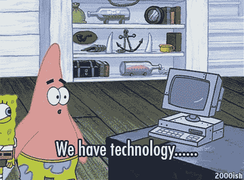

# 创造性逻辑学家

> 原文：<https://medium.datadriveninvestor.com/the-creative-logician-9fecc3967c6f?source=collection_archive---------22----------------------->

人类对抗机器。如果流行文化教会了我们什么，那就是机器要来抓我们。他们想把我们当作电池，把我们从地球上抹去，奴役我们。好吧，也许这不是真的(非常感谢好莱坞)。机器和电脑使生活变得更加容易。想象一下，没有闹钟叫你起床，没有咖啡机煮咖啡，没有微波炉热早餐，没有汽车开车去上班，没有电话源源不断地播放摇滚乐果酱。对我们来说，没有机器和技术的生活将会很艰难。

Patrick gets it

随着技术的不断进步，我们也需要适应。历史已经表明，新技术可以令人难以置信地**创新**并且能够**从根本上**改变我们所知道的生活。亨利·福特的装配线将装配一辆 T 型车的平均时间从 12 小时以上减少到 2 小时以下。第一次商业跨大西洋飞行花了 25 个小时，而最快的轮船航行花了 3 天多。首批数字可编程计算机之一 ENIAC ( **电子数字积分器和计算机)**，占地 1800 平方英尺，重 50 吨，而你口袋里的 iPhone 的计算速度快了近 13，000 倍。这些令人难以置信的进步使人类能够将精力集中在更复杂的问题上，而不仅仅是日复一日地工作。今天，自动化和人工智能处于技术进步的前沿。是时候**为未来**做准备了。

More computing power than the computer used for the calculations of the hydrogen bomb

自动化是一个流行词，在全国各地的公司会议室里回荡。随着市场竞争的加剧，公司寻找简单的方法来降低成本。其中之一是通过**运营**成本，即通过**尽可能多地自动化**流程。从简单的 excel 宏到专有的自动化处理界面，公司希望尽可能消除日常业务中的人类接触。自动化的使用把繁忙的工作交给了电脑和机器，让人类可以专注于其他事情。

然而，在我们开发程序和监控过程时，这仍然需要某种形式的人工交互。这就是人工智能发挥作用的地方。随着人工智能技术的快速发展，人类干预的需求正在稳步下降。像 IBM 的沃森这样受欢迎的人工智能通过数据分析和机器学习的“批判性思维”展示了人工智能的力量。

Watson raking in the dough

这意味着机器可以告诉其他机器做什么。如果天网和来自母体的机器的影像开始在你的脑海中出现，没关系，看起来机器不会来抓我们…暂时不会。这确实意味着人类需要开始以不同的方式思考。为什么要让 5 名员工完成一个手工流程，而一个电脑上的**程序**却可以做到，而且不需要他们的人类同事带来的福利、PTO 和 sass 成本？

使用计算机和人工智能进行严格的数据分析给了我们**机会**去调谐到我们大脑的其他方面，而不是纯粹的逻辑右脑思维。这种类型的思维是左右脑活动的混合，可以彻底改变你对“批判性思维”的看法。我们必须成为**创造性的逻辑学家**。

在从银行到工程的大多数公司工作中，右脑思考和逻辑是优秀员工的一些主要素质。你分析信息和数据，选择正确的行动方案。然而，对于人工智能来说，正确的行动路线可能已经为人所知。这意味着以前的思维方式，依靠逻辑和数据，是不必要的。这就是左脑发挥作用的地方:我们创造性、自发性和创新性思维的地方。随着运营和其他工作变得更快自动化，人类需要适应这种思维方式，以便在不断变化的商业环境中脱颖而出，创造新的工作和职业道路。

创意逻辑学家的概念包括几个关键的想法:积极的想法、整体的方法和创新。这不是你怎么想的问题，而是你怎么想的问题。能够在问题出现之前就设想出解决方案，意味着你能够引领潮流。通过全面的方法，你需要从各个方面来看待一个问题，强调强调以人为本的观点。迎合人们的感觉和情绪，你可以利用计算机和人工智能缺乏的力量。这些品质可以让你从人群中脱颖而出，拓宽你的视野。

随着运营和其他工作的自动化，对创造力和艺术出路的渴望将继续增加。这也可以通过社交媒体的受欢迎程度来看。通过 Instagram、Etsy 和 Dribble 等资源，艺术和其他形式的艺术表达对人们来说触手可及。越来越多的创意变得非常成功，非常受欢迎。将艺术激情和努力转化为职业、商业和生计手段的能力意味着更多的需求和机会。通过这些新的艺术形式，我们可以锻炼左脑肌肉，成为更强的创造性逻辑学家。就连初创行业的起飞也表明，这种思维方式会让你与众不同。

Digital nomads: finding passion and living life

重要的是要记住，尽管看起来机器、人工智能和其他形式的技术正在接管我们的生活并偷走我们的工作，但我们可以**适应**并享受新形式的成功。不再需要**执行**单调而平凡的任务来让一个公司一步步上升成为“成功的”，我们可以作为创造性的逻辑学家找到成功和满足感。找到我们的激情和支持自己的方式，交织左右脑输出，将是未来成功的关键。所以从小事做起，在日常生活中发挥创造力。在工作中，寻找解决其他人一直回避的问题的方法。在你的空闲时间，开始一项新的爱好:摄影、诗歌和绘画都是不错的选择。这种艺术思维方式将融入你的日常生活，彻底改变你的认知。拥抱人工智能和计算机，因为它们让我们成为更好的人。

之前发布在我的博客 myqlc.blog 上。