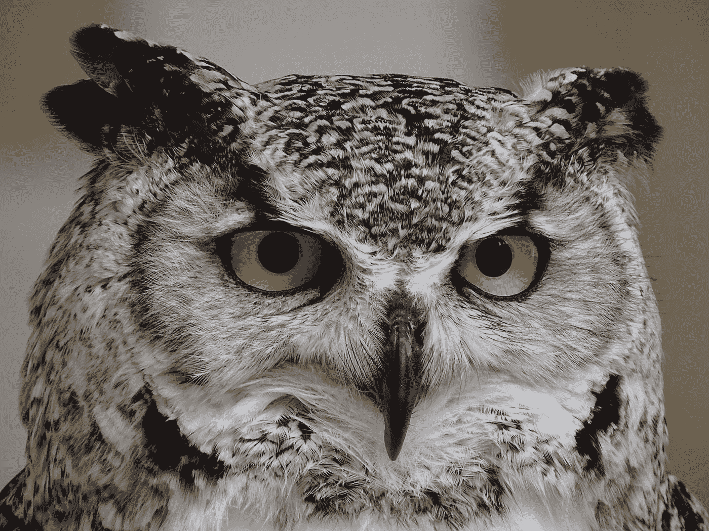
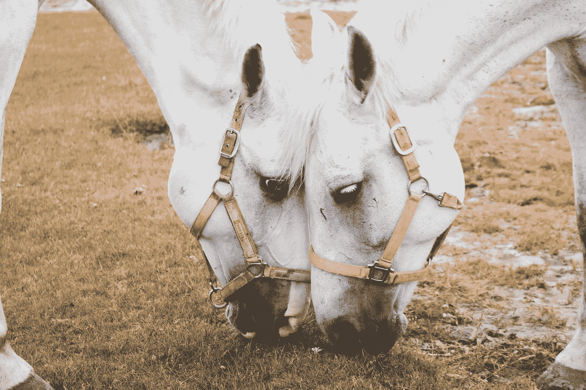

# 当涉及到办公室设计时，企业思维是如何粉碎创造力的

> 原文：<https://medium.datadriveninvestor.com/the-criminal-stupidity-of-corporate-think-when-it-comes-to-office-design-cf312970a7bc?source=collection_archive---------22----------------------->

by [Headway](https://unsplash.com/@headwayio?utm_source=medium&utm_medium=referral) on [Unsplash](https://unsplash.com?utm_source=medium&utm_medium=referral)

昨天，我阅读并评论了 Aytekin Tank 关于开放式办公室设计的一篇好文章。更具体地说，就是脸书自豪地推出的最新、最棒的东西([https://medium . com/swlh/why-open-office-design-make-you-less-productive-95d 45 ffba 9 EB](https://medium.com/swlh/why-open-office-design-makes-you-less-productive-95d45ffba9eb))。

Tank 解决了一些迫使人们在开阔空间工作的固有问题。他们过去被称为“牛棚”脸书的开放式办公室设计也不例外。早在 70 年代初，当我在华盛顿特区当随军记者时，我们有相同的设计。虽然这给了我们的主管，Sgt. Shepard 一个简单的方法来观察我们在做什么(并确保我们低头看着我们的打字机)，但这种开放式的设计让我很难完成高质量的工作。

这几乎不是一个新的对话。关于办公室设计和生产力的问题一直存在。

Tank 认为小团队工作得更好。虽然表面上我可能同意他的观点，但更重要的是认识到我们每个人都有独特的完成工作的方式。团队规模只是一个组成部分。

这与我们偏好隐私还是互动、沉默还是喋喋不休有很大关系。

by [Annie Spratt](https://unsplash.com/@anniespratt?utm_source=medium&utm_medium=referral) on [Unsplash](https://unsplash.com?utm_source=medium&utm_medium=referral)

这里有一个例子。

一位朋友最近离开了一家价值数十亿美元的公司，部分原因就在于此。她是一名软件工程师。她需要完全安静或者她选择的背景音乐来帮助她集中注意力。她的开放式隔间就在销售团队成员的旁边，他们会不请自来地走进她的工作区，喋喋不休。

或者，他们会在她面前大声交谈，几乎无法集中注意力。

这种侵犯工作空间的行为压力极大。作为一个致力于第一次就把事情做好做对的人，这破坏了她的工作质量。有时候她会把这个带出去。其他人，她不能。

所以，这家公司又失去了一名优秀的员工。她并不孤单。这样的离开源源不断。通常是出于完全相同的原因。

企业在努力提高效率、节省资金和最大化生产的过程中，常常以对待机器人生产线一样的温和轻蔑对待高度个体化的人类。通过忽视每个员工的独特性，他们可以像脸书一样，假设一个新的、开放的设计会为**每个人**工作。

Photo by [Gustavo Scafeli](https://unsplash.com/@gustavoscafeli?utm_source=medium&utm_medium=referral) on [Unsplash](https://unsplash.com?utm_source=medium&utm_medium=referral)

即使你不熟悉荣格人格原型，简单的常识会告诉你，我们中的一些人喜欢互动，另一些人喜欢安静。有些人更喜欢团队的兼容性和和谐。其他人，努力推动目标聚焦。

这些基本类型中的每一种都有不同和独特的需求，以便把工作做好。这些需求与这些类型处理时间、人、情绪和任务的不同方式有关。要想成功，每个公司都需要这些独特的个性。通过对所有员工一视同仁，拥有全新开放架构的脸书保证了员工的不满、流动以及某些情况下的高压力。

有一种完全合理的观点认为，如果一家公司雇佣那些在开放环境中茁壮成长的人，你就会得到和谐。我会反驳说，雇佣 3000 名具有完全相同偏好的人可能有点挑战性。

即使你可以，你也很容易和太多太多相似的人在一起。这是一个根本性的问题。

成功的公司会根据工作风格的多样性(以及其他特征)来招聘员工，然后尽最大努力营造良好的环境。

我职业生涯的大部分时间都在训练荣格原型。有些人把它们称为迪斯克、迈尔斯·布里格斯、社交风格或许多不同版本中的任何一种。当一家公司投资风格培训时，有几件事变得非常明显:

1.  为什么某些人在开放的集体区域茁壮成长
2.  为什么许多人在同一个环境中呆了一段时间后就离开了
3.  如何通过办公室设计最大限度地发挥这些人的天赋和偏好
4.  通过为这些风格提供理想的工作空间，该公司确保了更高的生产率、工作满意度以及最终更高的利润

by [Bernard Hermant](https://unsplash.com/@bernardhermant?utm_source=medium&utm_medium=referral) on [Unsplash](https://unsplash.com?utm_source=medium&utm_medium=referral)

# 老大哥效应

当我们认为自己被监视时，人类会倾向于做出不同的行为。不可避免的是，在一个开放的空间里，我们怀疑有人在监视我们(不管是对是错)，我们更有可能希望*看起来*像是在工作，即使我们并没有工作。正如 Tank 在他的文章中指出的那样，研究表明，一直有观众——或者认为我们有观众——会让人们感到看起来很忙的压力。

我不能代表任何人。就我而言，有时我只需要思考。

这可能看起来像是我对甜甜圈分神了。或者内曼·马库斯的下一次大拍卖。你看不出我在专注于一个故事构思。考虑角度不同。或者用自己的方式解决一个复杂的问题。

事实是我在*思考*。创造。正如我们在迪士尼常说的那样，*构思*。周围有噪音或音乐，我做不到。大声的谈话或者某个白痴经理的出现，他认为如果我不拼命打字，我就不可能工作。

我可能会上网做…任何事情…只是为了看起来我在工作。事实上，我不是。最重要的是，我对此感到压力很大。

*出于恐惧。*

20 世纪 90 年代，我在 TeleCheck 公司担任全国培训经理。公司雇了一个老派的制造业家伙做我们的经理。他那古怪的想法是，只有当我们坐在办公桌前时，工作才会被完成。作为一个通过与人面谈、在他们的工作环境中与他们共度时光(这在当时对适当的培训设计至关重要)而学到最多东西的人，这是一个丧钟。最重要的是，TeleCheck 甚至没有给我们提供电脑。

我很难理解这种想法。但是现在你有了。我的经历并不独特。毫不奇怪，我没有坚持多久。

我目前是国际培训公司英国口语第一的高级顾问，该公司提供自己版本的这些原型。他们使用动物模型，这不仅使他们更容易记住，而且为考虑如何支持和最大限度地提高员工的幸福和绩效提供了简单的参考点。这里有一个很短的入门:

by [Rúben Marques](https://unsplash.com/@klaus_blaze?utm_source=medium&utm_medium=referral) on [Unsplash](https://unsplash.com?utm_source=medium&utm_medium=referral)

**猫头鹰:**有动力把事情做好。注重细节，私密，专注。

by [Luke Tanis](https://unsplash.com/@saluken?utm_source=medium&utm_medium=referral) on [Unsplash](https://unsplash.com?utm_source=medium&utm_medium=referral)

**狮子**:做事有动力。目标明确，努力充电。

由[保罗·尼科莱洛](https://unsplash.com/@paul_nic?utm_source=medium&utm_medium=referral)在 [Unsplash](https://unsplash.com?utm_source=medium&utm_medium=referral)

**猴子:**渴望获得掌声:极富创造力，精力充沛，出色的头脑风暴家。

by [Ibrahim Rifath](https://unsplash.com/@photoripey?utm_source=medium&utm_medium=referral) on [Unsplash](https://unsplash.com?utm_source=medium&utm_medium=referral)

**马:**乐于帮助大家相处:冷静、安静、善于倾听和建立共识。

我们都是这些风格的混合体，但有一种倾向于占主导地位。这种主导风格决定了我们喜欢如何工作，如何与他人共度时光，以及我们对时间和行动的需求。没有好坏之分。这些仅仅是*偏好*。

忽视或忽略我们的员工(至少也包括我们的客户)的这些强大的激励因素是糟糕的计划。

对风格如何决定员工绩效和偏好的深思熟虑，从根本上改变了围绕办公室设计、团队构成以及我们如何聘用和最佳利用人才的对话。

by [rawpixel](https://unsplash.com/@rawpixel?utm_source=medium&utm_medium=referral) on [Unsplash](https://unsplash.com?utm_source=medium&utm_medium=referral)

Tank 讨论了他的公司如何使用小团队模式来实现目标。

虽然这非常有用，但它回避了另一个问题。

根据定义，小团队更有效率。更加敏捷。

然而，团队中的成员对最终产品的质量有很大的影响。

理想情况下，一个团队代表了每一种风格。更好的是，你至少要确保年龄、种族、肤色、年龄、性别、背景的多样性。一方面，这保证了你们会有一个活跃的讨论。这也保证了在优先权上的一些冲突。在某种程度上，这是一件非常好的事情。最终你会得到一个更好的最终产品。

多样性*确保*创造力。

因为我们是自我参照的，所以当我们参加设计或营销会议时，我们从我们自然的风格偏好出发说话。这样做的价值在于，我们也代表了与我们有共同价值观的那部分人。这适用于我们的个人风格，种族或肤色或年龄或性别，以及任何其他识别因素。在哈佛商业评论的*的这篇文章中，有一个多元化的商业案例[https://hbr.org/2013/12/how-diversity-can-drive-innovation](https://hbr.org/2013/12/how-diversity-can-drive-innovation)。*

没有这些考虑，我们得到香草。

这是床、浴室和其他东西之间的区别，走进一家私人拥有的精品店，店主周游世界，寻找吸引她独特眼光的珍宝。

HBR 也有一篇文章谈到了太多的多样性:[https://HBR . org/2017/06/does-diversity-actually-increasive-creativity](https://hbr.org/2017/06/does-diversity-actually-increase-creativity)。就像所有的事情一样，一点点的关注会有很大的帮助。

by [Cal Engel](https://unsplash.com/@calengel?utm_source=medium&utm_medium=referral) on [Unsplash](https://unsplash.com?utm_source=medium&utm_medium=referral)

剽窃一个短语，

我们都知道一句既睿智又诙谐的谚语

骆驼是由一个委员会设计的马。

香草是大量公司实体的产出，这些实体通过将员工视为商品而非独特的个体，从员工身上吸取了内部创业的血液。

太多的多样性会堵塞公司的动脉。*与万物一样，平衡*。

公司越大，对员工个人和消费者个人的关注似乎就越少。这是效率的产物。利润率。对待他人，就好像我们在工作和生活中想要的大部分东西都是一样的，这要容易得多，也便宜得多。

那些口头上支持“多元化”的公司，然后转身为同样的人创造牛车体验，可能会被生产率下滑和人员流动弄得措手不及。雇员、消费者和整个社会的成本是巨大的。

在为*公司*撰写的一篇文章中。作家 Ariana Ayu 概述了员工离职的非凡成本:[https://www . Inc . com/Ariana-Ayu/the-magnificant-cost-of-unhappy-employees . html](https://www.inc.com/ariana-ayu/the-enormous-cost-of-unhappy-employees.html)。虽然有许多因素在起作用，但我认为这是其中之一:员工没有受到重视。对他们一视同仁是一种侮辱。

by [rawpixel](https://unsplash.com/@rawpixel?utm_source=medium&utm_medium=referral) on [Unsplash](https://unsplash.com?utm_source=medium&utm_medium=referral)

当我们重视个人时，无论这个人是为我们工作还是从我们这里购买，我们都会对他们的独特之处感兴趣。那我们就尽力迁就。虽然规模经济在某种程度上限制了我们，但向另一个方向大规模前进几乎肯定会导致不满、人员流动，充其量只能带来不温不火的结果，无论是决策过程还是沃尔玛货架上的产品。

正如坦克写道:

*525000 平方英尺*

*3 亿美元*

*3000 名员工*

***1 开办公室。***

我想知道，如果建筑师加拿大人弗兰克·盖里接受过某种风格训练，情况会有什么不同。

让我们与众不同是我们被聘用的原因之一。

公司有责任找到支持和最大化这些天赋的最佳方式，而不是剥夺个人和公司固有的创造力。

不，这不容易。但是这*值得*吗。