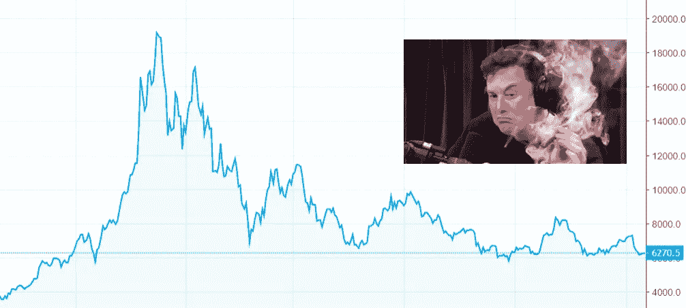
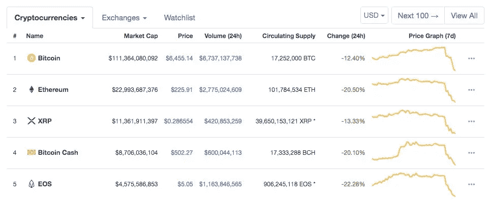
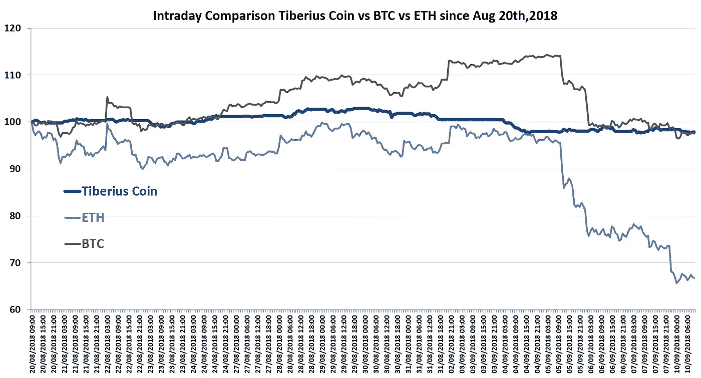

# 密码市场再次崩溃

> 原文：<https://medium.datadriveninvestor.com/the-crypto-markets-are-crashing-again-739e9c96cc20?source=collection_archive---------41----------------------->

上周对于加密货币投资者来说是一个充满压力的时期，因为市场暴跌，比特币在四天内损失了超过 17%的价值。

BTC 在 2017 年 12 月达到峰值，约为 17，000 美元，随后在 2018 年 2 月急剧下降至 7，000 美元。波动性是游戏的一部分，但这并没有让投资者更容易参与加密市场。

长期加密投资者可能理解这种下跌。尽管如此，当这种下降似乎成为常态时，很难将 cryptos 视为合法的投资工具。

## **这种波动是不好的**

随着代币不断发展以提供简化的投资机会，比特币、以太坊、Ripple 等传统密码正在暴露其本质——对新技术的投机性押注。

这并不是说密码市场只是一种赌博形式。

## **他们肯定不是。**

然而，如果我们想规范加密投资，我们需要找到克服这种破坏性波动的方法。当比特币、以太坊、Ripple 这样掉下去:

你知道你的市场缺乏稳定性。

# 是什么导致了这次事故？

大银行已经努力稳定加密市场。第一步是芝加哥商品交易所集团决定[创建比特币期货](https://www.cmegroup.com/trading/bitcoin-futures.html)。通过将比特币捆绑到期货市场，人们认为它将使价格正常化，并创造适当的流量。

尽管如此，市场继续见证大幅波动，因为某些事件导致波动性飙升，导致更大的跌幅。

最重要的是，高盛之前暗示他们希望创建一个加密交易平台。然而，他们似乎暂时搁置了这个想法。

正是这个消息，对大机构对加密技术不感兴趣的担忧，加上恐惧的投资者，导致比特币暴跌 17%。

如果你读得更深入，甚至有一个[传言，价值近 7 亿美元的 BTC 从丝绸之路转移到各种公共交易所](https://www.reddit.com/r/CryptoCurrency/comments/9cf4j3/silkroad_wallet_with_1_bn_in_bitcoin_on_the_move/)，导致许多人相信一场大抛售即将到来。

自八月中旬以来建立起来的所有善意在短短四天内化为乌有。作为一名投资者，当这种事情几乎在一夜之间发生时，你怎么能对加密市场有信心呢？

答案很简单。

# 像提比略硬币这样的资产支持代币是解决方案

像提比略硬币这样的资产支持代币不会以同样的方式受到波动性的影响。

## 为什么会这样？

因为每一枚提比略硬币都有其底层金属的价值支持。它的价值不会迅速下降，因为它所支持的科技、电动汽车和稳定金属不会迅速下降。金属市场太大了，不能这样下跌，因为它们的价值远远超过整个加密市场。

让我们看看上周的崩盘。

不像主要的密码(BTC，瑞士联邦理工学院和 XRP)，提比略硬币表现相当好。流行的密码是由非理性、感知价值和其他不可靠的来源推动的，而资产支持的代币，如提比略硬币，由于其背后的金属，具有合法的价值。

你看，每枚提比略硬币实际上也可以兑换成基础金属，使其成为一种投资工具、一种可交易的商品、一种[通胀对冲](https://www.tiberiuscoin.com/2018/08/Start_Protecting_Your_Life_/)，甚至是一种主要制造商可以用来创造科技产品的象征。

# 稳定和透明确实存在

虽然大多数代币都是投机性的赌注，但提比略硬币绝不是。你总是可以通过简单地检查支持它的主要金属来预测一枚泰伯利亚硬币的价值。

投资主要的密码没有错。这是投机游戏的一部分。但是，如果你想投机，你也应该花时间对冲你的赌注，保护你的投资组合。

提比略硬币让你轻松进入加密和数万亿美元的金属市场。所以，下一次 BTC 崩盘时，你就不会那么担心了，因为你的投资组合将部分免受这种非理性波动的影响。

提比略硬币将于 2018 年 10 月 1 日上线，我们已经准备好带给你你需要的改变，你准备好接受它了吗？

# 改变是好事。

保持最新的关于提比略硬币的信息。今天就加入[官方电报讨论吧！](https://t.me/tiberiuscoinofficial)

**JOIN OUR COMMUNITY!**

最初发布于:[https://www . tiberiuscoin . com/2018/09/The _ Crypto _ Markets _ Are _ Crashing _ Again/](https://www.tiberiuscoin.com/2018/09/The_Crypto_Markets_Are_Crashing_Again/)