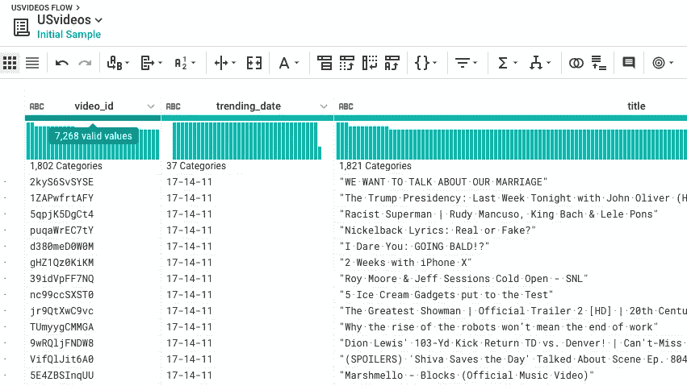
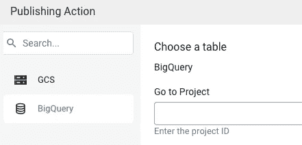
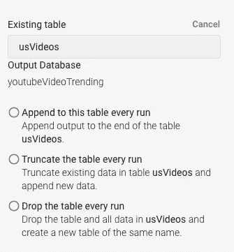
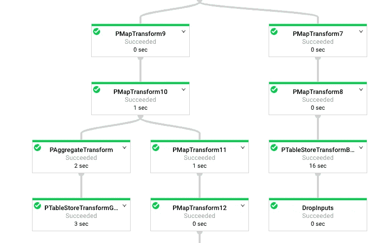
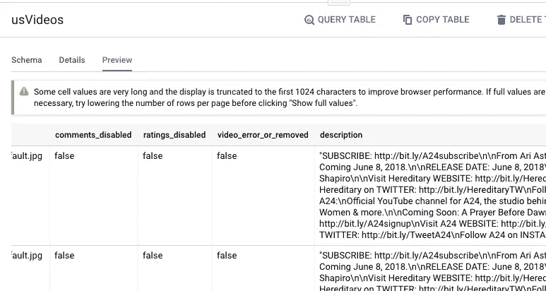

# 治愈将 CSV 摄入 BigQuery 的痛苦

> 原文：<https://medium.datadriveninvestor.com/the-cure-for-the-pain-of-ingesting-csv-into-bigquery-12ed5c2a5e2a?source=collection_archive---------4----------------------->

将 CSV 文件加载到 BigQuery？您必须至少遇到以下问题之一:

*   右双引号(")和字段分隔符之间的数据。
*   CSV 表遇到太多错误，放弃
*   无法将字段 Field1 的“Field1”解析为 double
*   不是 UTF 8 编码的
*   模式不匹配
*   在您的 CSV 文件中使用双引号“”

**您可能尝试过的解决方案:**

*   从 web 用户界面加载
*   使用命令行“bq load”加载
*   加载 python 代码
*   用 DML 语句加载
*   将 CSV 转换成 JSON，然后从 JSON 文件加载

*痛苦吗？抑郁？下来？感觉忧郁？*

*是的，我也是。*

**治愈将 CSV 摄入 BigQuery 的痛苦**

1.  将 CSV 文件从本地或云存储加载到 **DataPrep**

2.运行一个作业将数据接收到 BigQuery 中

Choose a project of BigQuery

创建新表或加载到现有表中

提交作业

数据流将选择作业并立即运行它

3 作业完成后，从 BigQuery 检查表

搞定了。这张桌子多漂亮啊！无痛苦的伟大开发者体验！

总而言之，诀窍在于 Dataprep 在源数据要求方面比 BigQuery 更宽容，允许数据肮脏、混乱、丑陋、<whatever come="" to="" your="" mind="">等。</whatever>

按照下面的过程，你会看到没有雨的彩虹。

## 来自 DDI 的相关故事:

 [## 数据科学和软件工程哪个更有前途？

### 大约一个月前，当我坐在咖啡馆里为一个客户开发网站时，我发现了这个女人…

medium.com](https://medium.com/datadriveninvestor/which-is-more-promising-data-science-or-software-engineering-7e425e9ec4f4)  [## 用 7 个步骤解释深度学习

### 和猫一起

medium.com](https://medium.com/datadriveninvestor/deep-learning-explained-in-7-steps-9ae09471721a)