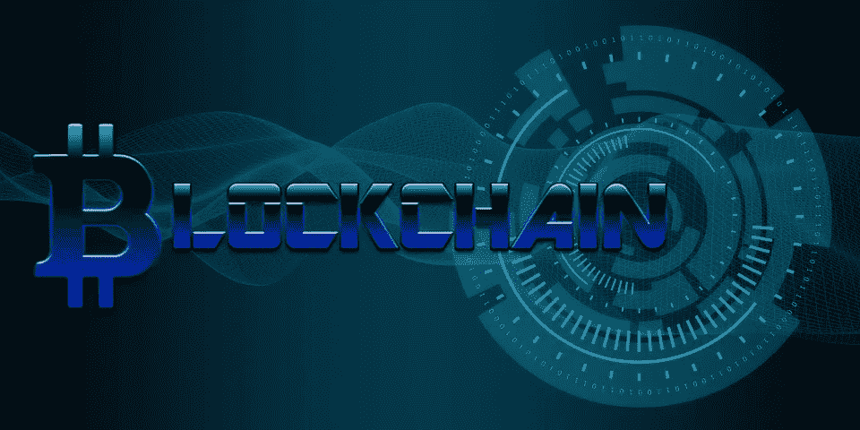

# 区块链空间的现状

> 原文：<https://medium.datadriveninvestor.com/the-current-state-of-the-blockchain-space-8b6973a46778?source=collection_archive---------8----------------------->

首先，我想说我非常热爱区块链科技和加密货币。它们有可能颠覆任何使用可信中间人的行业，并将直接控制权交还给最终用户。然而，正如任何技术革命和随之而来的范式转变一样，都有一个试错的过程。什么可行，什么不可行。我们和区块链科技公司目前正处于这个阶段。99%的市场是由纯粹的投机推动的。没有功能齐全的区块链产品能够满足大众的需求。区块链必须比现有系统更便宜、更快速、更易于使用，并且具有同等的可扩展性，如果不是更大的话。没有一个区块链项目可以证明完成了这一壮举…..还没有。

## 区块链尚未被发现的潜力

互联网的出现是 90 年代的技术革命，是 18 世纪末的工业革命。人类能力和成就的这些巨大飞跃改变了我们的整个现实，颠覆了几乎每一个成熟的行业。它们改变了我们旅行、互动、交流、做生意甚至思考的方式。我们曾经知道的一切都发生了翻天覆地的变化，生活变得更加美好，事情变得更加容易和高效。区块链技术的出现也是如此，信任的元素突然被放到了客观数字和计算机的手中。区块链是让计算机获得信任的第一步。听起来有点可怕，我会说它是。不过请放心，天网和终结者的时代还很遥远，除非我们开发出防止有自我意识的机器人成为现实的方法，否则我们应该是安全的。但现实一点，这种可能性有多大？！反正我跑题了。

区块链技术仍处于初级阶段。区块链速度慢，用户不友好，不可扩展，而且价格昂贵。例如，在以太坊上开发的 DApp 要求最终用户首先购买以太坊，然后每当他们在 DApp 中做某事时支付交易费。另一方面，EOS 要求开发者购买非常昂贵的 RAM 来开发 DApp，而用户却可以获得免费的交易…..只有在用户购买一些 EOS 之后，从 github 下载一个 EOS 钱包，创建一个密钥对并将 EOS 发送到那个密钥对。而不是吸引那些不太关心分权的普通消费者。关键是，在真正的主流采用发生之前，区块链理工大学需要成熟。UI 将是最重要的，治理也是如此。一个能够解决大量现实问题，在去中心化和治理之间找到平衡，同时提供速度、可伸缩性、成本效益和全面流畅的用户体验的区块链将是超越所有这些的区块链。

2018 年对区块链和加密货币整体来说是极其进步的一年。在创新方面取得了许多飞跃，区块链每天越来越多地进入全球意识。大规模采用的问题是何时，而不是是否会发生。我肯定很快就会看到这种情况发生，但就目前的情况来看，区块链空间仍然有一些成长的烦恼要经历。