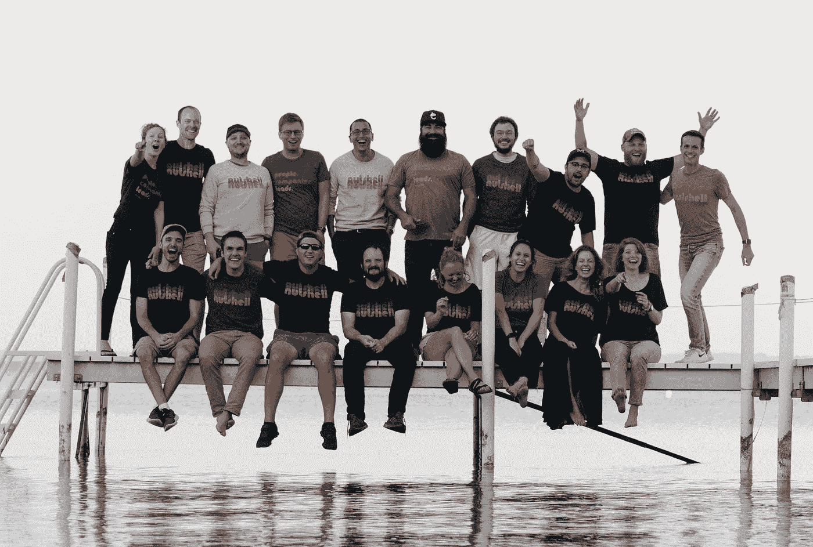
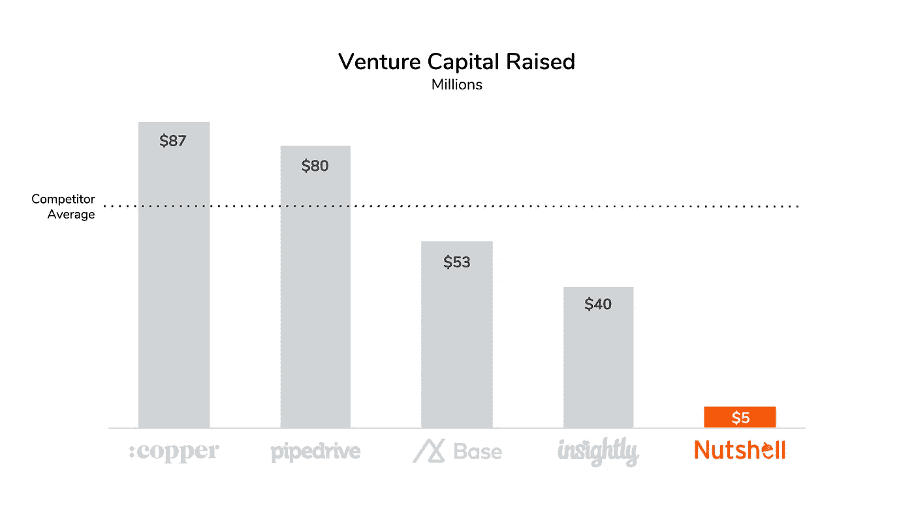
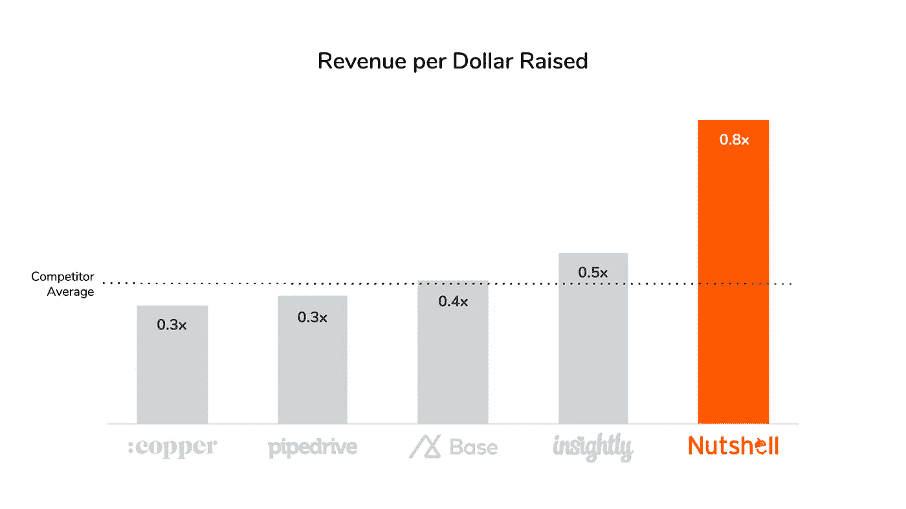
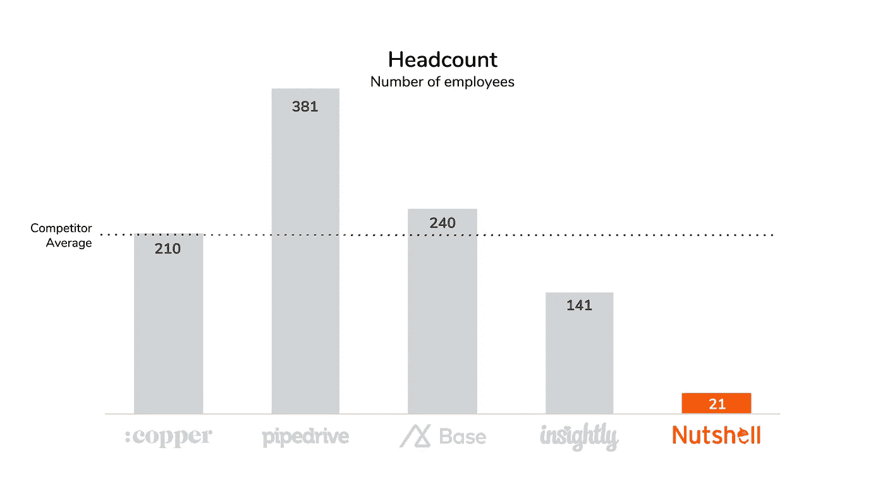
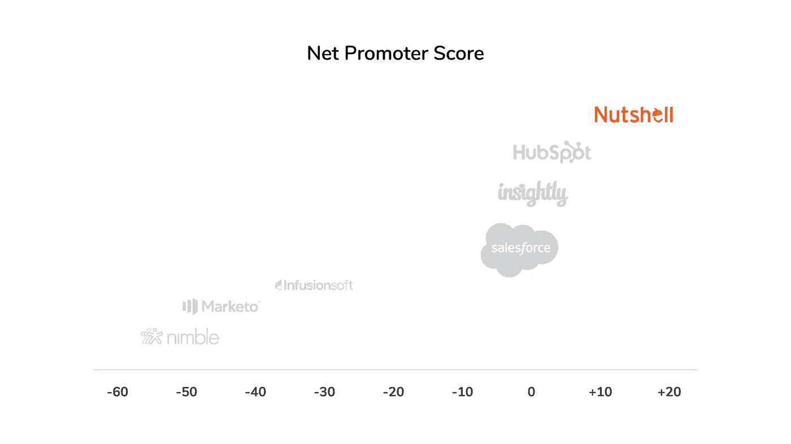

# 客户不在乎什么“规模”:你能得到什么资金，你要付出什么代价

> 原文：<https://medium.datadriveninvestor.com/the-customer-doesnt-care-what-scales-what-funding-gets-you-and-what-it-costs-you-e4e57a573a99?source=collection_archive---------39----------------------->

## 当谈到“中间人”时，我们的行业很有趣

我们毫不介意把独角兽捧在基座上，像崇拜偶像一样崇拜它们。我们很高兴庆祝彻底的失败(也许太多了)，因为你可以从那些大起大落、振作起来的人身上学到很多东西。

但是绝大多数科技公司更像是 T2 的果壳 T3。我们只是在做我们该做的。我们有足够的利润来维持我们的运营和投资未来的产品开发，但我们不会很快加入三逗号俱乐部。

这没关系，因为它让我们专注于重要的事情。

# 当你筹集资金的时候你会失去什么

金钱对公司如何决策有着巨大的影响。

当一家公司获得大量投资资金时，这些资金会带来一系列与客户需求不一致的预期。被数千万美元套牢意味着你必须不断想办法扩大你的客户群，从他们身上榨取更多的收入，试图为你的投资者赚更多的钱。

这种安排意味着**你的客户永远不会排在第一位**。由于你的公司必须为投资者提供每一美元的丰厚回报，更多的钱意味着更多的压力来关注“规模”的东西。

规模是指让你从相同的资源中获得更多收入的战略和战术。例如，人们普遍认为电话支持的可扩展性不如电子邮件或聊天支持，因为支持电话需要单个团队成员接听，并且会占用大量时间。将你的客户支持外包到海外，让那些支持代表按照他们自己的时间表通过电子邮件或聊天回复客户信息，要容易得多，也便宜得多。

因此，如果你曾经想知道为什么当你打电话求助时，拥有庞大团队、资金雄厚的大公司不拿起电话提供免费帮助，这就是你的答案:**它没有规模。**

融资的优势之一是你可以在营销上花更多的钱。然而，虽然这将让你获得更大的扩音器来接触潜在客户，但更大的营销预算会带来一些相当重要的负担，因为你的投资者会期待你用这笔钱疯狂地推动客户增长。

这也不意味着你的收入会有效增长。现在，我不知道我们每个竞争对手的确切收入，但我知道足够做出一个非常有根据的猜测。尽管 CRM 和销售自动化领域的其他公司比果壳公司多筹集了 8 到 20 倍的资金，但他们肯定没有 8 到 20 倍的收入。差得远。

他们也没有创造一个技术更先进的产品，或者更受用户欢迎的。只要看看任何软件比较网站，你就会发现，一般来说，我们都提供相当相似的功能。我们的产品同样受到高度评价，在用户评论中[经常超过我们的竞争对手](https://www.nutshell.com/blog/nutshell-named-crm-high-performer-g2-crowd-fall-2018/)，尤其是在易用性方面。(令人难以置信的是，CRM 用户分不清一个几百万美元、20 个人的产品和一个 9000 万美元、300 个人的产品之间的区别，但当然，风险投资的钱很少真正流向客户体验。)

那么，这让我们的竞争对手处于什么位置呢？他们有大量的资金和人员，但是他们的团队并不一定能开发出功能更强的产品，也不一定能更好地服务它。他们有更多的收入，但他们必须根据什么样的规模做出决策。

换句话说，**金钱影响着你提供给客户的产品和体验，在某种程度上，更多地受到投资者需求的引导。总有一天，小鸡会得到报应，当它们得到报应时，你最好有一个大而肥的窝在等着它们。**

# 掌控自己的命运是无价的

人们总是问我，是什么让坚果壳与我们的竞争对手不同。我通常描述我们对设计的不懈关注，以及它如何影响我们客户完成工作的能力。我还谈到了能够[记录和自动化您的销售流程](https://www.nutshell.com/tour/sales-automation/)的重要性，以及我们的信念，即公司应该能够使用最适合他们的软件，并且这些软件应该通过无缝集成在一个平台上很好地协同工作。

那都是真的。但这是不可量化的。因此，这是我们与竞争对手明显不同的另一个方面:

坚果壳几乎没有筹集到任何外部资金，我们从那些我们可以真正称之为朋友的人那里获得资金。事实上，超过 80%的公司由创始人、朋友、员工和我自己所有。这意味着我们掌握自己的命运，硅谷风险基金不会左右我们的决策。

从第一天起，我们就非常谨慎地考虑我们筹集多少钱，什么时候筹集，从谁那里筹集，因为像生活中的所有事情一样，钱是有条件的，你拿的钱越多，这些条件就变得越复杂。

另一方面，我们的竞争对手已经从硅谷投资者那里筹集了大量资金:

请注意，[基地最近将他们的公司卖给了 Zendesk](https://www.bizjournals.com/sanfrancisco/news/2018/09/11/zendesk-buys-base-sales-software.html) ，并且有传言称 Copper (fka ProsperWorks)正在考虑另一个大的回合。

现在，与我们的竞争对手相比，看看果壳每筹集一美元的收入:

这不是魔术。**没有沉重的财务负担意味着我们可以优先考虑正确的事情。**我们不担心什么是“可扩展的”,因为谢天谢地，我们不必担心，而且这对我们的客户来说很少是最重要的。(我认为从来没有人打电话给我们或发送支持票来询问我们的可扩展性。)接电话并主动帮助那些难以同步电子邮件的人不会让坚果壳成为独角兽，但它会确保那些对我们来说最重要的人不会被冷落。

人数呢？果壳拥有 21 名不可思议的团队成员，他们为全球成千上万的客户开发产品并提供支持。看看我们竞争对手的团队比我们大多少:

同样，那些拥有 100 多名员工的公司在做什么，与我们拥有 21 名员工的公司有什么根本的不同？(除了导致湾区房地产价格昂贵之外，这反过来又造成了科技行业的薪资泡沫，最终将彻底埋葬硅谷。不要让我开始。)

因此，虽然 Techcrunch 将继续报告我们的竞争对手的虚荣心指标，以及他们筹集了多少美元和雇佣了多少员工，但我们将保持低调，专注于反映我们实际上为人们服务得有多好的指标。

比如我们的 NPS 评分，比如:

当然，*真正的*成功指标是你的客户的成功、成长和快乐。如果你没有让他们的生活变得更容易，为什么还要麻烦呢？