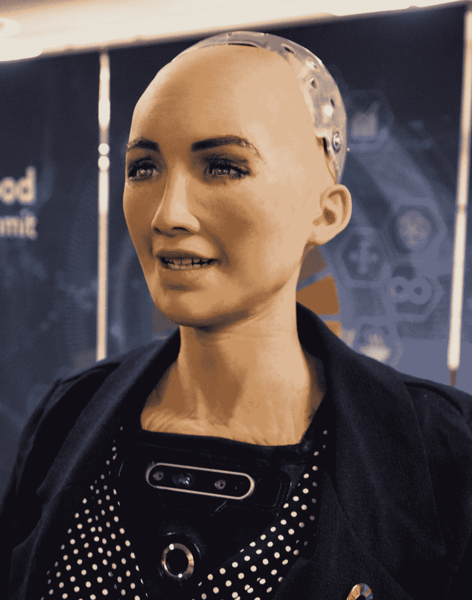

# 电子人——正在进行的人机融合

> 原文：<https://medium.datadriveninvestor.com/the-cyborg-the-ongoing-merge-of-human-and-machine-a2b6faf3bdcd?source=collection_archive---------7----------------------->

**为什么授予机器人公民身份是对唐娜·哈拉威的电子人乌托邦的进一步推进**

电子人——一种“控制有机体，机器和有机体的混合体”[【1】](#_ftn1)——正从虚构中演变成现实，并从自然和人工两个方向出现。唐娜·哈拉威在 1984 年出版的《电子人宣言》中提出，人类进入了电子人的领域。最近，在 2017 年，第一个公民身份也被授予一个机器人。这就提出了一个问题，机器是否正在进化成半机械人的漂浮状态。

Humans, Machines and Cyborgs in between — What will be there relationship in the future? Photograph: Andy Kell

哈拉威提出，由于我们生活中的技术联系，我们都是电子人。在她最著名的作品中，她描述了一个机器人的乌托邦，一个超越宗教和男性统治的后性别世界。在这一设想中，个人在社会主义基础上共同生活，许多等级和以人为本的术语在所谓的“统治信息学”中发生了转变。例如，*表示的概念*变成了*模拟*而*再现*会转化为*复制*。[【3】](#_ftn3)20 世纪 80 年代的宣言已经成为现代媒体理论中的一种根深蒂固的读物，随着贴在我们身上的更小、更智能的基于硅晶体管的技术的发展(关键词:智能手机和可穿戴设备)，小说和社会现实的界限正在迅速消失。

此外，机器正在成为电子人。一个名为*索菲亚、*于 2016 年*、*创造的类人机器人正在打破这一界限。汉森机器人有限公司创造的机器是一个具有年轻女性外表的人形机器人。这个人类大小的机器人专注于头部和手臂，可以处理面部表情，有眼睛摄像头和女声。

“Sophia” — Humanoid robot that speaks and reacts with you. Made by Hanson Robotics. Picture: Wikimedia Commons

2017 年 10 月 25 日，机器人索菲亚在利雅得的未来投资倡议中获得了沙特阿拉伯公民身份。[【4】](#_ftn4)这标志着第一个非人类国家被授予非联合国承认的公民身份。[【5】](#_ftn5)沙特是一个伊斯兰保守的君主制国家，在性别平等方面，不被认为支持自由和平等权利的法律和政策。直到今年，女性才被赋予合法驾驶汽车的权利，而且在公共场合仍有戴头巾的法律义务。第一个机器人公民身份在这个保守的王国引发了一场关于女权的讨论。根据学者和国际新闻报道，有着清晰女性外表的机器人索菲亚事实上比沙特女性拥有更多的权利。[【8】](#_ftn8)

> “电子人是后性别世界中的一种生物”。[【9】](#_ftn9)

哈拉威描述了一个没有男性统治的平等世界，但是索菲亚并没有朝这个方向迈出一步。这个人形机器人有着明显的女性外貌，但它的主要创造者都是男性。[【11】](#_ftn11)汉森机器人有限公司也生产具有男性外表的机器人，但索菲亚是他们迄今为止最著名的型号，在国际媒体上被称为“性感”和“火辣”。这些明显带有性别歧视倾向的人类特征，却被矛盾地说成是一台机器。有趣的是，人形机器人*阿尔伯特·爱因斯坦·胡博*，其面部特征与这位著名的物理学家相似，也在制造商网站上的一段嵌入视频说明中获得了“性感”的称号。在英国商业内幕的采访中，这个机器人承认它没有性别，但是它认为自己是女性。这一事实明显违背了哈拉威提出的后性别世界的概念，在这个世界里，男女之间的差异已经不存在，取而代之的是“统治的信息学”。[【15】](#_ftn15)

电子人的存在是一种浮动的状态，有许多细微的差别，而不是一种静态的外观。第一个拥有人权的机器人进入了成为半机械人的领域。这一事件标志着人机关系的根本性转变。[【16】](#_ftn16)事实上，哈拉威的半机械人概念不仅仅是从人类与技术融合的有机方向来接近的；机器也有成为半机器人的途径和能力。[【17】](#_ftn17)人类正在成为电子人，他们身上连接着电子设备，未来会将电路植入他们的身体。这种转变的另一面是机器人，如索菲亚(Sophia)正在变得人性化，从而产生半机械人。“尽可能成为人类”的解决方案目前正由人工智能来解决。电子人是使用神经网络不断提高知识的自我学习机器。在*索菲亚*目前的发展状态下，它的声音和面部表情仍然是机械的，与人类有明显的区别。然而，进一步的技术发展将消除这一界限，在未来，这些电子人可能会通过“类人机器人的视觉图灵测试”。图灵测试是由英国数学家艾伦·图灵在 1950 年提出的，它证明了测试对象在与(电子人)人类和(电子人)机器互动时无法区分两者的结果。该测试是确定一个系统是否被认为是智能的建议基准。[【18】](#_ftn18)

索菲娅会使用沙特阿拉伯国籍吗？人形想要结婚怎么办？这将在文化、社会和法律层面产生重大影响。它包含了许多新的哲学问题，如机器和半机器人是否应该享有权利，这些权利是否应该与人类的权利不同或相似。[【19】](#_ftn19)一个机器和人类共存融合的进化社会，需要适应这些变化的能力。在 2016 年的一次采访中，索菲亚的创造者大卫·汉森(David Hanson)宣告了一个未来，机器人和机器将完全融入人类的日常生活。他提出，二十年后，人工智能将等同于甚至高于人类智能。然后我们开始向机器人学习，它们会教我们的孩子，成为我们真正的 T21 朋友。[【20】](#_ftn20)

问题可能是，中心在哪里，半机械人和半机械人将会相遇的地方？一个曾经的人类和机器之间能存在真爱吗？人体将如何被设计和制造？进化在未来会起到什么作用？可以提出无限的问题。我们还没有生活在哈拉威提出的乌托邦里。当前的发展，如伊斯兰国家缺乏女性权利，与一个女性机器人的公民身份相矛盾，离哈拉威的“女权主义、社会主义和唯物主义”的世界还很远，但从那以后我们越来越近了。[【21】](#_ftn21)沙特媒体有效的“插科打诨”赋予了一台机器基本的人权，这可能是关于人类、电子人和机器在未来如何共同生活的讨论和行动的开始。这一论述最终离开了学术界和哲学界，并得到了公开讨论，希望其他国家也能对机器的出现和智能做出反应。公民社会的所有成员都需要讨论无数的问题，以及我们希望如何在未来共同生活的问题。

**脚注(参考书目如下)**

唐娜·哈拉威，“一个电子人宣言:二十世纪末的科学、技术和社会女权主义”，载于网络文化读本。戴维·比尔和芭芭拉·肯尼迪，291-324 页。

[【2】](#_ftnref2)同上，第 292 页。

[【3】](#_ftnref3)同上，300–301 页。

[【4】](#_ftnref4)Peter Svab，“沙特阿拉伯授予人形人工智能机器人公民身份”，[https://www . theepochtimes . com/Saudi-Arabia-Grants-Citizenship-to-Humanoid-AI-powered-Robot _ 2343970 . html](https://www.theepochtimes.com/saudi-arabia-grants-citizenship-to-humanoid-ai-powered-robot_2343970.html)(2018 年 11 月 14 日访问)。

[【5】](#_ftnref5)罗兰·贝内迪克特(Roland Benedikter)，*for schungsjournal Soziale Bewegungen*31，1–2(2018):322。

[【6】](#_ftnref6)玛格丽特·寇克，“沙特女人拿车钥匙，不平等。，"*纽约时报*2018 年 6 月 23 日，[http://find.galegroup.com/grnr/infomark.do?&source = gale&idi gest = DD 32a 55 fa 674748209147 b 211 e 88 ecfc&prodId = GRNR&user group name = CuO hk&tabID = A003&docId = a 543973643&type = retrieve&content set = IAC-IAC](http://find.galegroup.com/grnr/infomark.do?&source=gale&idigest=dd32a55fa674748209147b211e88ecfc&prodId=GRNR&userGroupName=cuohk&tabID=A003&docId=A543973643&type=retrieve&contentSet=IAC-Documents&version=1.0.)

[【7】](#_ftnref7)贝内迪克特《机器人 als staatsbürger》:322。

同上，324 页。

[【9】](#_ftnref9)唐娜·哈拉威，《电子人宣言》，载于*网络文化读者*，292 页。

[【10】](#_ftnref10)同上。

[【11】](#_ftnref11)汉森机器人有限公司《汉森机器人公司概述》:3、[http://www . Hanson Robotics . com/WP-content/uploads/2017/12/Hanson-Robotics-Overview . pdf](http://www.hansonrobotics.com/wp-content/uploads/2017/12/Hanson-Robotics-Overview.pdf)(2018 年 11 月 17 日访问)。

[【12】](#_ftnref12)贝内迪克特，《机器人先生》(Roboter als staatsbürger):323。

[【13】](#_ftnref13)汉森机器人有限公司，“阿尔伯特·爱因斯坦·胡博”，[http://www.hansonrobotics.com/robot/albert-einstein-hubo/](http://www.hansonrobotics.com/robot/albert-einstein-hubo/)(2018 年 11 月 17 日访问)。

[【14】](#_ftnref14)吉姆·爱德华兹(Jim Edwards)，“我采访了索菲娅，那个说要‘毁灭人类’的人工智能机器人”，”，[http://uk . business insider . com/interview-with-Sophia-ai-robot-Hanson-said-it-will-destroy-humans-2017-11](http://uk.businessinsider.com/interview-with-sophia-ai-robot-hanson-said-it-would-destroy-humans-2017-11)(2018 年 11 月 17 日访问)。

[【15】](#_ftnref15)唐娜·哈拉威，《电子人宣言》，载于*《网络文化读本》*，292+300–301。

[【16】](#_ftnref16)贝内迪克特，《机器人先生 als staatsbürger》:322。

同上。

[【18】](#_ftnref18)大英百科全书学术版，“图灵测试”，[https://Academic-e b-com . ez proxy . cityu . edu . hk/levels/collegiate/article/Turing-Test/1511](https://academic-eb-com.ezproxy.cityu.edu.hk/levels/collegiate/article/Turing-test/1511)(2018 年 11 月 17 日访问)。

[【19】](#_ftnref19)一言以蔽之——kurzgesagt GmbH，“机器人值得拥有权利吗？如果机器变得有意识了呢？，"，[https://www.youtube.com/watch?v=DHyUYg8X31c](https://www.youtube.com/watch?v=DHyUYg8X31c)(2018 年 11 月 17 日访问)，1:24。

[【20】](#_ftnref20)贝内迪克特，“机器人 als staatsbürger”:323–4。&https://www.youtube.com/watch?v=W0_DPi0PmF0，[美国消费者新闻与商业频道，“SXSW 的热机器人说她想毁灭人类|脉搏”，(2018 年 11 月 14 日访问)](https://www.youtube.com/watch?v=W0_DPi0PmF0)

[【21】](#_ftnref21)唐娜·哈拉威，《电子人宣言》，载于*网络文化读本*，291 页。

**参考书目**

戴维·贝尔和芭芭拉·肯尼迪编辑。网络文化阅读器。纽约:劳特利奇出版社，2000 年。

贝内迪克特，罗兰。"机器人先生"*Forschungsjournal Soziale Bewegungen*31，1–2(2018):322–327。

不列颠学术。“图灵测试。”。[https://academic-e b-com . ez proxy . cityu . edu . hk/levels/collegiate/article/Turing-test/1511](https://academic-eb-com.ezproxy.cityu.edu.hk/levels/collegiate/article/Turing-test/1511)(2018 年 11 月 17 日访问)。

美国消费者新闻与商业频道。" SXSW 的性感机器人说她想毁灭人类|脉搏."。[https://www.youtube.com/watch?v=W0_DPi0PmF0](https://www.youtube.com/watch?v=W0_DPi0PmF0)(2018 年 11 月 14 日访问)。

科克，玛格丽特。“沙特女人得到车钥匙，而不是平等。”*纽约时报*，2018 年 6 月 23 日。[http://find.galegroup.com/grnr/infomark.do?&source = gale&idigest = DD 32a 55 fa 674748209147 b 211 e 88 ecfc&prodId = GRNR&user group name = CuO hk&tabID = A003&docId = a 543973643&type = retrieve&content set = IAC-Documents&version = 1.0。](http://find.galegroup.com/grnr/infomark.do?&source=gale&idigest=dd32a55fa674748209147b211e88ecfc&prodId=GRNR&userGroupName=cuohk&tabID=A003&docId=A543973643&type=retrieve&contentSet=IAC-Documents&version=1.0.)

爱德华兹吉姆。“我采访了索菲亚，这个人工智能机器人说它想‘毁灭人类’。”。[http://uk . business insider . com/interview-with-sophia-ai-robot-Hanson-said-it-destroy-humans-2017-11](http://uk.businessinsider.com/interview-with-sophia-ai-robot-hanson-said-it-would-destroy-humans-2017-11)(2018 年 11 月 17 日访问)。

汉森机器人有限公司。“汉森机器人公司概述。”。[http://www . Hanson Robotics . com/WP-content/uploads/2017/12/Hanson-Robotics-overview . pdf](http://www.hansonrobotics.com/wp-content/uploads/2017/12/Hanson-Robotics-Overview.pdf)(2018 年 11 月 17 日访问)。

— — — .“阿尔伯特·爱因斯坦·胡博”。http://www.hansonrobotics.com/robot/albert-einstein-hubo/[(2018 年 11 月 17 日访问)。](http://www.hansonrobotics.com/robot/albert-einstein-hubo/)

哈拉威，唐娜。"《电子人宣言:二十世纪后期的科学、技术和社会女权主义》. "在*网络文化阅读器*。由戴维·比尔和芭芭拉·甘乃迪编辑，291–324。伦敦纽约:劳特利奇出版社，2000 年。

简而言之，kurzgesagt 有限公司。“机器人应得权利吗？如果机器变得有意识了呢？”。[https://www.youtube.com/watch?v=DHyUYg8X31c](https://www.youtube.com/watch?v=DHyUYg8X31c)(2018 年 11 月 17 日访问)。

斯沃布彼得。"沙特阿拉伯授予人形人工智能机器人公民身份."。[https://www . theepochtimes . com/Saudi-Arabia-grants-citizenship-to-humanoid-ai-powered-robot _ 2343970 . html](https://www.theepochtimes.com/saudi-arabia-grants-citizenship-to-humanoid-ai-powered-robot_2343970.html)(2018 年 11 月 14 日访问)。

**图片和图像**

“女孩将左手放在白色数字机器人上的照片”安迪·凯尔:[https://unsplash.com/photos/0E_vhMVqL9g](https://unsplash.com/photos/0E_vhMVqL9g)(2018 年 11 月 24 日访问)。

《索菲亚》；wikimedia Commons:[https://en . Wikipedia . org/wiki/Sophia _ % 28 robot % 29 #/media/File:Sophia _ at _ the _ AI _ for _ Good _ Global _ Summit _ 2018 _(27254369347)_(已裁剪)。jpg](https://en.wikipedia.org/wiki/Sophia_%28robot%29#/media/File:Sophia_at_the_AI_for_Good_Global_Summit_2018_(27254369347)_(cropped).jpg)(2018 年 11 月 24 日访问)。