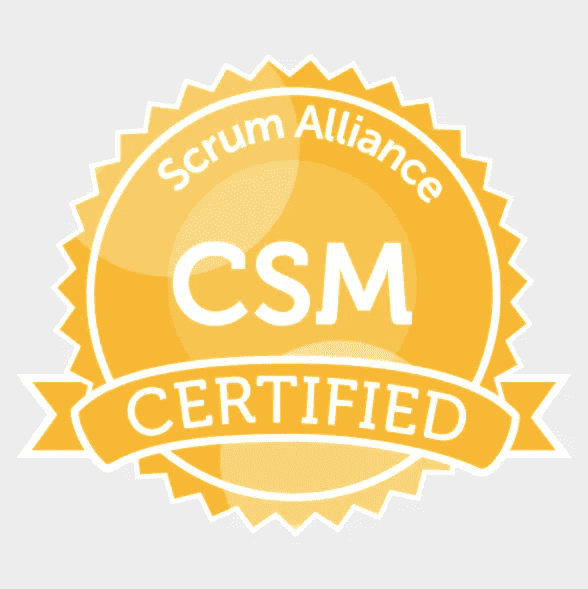

# 认证和作为技术人员的自学之间的舞蹈

> 原文：<https://medium.datadriveninvestor.com/the-dance-between-certifications-and-self-learning-as-a-technologist-279975c8630b?source=collection_archive---------15----------------------->

我选择通过为每一个对我重要的证书付费来拥有我的技术专家证书。我从来没有等待或有权利意识到我的雇主应该支付他们。在过去的 16 年里，我获得了一系列证书，包括 PMP、ITIL、CSM、CSPO、CSP 和 SPC。只有 itIL 基金会认证是由前雇主赞助的，因为他们向所有 IT 员工提供该认证。

在我职业生涯的特定战略点上，我利用我的认证获得了推动我职业发展的关键工作。所以，我当然明白证书可以帮助求职者找到工作。

有这么多的候选人申请职位，通常简历上的一个特定证书可以根据特定的过滤器决定申请是被考虑还是被拒绝。这在某些技术领域尤其重要，在这些领域，极具挑战性的认证证明了广泛的知识和经验。一些很好的例子包括 CISSP 安全认证和 CBAP 商业分析师认证。

虽然证书在获得工作机会的过程中起着一定的作用，但是许多证书仅仅证明了主动性。例如，考虑 Scrum Alliance 提供的两个一级敏捷认证:认证 ScrumMaster (CSM)和认证 Scrum 产品负责人(CSPO)。CSM 通过参加为期两天的课程(由认证的 Scrum 培训师进行)并通过一个简单的 40 题测试来获得。CSPO 更简单。只要参加由认证的 Scrum 培训师教授的为期两天的课程就可以获得。

不要误解我。我选修了这两门课程，它们对我很有价值。在作为敏捷实践者的后续角色中，我使用了来自每门课程的材料，由非常有经验和受尊敬的培训师讲授。

我在这里要说的是，因为像这样的认证不需要你已经是一个从业者，也不需要证明你的工作知识，所以在你的简历上有这些认证的价值在于，它们显示了你的主动性和对自己的投资。这是积极的，我很高兴承认获得 CSM 帮助我获得了我的第一个全职 Scrum Master 角色。

话虽如此，但在可预见的未来，我不打算更新我目前的认证或追求任何新的认证。

Photo by [Lubo Minar](https://unsplash.com/@bubo) on [Unsplash](https://unsplash.com/)

为什么？这其实很简单。在过去的五年里，我作为一名敏捷实践者，扮演着 Scrum Master 和/或敏捷蔻驰的角色。在那段时间里，我获得了与敏捷团队、产品负责人和其他支持角色一起工作的丰富实践经验。我已经在我目前的公司 [IHS Markit](https://ihsmarkit.com/index.html) 内部提供了广泛的培训(包括相当于两天的 CSM 和 CSPO 课程)。我也指导过许多个人和团队，帮助他们在敏捷角色中变得成熟。

简而言之，我获得的经验比任何证书都要多得多。

但这只是我不追求更多认证的原因之一。另一个重要原因是，我每周都会抽出时间给[刻意练习](https://medium.com/@rich_sevawise/musings-on-deliberate-practice-and-why-its-critical-for-those-of-us-with-no-defined-retirement-age-9584856a98af)。刻意练习指的是高度集中的学习，许多成功的专业人士声称每周集中学习五小时的相关规则是他们成功的关键。

我非常幸运，因为我有一个老板，他为他的团队实践并全力支持五小时规则。然而，虽然我们在工作时间抽出时间进行有意识的练习，但我们对职业的热情意味着我们也会选择在非工作时间进行高度集中的学习。

作为一个恰当的例子，我在 2019 年元旦写了这篇文章的大部分内容。而如果你觉得写作不是刻意的练习，那就需要试一试。写作是一个很好的练习，可以综合先前的知识并获得新的见解。你是否选择出版并与他人分享你的作品是次要的。

*专业人士可能犯的最大错误是不投资于他们的持续学习。*

Photo by [rawpixel](https://unsplash.com/@rawpixel) on [Unsplash](https://unsplash.com/)

世界正以惊人的速度变化着，我们都知道这一速度正在加快。那么，为什么有人会选择不投资于自己，以确保他们的技能和知识保持最新、相关和适销对路呢？

我只能想到三个原因。

1.一个人对自己所做的事情没有足够的热情去想学得更多。

2.一个人觉得他们的雇主欠他们培训，因此他们不应该在自己身上投资时间或金钱。

3.一个人在目前的工作中表现良好，对自己的职业发展感到满意。

让我们把这些分解一下。

#1.如果你对持续学习没有足够的热情，那肯定是你需要考虑做其他事情的信号。不幸的是，在你真正找到自己的激情之前，很难理解对某件事真正充满激情是什么感觉。

在成为敏捷实践者之前，我管理了一个传统的项目管理办公室将近五年。虽然我很成功，但我从未对那个角色有过真正的激情。我没有每周花几个小时在我获得项目管理专家(PMP)认证的基础知识上。如果我当时有现在这样的眼光，我会更快地寻找其他职业方向。

#2.权利从来都不是一个成功的公式。雇主对员工的投资程度差异很大。此外，雇主通常会为精选的员工支付一些一次性培训费用。那比再考一个认证好不了多少。真正持久深入的学习来自于刻意的练习。你必须主动与你的经理协商，以获得每周固定的学习时间。如果他们不愿意这样做，那就说明你需要了解你的经理和/或雇主。是时候投资自己了，在自己的时间里有意识地练习，找到一个更好的经理和/或雇主。

#3.使用特定技能很容易让人感到舒服，尤其是如果你的雇主对你的工作满意的话。然而，技术发展非常快，如果你还在使用五年前的技术，你的技能可能已经过时了。有一天你可能会醒来，发现自己往好里说被边缘化了，往坏里说被解雇了。

作为一名技术专家，永远不要满足于自己掌握的技术的技能和专业水平。

Photo by [Ben White](https://unsplash.com/@benwhitephotography) on [Unsplash](https://unsplash.com/)

如果有一天我发现自己正在面试一份敏捷实践者的新工作，但是因为我的证书不是最新的，所以没有得到这份工作，我该如何应对？

我会感谢这位未来雇主的坦诚，并认为自己很幸运，躲过了一颗子弹，没有带着错误的心态加入一家公司。如果他们把一张纸看得比可论证的专业知识和经验更重要，他们就不是我想加入的公司。

**关键要点**

利用特定目的的认证，在关键点上推进你的职业生涯。

充分利用你的能力，通过有意识的实践来重塑自我，促进你的持续成长，并成为你所在领域的领先技术专家。