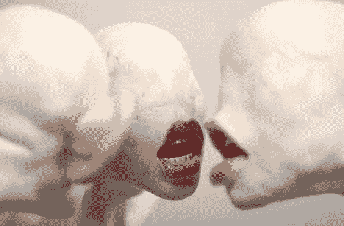

# 危险的社交媒体；对意识的威胁

> 原文：<https://medium.datadriveninvestor.com/the-dangerous-social-media-threats-to-awareness-80f5c2f49092?source=collection_archive---------4----------------------->

Sculpture by Choi Xooang

牛津词典将**知识**定义为:

> 通过经验或教育获得的事实、信息和技能；对某一主题的理论或实践理解

在人类历史的很大一部分时间里，获取知识是一项挑战性的艰苦活动，这种活动通常贯穿于各个时代。不同领域知识的快速增长使得任何人几乎不可能拥有所有领域的知识。因此，随着我们的成长，我们将需要在非常具体的领域具有深厚知识的专家之间进行更多的跨学科领域的整合。

信息技术的发展使得这种整合变得更加容易。此外，获取信息更容易，因此获取知识似乎不那么困难。只需在互联网上简单搜索并点击链接，你就可以获得 50 年前不容易获得的信息。这是危险幻觉的开始，这种幻觉似乎在全世界都很流行。

牛津定义的知识，并不意味着信息的可获得性，它意味着对一个主题的理论和实践的理解。互联网和社交媒体的革命性发展促进了可及性，但也导致了知晓的错觉，我称之为“**伪意识**”，这比不知晓更有害。伪意识是当一个人觉得她/他只通过阅读维基百科上的几行文字或阅读社交媒体上关于它的几个帖子就了解了一个主题。人类思维简化概念的自然倾向，对这种容易获得的“为傻瓜”收藏感到高兴。读几行卡夫卡的《审判》，或者读一段尼采的《查拉图斯特拉如是说》，你可能会产生一种错觉，以为自己理解了卡夫卡或者尼采所说的话。通过在网上浏览有关黑洞的内容，你会产生一种错觉，以为自己对这个概念有了一个物理学家的初步了解。

伪觉知比无觉知更有害，因为当你没有觉知，你知道你不知道一些事情，那么你可能会有学习的动力和接受度。另一方面，伪觉知带着知道的错觉，阻碍了学习过程。社交媒体的另一个副作用是反意识，这是错误的信息和愚蠢，包裹在一层薄薄的科学解释中。这是危险的，因为它感觉像是科学的，而实际上不是，观众可能无法辨别信息的无效性。

Designed by Kyle Bean

社交媒体的使用是提高认识和轻松传播信息的机会，可以更容易地获取事实、信息和技能，即知识，但同时，它也会导致伪意识和反意识的快速增长。对于知识分子来说，对付一个半知半解或错误学习的社会，比对付一个不知不觉的社会更困难。在后者中，学习过程导致进步，但在前者中，需要忘却和再学习，这往往被知识的幻觉所阻碍。有什么办法可以消除这个伟大工具的负面影响呢？看来第一件要做的事，是让社会知道错误信息的危险和难以捉摸的感觉。学习过程应该向社会进行教育和传授，以确保社会理解互联网和社交媒体不是学习过程本身，而是一种促进工具，使其更容易获得信息。社会应该明白，获取信息和对信息的肤浅记忆不会导致对主题的深刻感知和理解。

伪意识和反意识是对我们物种的重要威胁。如果我们都觉得自己知道，而实际上并不知道，我们还能生存吗？