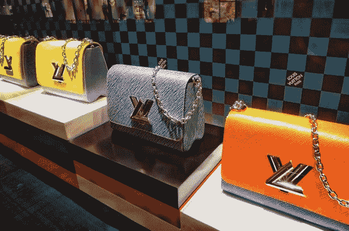

# 将消费作为奖励的危险

> 原文：<https://medium.datadriveninvestor.com/the-dangers-of-using-spending-as-a-reward-c1108179a874?source=collection_archive---------17----------------------->

Picture provided by Data Driven Investor

“犒劳自己。”这是最近很常见的一句话。它可以有多种含义。要么你应该放纵自己，因为一切都很糟糕，你应该在生活中获得一些积极的东西。或者，这是最常用的说法:你应该奖励自己，因为事情确实进展得很好。

那双你一直想买的新鞋，但又觉得太贵了。你这一周工作很出色。完成了两笔交易，有了一个非常满意的[客户](https://www.datadriveninvestor.com/glossary/client/)，甚至吸引了几个新客户(我不知道，我是个学者，你能看出来吗？).尽管这可能是虚构的(也是不现实的)，但你已经度过了美好的一周！

你运气很好。像#赢家一样度过一生！现在看到这双靴子会怎么样？哦，你会想要的。你为什么不应该拥有这些？你这周过得很棒。在工作中表现出色。你值得拥有它们！在你的银行账户意识到这一点之前，你已经是这双(太贵了)靴子的骄傲的主人了。如果你不像我一样是鞋迷匿名组织的成员，就假装我在谈论一些很酷的技术东西。

 [## 忠诚度是一个简单的命题|数据驱动的投资者

### 万豪在数据泄露后面临集体诉讼，这是使用大数据的危险之一:值得吗…

www.datadriveninvestor.com](https://www.datadriveninvestor.com/2019/03/24/loyalty-is-a-simple-proposition/) 

这个场景对你来说一定很熟悉。即使你没有赚大钱，“犒劳自己”包括在喝普通咖啡的同时给自己多买一杯咖啡或一块松饼，而不是买鲁布托或虚拟现实耳机。不管花费多少，你所做的是花更多的钱来庆祝胜利。这很快就会变成一种有害的关系。

Picture provided by Data Driven Investor

为什么这种关系很可能是有毒的？好吧，让我们深入到我最喜欢的一个基础:条件反射。 ***操作性条件反射。***

操作性条件反射是一个深刻的心理学概念，四种不同的强化和惩罚(积极的，消极的)应用可以导致非常不同的行为结果。

让我举四个例子:

要**正面惩罚**有人就是要*加*一个**负面刺激**。这可以采取酷刑的形式，或者，稍微不那么极端，让他们做家务，或一般忏悔。

给**负面惩罚**某人就是给*带走*一个**正面刺激**。这可以采取让你的孩子禁足(剥夺自由)或因为他们违反宵禁而拿走他们的手机的形式。

去**负面强化**某事意味着*拿走*一个**负面刺激**。这通常是最难举例的一个，但是想想止痛药。如果你头痛，你可以服用止痛药，它(有希望)带走负面刺激(疼痛)。如果药物起作用，你会再吃一次，如果不起作用，下次头疼的时候你就不用费心了。

对**积极强化**某事意味着*给*增加一个**积极刺激**。这就是我们在这里要关注的。虽然这主要是消费行为，但我想深入探究。

消费本身就是一种非常容易上瘾的行为。如果花钱——对许多人来说是一个非常抽象的概念——能给你带来你真正想要的新事物的快乐(一个非常具体的概念),那么它本身就是基于积极的强化。通过操作性条件反射，我们建立了习惯。如果每次你做了值得庆祝的事情，你知道你可以给自己买一些你想要的东西，那么，这是一个很好的习惯！

相信我，我和其他人一样对此感到内疚。如果我认为我做得好，我也想要我的奖赏。我们动物就是这样被编程的。然而，这个问题的核心并不是操作性条件反射。不，是它的大龄恶妹: ***古典调理*** 。

经典条件作用是由巴甫洛夫提出并证明的。是的，有狗，唾液和铃铛的那个。那一个。有人一按门铃，狗就流口水，这和你花钱太多有什么关系？好吧，让我们更深入地研究一下习惯的形成。

当我们从操作性条件作用转移到经典条件作用时，我们不再看奖励和惩罚的联系，我们只是看联系。通过你的消费习惯，你已经在做好某件事和立即花钱之间建立了一种(非常强烈的)联系。现在，一旦你做了一件好事，一件在你看来值得庆祝的事，你几乎会有拿起钱包、电话和钥匙跑到下一家商店的冲动。那不健康。

你知道买东西的感觉。太棒了。成功的感觉。生活中有了新产品的感觉。这一切都太难以承受了。

如果在你极度兴奋的时候，你透支了，这可能会让你难以承受…

首先，幸福、自信和普遍胜利的状态不适合理财。你高估了自己的能力，也低估了这笔钱还能维持多久。第二，如果你在一个月中有许多好日子，你能负担得起保持这个习惯吗？我想你不会……至少，我高度怀疑。

给自己额外奖励，如果意味着一周后打到 0 以下，值得吗？这些是你需要问自己的问题。

如果这是你，别担心这也是我。但是现在是我们围绕奖励和积极强化建立一个更健康的习惯的时候了。生活中一定有比买新鞋(或科技产品，无论什么)更多的东西。我似乎总是没有时间真正坐下来看一部电视剧。为什么不让这成为一种奖励。在我坐着的那 45 分钟里，我本可以跑去商店给自己买双新鞋，但是坐下给了我同样的享受，而且便宜得多！

总而言之，如果你做得好，你应该能够“善待自己”。是的，我完全支持强化好的行为。只是不要用有毒的行为来强化它们。

莫尔·范·登·阿克是华威商学院行为科学专业的博士生。她研究了不同的支付方式，尤其是非接触式和移动支付方式，对我们管理个人财务的影响。在她的“空闲”时间里，她写了一些关于个人理财、行为科学、行为金融和博士生生活的文章，这些都发表在《金钱在头脑》上。通过 DDI，她撰写了关于个人和行为金融的文章，以确保学术界的知识流入主流，并能帮助尽可能多的人！

*原载于 2019 年 12 月 26 日*[*【https://www.datadriveninvestor.com】*](https://www.datadriveninvestor.com/2019/12/26/the-dangers-of-using-spending-as-a-reward/)*。*