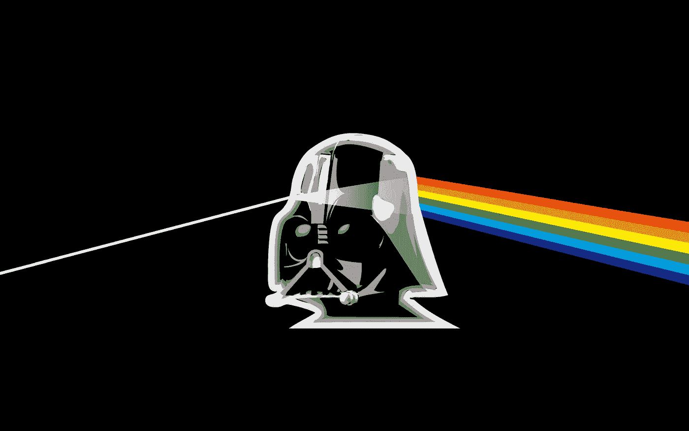

# 思想的阴暗面

> 原文：<https://medium.datadriveninvestor.com/the-dark-side-of-the-mind-9691c8969345?source=collection_archive---------18----------------------->

> “一个普通人对不寻常的事情感到惊奇；智者惊叹于平民。”—孔子

你上一次给别人寄手写的信是什么时候？我想，也许永远不会。这种做法已经完全废弃不用了。超过 30 岁的人可能有机会经历这些。想想你坐下来用你自己的双手写一篇文章，在这篇文章中，我们可以表达我们的感情，也就是说，有情感，很多，在书法的类型和文章的结构上。这些细节告诉我们很多关于传统信件的作者，用墨水记录在纸上。

我们今天所知道的许多事情之所以成为可能，是因为历史上重要人物之间的信件往来。未来，当历史学家搜寻我们这个时代，也就是互联技术的摇篮时，是否有可能对我们现在在做什么做出清晰真实的解读？

电子邮件发送迅速。他们使用标准的类型学(字体)。此外，由于《匆匆》的内容和压力，它们通常是肤浅的，而且在许多情况下看起来没有人情味。过去，一封信到达目的地需要很长时间。有时，描述的场景已经改变，信息失去了一些目的。出于这个原因，我想，人们会对将要说的话非常谨慎；毕竟，收件人的情绪和他的反应，当然，处于危险之中。

随着时间的推移，技术促进了发送信息的过程，使其越来越快，从而消除了对手续的需要，这些手续已变得不必要。例如，电报在当时是一种复杂的媒体，但它能发送的信息量有限。因此，发一封电报很贵，是按字数收费的。“绝对必要”的时代开始了。

## 甚至在传真和互联网之后，促进了信息流通的民主化进程，我们习惯了生活在表面上的想法，在那里一切似乎更容易。我们可以想写多少就写多少，但我们更喜欢普通的日常工作，只是为了方便；毕竟，时间就是金钱。

最近，我偶然发现了一部关于著名的不知名的斯坦尼斯劳·斯库卡斯基的纪录片；就在第二次世界大战爆发前，一位敢于嘲弄强大的德国元首的雕塑家。在这部由网飞精心制作的电影中，一位年近九十的微笑的小老头讲述了他的想法。我说，大多数都很陌生。20 世纪上半叶，Szukalski 生活在美国和波兰之间。当他还是个孩子的时候，他自学成才，创造了自己的字母表，让老师们大吃一惊。他与第一位雕塑家大师产生了分歧，导致他投入了自己的事业，没有遵循规则。他决定亲手写他的故事。这让他付出了昂贵的代价。

这位被称为二十世纪的米开朗基罗的艺术家，在洛杉矶郊区的一个简单的房子里孤独地度过了他的一生。然而，在此之前，他受纳粹邀请创作了一幅反映希特勒伟大的作品，得到的回答是一幅德国总理跳芭蕾舞的草图，配上恰当的女性装束。也许这就是纳粹选择波兰开始他们统治世界的该死计划的原因。是的，这只是作者的一个愚蠢的想法。Szukalski，在盛衰之间，在他的祖国的来来往往之间，变得富有和著名，贫穷和憎恨，在加利福尼亚一个被遗忘的角落里结束了他的日子。

然而，这些都没有动摇他。甚至他的伟大创造也没有在第二次世界大战中被毁。回到美国后，他仍然决心让他的艺术变得真实，具有不容置疑的独创性。当然，这最终把他的名字放在了月球的另一边，在那里你什么也看不见。在他妻子去世后，他继续坚持不懈地写作他的理论，甚至忍受着年龄的重压和从未放松过手的孤独。然后一个好奇的学生决定去拜访他。多年的友谊，超过 200 小时的录音磁带，30 年后有人决定将他们的故事公之于众。

## 想知道这是什么感觉，你需要看纪录片。无法用语言来描述。尤其是使用像 *Garamond* 这样的类型，我的最爱！

虽然已经上了年纪，他仍然没有失去旧报纸上记载的他年轻时的活力。有创造力的人通常会有的一种躁动。*米哈里·契克森米哈*在他的书*创造力:发现和发明的心理学*中评论说，人们运用他们的创造潜力，尽管并不总是有意识的，但总是在思想的领域中创造桥梁。对他来说，正是对事物僵化的不满使伟大的创造性进步成为可能。

我发现了一个鼓吹学习手写的运动。技术让事情变得简单，今天我们几乎不需要写任何东西。然而，对这些人来说，保持写作艺术的活力是很重要的，因为科学已经证明了它的价值。印第安纳大学和加州大学的研究表明，手写涉及打字和发送信息所不能涉及的大脑部分，改善了人们处理和检索信息的方式。

## 技术正在做着伟大的工作，但我们需要小心我们做出的快速选择，这样我们就不会错过历史的列车。

阿伊女孩弗朗西斯·巴博萨(Francielly Barbosa)已经表明，天才的想法确实需要大量的不满。她住在距离巴西贝伦 44 英里的莫朱镇。她对她所在社区的状况感到不舒服，那里挤满了棚屋，很少在不舒服的地面上休息，这是垃圾填埋场、垃圾和艾姆普斯的混合物。这位学生把这个想法带到了她所在的简单学校的简单实验室，在那里，在老师的支持下，她找到了解决邻居房子摇摇欲坠的方法。种子变成了一种化学混合物，这使得水泥在砖块的成分中扮演了重要的角色，砖块可以用该地区所有院子里剩下的材料制成。问题解决了，用问题本身作为燃料去解决它。只需要一个人足够麻烦并采取行动。

我们不必扔掉电脑，也不必互相回信。我们需要大量的 T2 玉米醇溶蛋白。在希腊语中，眼花缭乱，对发现感到惊讶的能力。来自古代哲学的东西。这个奇怪的词是让我们不安的精神，在寻找答案。数字世界让我们有机会在一张布满墨水和符号的纸上写下具有独特魅力的文字。当我们使用自己的笔迹时，我们无法隐藏自己的情感。手写的文字谴责我们，这在一封标准化的邮件中很难发生。我相信，如果在日常生活中有更多的好奇心和发现美的意愿，我们可以“写”得更好。

智慧不傻，可以用科技来解放自己。这里用比特和字节画得很漂亮。重要的不是媒介，而是信息。Szukalski 是一个根深蒂固的艺术家，动荡不安，充满了奇怪的想法，有些难以忍受。但他没有错过历史的列车。他把他的理论写在厚厚的书里，他自己用自己的字母一页一页地粘贴，即使没有人想看。

This is my new book, spare some time to know more about creativity.

有趣的是，当他们把摄像机放在他面前时，他一点也不觉得不舒服。这位几乎孤独终老的厌世者拥抱了一项对他来说似乎很陌生，但也让他眼花缭乱的技术。录制完图像后，在电视上看到自己，听起来像是一个奇迹。也许这让他的作品成为永恒。

## 如今，他的骨灰遍布复活节岛；他说人类起源的地方。

现代世界的便利让一切都变得更加流动，但它们却在某种程度上淡化了我们思想中的重要空间。我们想象中太多黑暗的角落藏着能够揭示神奇动物的惊喜。我们只需要一个小小的信标来释放能量。亚里士多德在《形而上学》中说，人们惊奇地发现，他们现在已经到达了哲学的普遍起源。

弗朗西莉和*苏卡斯基*给未来发了一封信。他们创造了自己的字母表，用鲜血、汗水和汗水书写。人性中固有的永恒的质疑，能让我们体验到令人难以置信的发现的炫目。无论是在水果种子里，还是在一个满是蟑螂和奇怪雕塑的房子里，住着一个精致的老人，故事的主人如此有趣，以至于没有书敢登记它。尽管如此，请记住:互联网的力量无所不能。绝对没有！