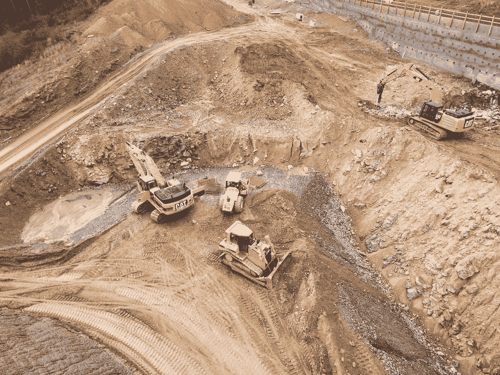

# 投资新兴市场的阴暗面

> 原文：<https://medium.datadriveninvestor.com/the-darkside-of-investing-in-emerging-markets-f1b082ff270d?source=collection_archive---------20----------------------->

## *数万亿美元的投资如何导致发展中国家的普遍贫困、政府不稳定和环境破坏——以及投资者的长期低回报*

Photo by [Shane McLendon](https://unsplash.com/@kctinman?utm_source=medium&utm_medium=referral) on [Unsplash](https://unsplash.com?utm_source=medium&utm_medium=referral)

随着发达国家经济增长放缓，西方世界的投资者正将数万亿美元投入新兴市场。资产管理研究公司 Strategic Insight 的首席研究主管阿维·纳赫马尼(Avi Nachmany)表示:“自 2007 年以来，美国一半的股票资金流入了(新兴市场)股票基金和(交易所交易基金)。六年前，(新兴市场)股票投资的份额仅为 10%。”预计到 2020 年，新兴市场股票和债券基金管理的总资产[将达到 10 万亿美元，高于 2013 年的 4 万亿美元。从私募股权公司到对冲基金，另类投资基金也将他们高净值客户的数十亿美元资金投入新兴市场。但是高水平的投资并不是没有代价的。大多数外国投资流入制造业、能源和资源开采，这三个部门经常造成环境恶化、污染和其他社会成本。印度尼西亚的森林被烧毁，以适应玛氏(Mars)和雀巢(Nestle)制作的流行小吃中使用的棕榈油的生产，而非洲的大片土地被摧毁，以开采黄金、铂和其他自然资源。迫切需要税收和短期经济增长的发展中国家政府张开双臂欢迎投资，不管长期社会经济代价如何。西方投资者对短期投资组合表现的追逐，加上预算匮乏的发展中国家政府专注于短期经济增长，最终导致更糟糕的发展结果、政治不稳定以及公司及其股东的长期回报降低。](http://www.sionline.com/media/releases/130613-pressrelease.pdf)

外资跨国公司的商业行为造成环境破坏和社会经济问题的例子在发展中国家比比皆是。一个这样的例子是由台湾跨国公司台塑经营的价值 106 亿美元的工业园区排放的有毒废水对越南海岸线以及相关渔业和旅游业的破坏。这座工业园区排放的混合毒素导致近 70 吨死鱼被冲上越南海岸，当地渔民失去了任何收入来源。先锋新兴市场股票基金(Vanguard Emerging Markets Stock fund)和贝莱德 iShares Core MSCI Emerging Markets ETF 等西方基金持有台塑最大的股权。总的来说，这场灾难花费了福尔摩沙 5 亿美元来清理，无数渔民失业，越南市民对政府充满敌意，越南海岸线上到处都是死鱼和有毒废物。

私募股权公司的投资也可能导致不可持续的发展，这对发展中国家经济的长期生存能力和社会凝聚力是灾难性的。全球第三大私募股权基金凯雷集团(Carlyle Group)管理着一只 25 亿美元的基金，专注于投资美国以外的石油和天然气项目。该集团[最近以 6.28 亿美元收购了荷兰皇家壳牌公司(Royal Dutch Shell)在加蓬](http://www.carlyle.com/media-room/news-release-archive/carlyle-backed-assala-energy-completes-acquisition-shell-gabon)的所有石油资产和业务。加蓬是一个资源丰富的西非国家，正在与政治不稳定和冲突作斗争。壳牌在加蓬的业务充满了环境灾难和社会冲突。壳牌公司卷入了无数的石油和天然气泄漏事件，例如将沃韦泻湖用作石油残渣处理场，目前污染了加蓬的水道，并加剧了该国的净水危机。加蓬人民——与失业和缺乏清洁饮用水作斗争——愤怒地走上街头，加剧了政治不稳定。

面对严重的预算短缺、资源匮乏以及刺激增长的廉价能源的迫切需求，发展中国家政府以长期经济发展和环境健康为代价接受外国投资。由于贫穷国家几乎没有货币资源或知识型劳动力，外资投资集中在低技能和资本密集型行业，如资源开采和制造业。为了推动增长和增加政府收入，发展中国家需要廉价能源，通常是由外国公司开采和燃烧的肮脏化石燃料。能源生产中的污染被视为一个经济体向更具生产力的工业和知识型能力转型的不幸副产品。然而，据荷兰中央银行的经济学家称，外国资源开采通常会陷入依赖和剥削的恶性循环，使发展中国家依赖外国投资获得税收，却没有资源投资于教育、基础设施或医疗保健。在加蓬，政府年度税收的 60%来自石油和天然气行业，但加蓬人民认为主要雇佣外国工人的石油公司没有带来什么好处。在其他行业，如采矿业和制造业，公司雇用当地工人，但从事不公平和不安全的劳动实践。当地工人的生计依赖于外国公司，他们通常没有其他就业选择。外国工业对资源开采的依赖常常使工人没有足够的工作，经济处于一维停滞状态，极易受到周期性行业冲击的影响。最近油价下跌导致加蓬政府资金严重不足，无法履行基本义务。为了启动经济增长，发展中国家需要外国投资。但如果没有适当的问责制，企业几乎可以自由支配依赖外国投资的政府和工人，这不利于长期经济增长、环境健康和当地工人的命运。

发展中国家人口迅速增长，劳动力廉价，能源需求巨大，因此与发达市场相比，发展中国家为外国投资者提供了获得巨额回报的独特机会。去年，许多新兴市场基金的回报率是西方基金的两倍左右。从对冲基金到散户投资者，投资者迷恋于短期的优异表现，纷纷将资金投入跨国公司，这些公司从发展中国家开采自然资源、建设工厂并采购供应链。但是，随着股东推动公司在短期内获得更高的回报，公司经理的动力在于立即降低成本和实现利润最大化，往往忽略了其他义务，如废物清理和公平劳动实践。资金不足的发展中国家政府过于关注短期税收，缺乏投资可持续性和企业监管的资源，因此环境和社会风险没有得到考虑。然而，人们发现，对短期回报的痴迷对投资者不利。研究表明，从长远来看，考虑到环境和社会因素的公司会给股东带来更多的价值。同样，将资金投入可持续企业的基金，要么与只关注财务表现的传统基金不相上下，要么表现更好。但散户投资者往往被动地投资于指数基金，对可持续性风险知之甚少。在高净值投资领域，许多私人股本基金正在寻求快速的资产周转，通常平均持有公司 3 至 5 年左右。发展中国家政府、外国投资者和跨国公司都被激励在没有任何责任或监督的情况下实现短期增长最大化，长期可持续性被回避，因为短期增长从长期来看对发展中国家和投资者有害。

通过将环境和社会风险因素纳入投资决策，基金经理、散户投资者、非政府组织和政府支持的发展基金可以将发展中国家的企业行为转向更可持续的——从长远来看——盈利的途径。由于发展中国家政府缺乏有效性，现有的促进可持续发展的方法主要集中在资产管理者、公司、全球发展组织和环境监管机构。目前指导长期可持续发展战略的有三种有些冲突的思想流派:鼓励对创新和可持续公司(所谓的“绿色”公司)的投资，限制对“肮脏”行业的投资，以及引入环境、社会和治理(ESG)因素措施来让公司承担责任。世界银行正通过其私人贷款机构国际金融公司(IFC)鼓励对专注于创新型可持续发展的公司和项目进行投资。国际金融公司与私募股权公司阿波罗全球管理公司和法国投资公司 Amundi 合作，发行了总额为 30 亿美元的债券，为发展中国家的环境可持续项目提供资金。通过出资与私募股权公司合作，国际金融公司激励私募股权投资者关注长期可持续性。因此，那些原本很难获得资金的公司，比如前期资本成本高的太阳能公司，现在更容易获得投资。在零售投资领域，[世界银行与拉丁美洲证券交易所运营商 BM & FBOVESPA](http://www.bmfbovespa.com.br/en_us/products/indices/sustainability-indices/corporate-sustainability-index-ise.htm) 合作开发企业可持续发展指数。符合该指数标准的公司，包括长期发展前景、环境可持续性、所有利益相关者的共享价值等。获得投资者资本的显著敞口。然而，除了拉丁美洲，发展中市场的可持续性指数产品相当稀少。随着社会责任投资越来越受欢迎，特别是在年轻人中，增加新兴市场可持续发展基金的数量可能会吸引更多的 401K 捐款。随着世界银行鼓励私募股权基金和散户投资者投资于创新、可持续和长期导向的公司，发展中国家获得了关键的基础设施升级、创新能源解决方案和对维持长期增长至关重要的经济多样性。

政策制定者和发展专家提出的另一个解决方案是完全限制高污染行业的外国投资。在 2015 年的巴黎气候大会上，经合组织成员国同意限制对巴基斯坦和其他发展中国家煤炭项目的融资。但是巴基斯坦仍然需要廉价的能源来维持其经济发展，相反[转向各种中国公司](http://www.latimes.com/world/asia/la-fg-china-dirty-energy-20170601-story.html)——以藐视环境和安全标准而闻名——来建设五个煤电厂和开采数十亿吨煤。具有讽刺意味的是，对煤炭融资的限制并没有阻止燃烧肮脏的化石燃料，甚至可能加剧了这一问题。

另一个解决方案是让环境和人权监管机构让“肮脏”行业为其造成的社会和环境成本负责。在台塑事件中，环境监察机构记录了工厂造成的污染，并促使越南政府对台塑处以 5 亿美元的罚款，尽管此前[政府已经否认台塑是有毒物质排放的幕后黑手](http://www.reuters.com/article/us-vietnam-formosa-plastics-environment/vietnam-says-no-proof-formosa-steel-plant-linked-to-mass-fish-deaths-idUSKCN0XO18L)。巨额罚款阻碍了对受影响公司的投资，为政府提供了必要的收入，并激励投资者让公司对其环境、社会和治理(ESG)风险负责。从主权财富基金到共同基金，大型资产管理公司可以利用其在公司中的高度集中的所有权来创建特定行业中所有公司都必须遵守的标准化环境和社会标准。例如，[瑞典国家养老基金](http://hbr.org/2017/12/can-index-funds-be-a-force-for-sustainable-capitalism)与海产品行业的公司合作，开发从海洋到市场的可持续供应链管理。此外，[挪威国家养老基金](http://hbr.org/2017/12/can-index-funds-be-a-force-for-sustainable-capitalism)正与联合国儿童基金会合作，在孟加拉国等国家改善儿童在时尚产业供应链中的权利。

然而，要制定这样的标准并追究公司的责任，私营部门的基金经理需要有很大的意愿来制定和实施一套各方都同意的标准化的环境、社会和治理会计标准。尽管贝莱德(BlackRock)首席执行官拉里·芬克宣扬企业社会责任和共享价值创造的重要性，但这家全球最大的资产管理公司尚未在这个问题上投入大量资源。贝莱德只有 75 名员工，负责其持股的全球数千家公司的可持续发展问题。资产管理者可以与环境组织、非政府组织和全球发展组织合作，强化 ESG 责任，而不是依赖几乎不存在的内部团队。通过严格的监管，大型资产管理公司将向企业施压，要求它们在对业务采取长期和更可持续的观点的同时，将环境和社会风险降至最低。随着环境和社会成本的降低，投资者将从更高的回报中获益。与此同时，发展中国家仍然可以获得经济增长所需的资本，而不会出现可预防的外部因素，如不小心将工厂废物倾倒入危险水体或虐待工人。虽然化石燃料等“肮脏”行业固有的负面外部因素(如空气污染)仍然存在，但加强环境和社会问责制可以将外国投资转变为支持未来发展的角色，降低当前政府依赖和企业剥削循环继续下去的可能性。

然而，投资者心理中根深蒂固的短期主义以及发展中国家对廉价化石燃料和强劲制造业的依赖阻碍了创新、可持续外国投资改变世界的可能性。发展中国家经常是干净的石板，没有过去的工业和能源系统的包袱。通过改变外国投资的性质，这些市场可以成为未来的堡垒，而不是沦为资本主义破坏性历史的重演。