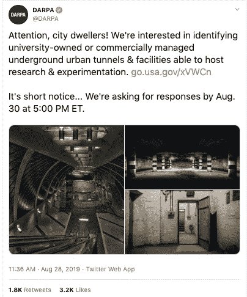
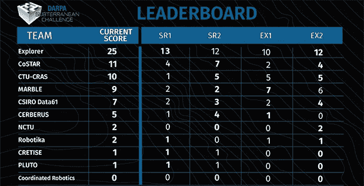
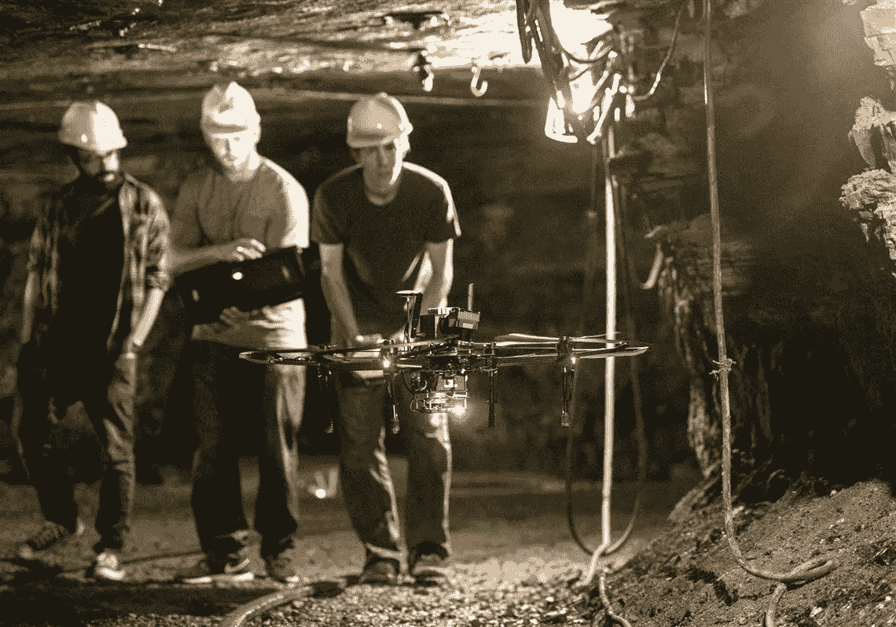

# DARPA SubT 挑战:机器人铁人三项赛

> 原文：<https://medium.datadriveninvestor.com/the-darpa-subt-challenge-a-robot-triathlon-1b7b6f30ecb?source=collection_archive---------8----------------------->

在纽约市长大的最大的城市传说之一是关于生活在下水道中的短吻鳄的谣言。这个神话甚至激发了一本名为《大逃亡:或者，下水道故事》的流行儿童书籍，书中有爬行动物从公寓厕所里爬出来的插图。直到今天，城市居民仍然焦虑地看着检查井，想知道下面藏着什么。上个月，美国国防部呼吁进入商业地下建筑，也分享了这种好奇心。

美国军方的研究部门 [DARPA](https://www.darpa.mil/) 在 2017 年发起了地下(或 SubT)挑战，明确目标是开发增强地下任务“态势感知能力”的系统。虽然军队利用机器巡逻沉没的建筑群的前景令人想起[矩阵](https://matrix.fandom.com/wiki/Sentinel)的图像，但事实上，地球上有待探索的最后一个前沿是地表以下。随着 SubT 越来越接近其计划于 2021 年举行的高潮活动，该机构正在开始三项计划中的真实世界测试的第一阶段。

 [## 模式和机器人:复杂的现实|数据驱动的投资者

### 哈耶克的名著《复杂现象理论》(哈耶克，1964)深入探讨了复杂性的话题，并断言…

www.datadriveninvestor.com](https://www.datadriveninvestor.com/2019/03/04/patterns-and-robotics-a-complex-reality/) 

根据竞赛描述，最初的重点领域将是“人造隧道系统”，其次是“地下城市环境，如公共交通和市政基础设施”，最后是“自然形成的洞穴网络”。今年夏天，美国国防部高级研究计划局发布了一项针对地下基础设施的信息请求，目的是为了“全球安全和灾难相关的搜救任务”

参赛的技术专家将有机会赢得 200 万美元的硬件发明和 75 万美元的软件创新，“对地下领域的利用产生破坏性和积极的影响。”正在考虑的解决方案类型包括“快速绘制地图、导航和搜索未知的复杂地下环境以定位感兴趣的物体”的平台在进一步解释目标时，DARPA 项目经理 Timothy Chung 说:“作战人员和应急人员在地下环境中面临的主要限制之一是缺乏态势感知能力；我们常常不知道下面有什么。”Chung 的老板，战术技术办公室主任 Fred Kennedy 证实，“我们已经到了一个关键点，机器人技术、自主性甚至生物系统的进步可以让我们探索和利用对人类来说太危险的地下环境。我们可以使用替代物来绘制地图并评估它们的适用性，而不是避免洞穴和隧道。”肯尼迪甚至为这一挑战创造了一个口号——“让不可及的变得可及。”

8 月一个闷热的下午，在宾夕法尼亚州一个废弃的煤矿里，来自全球的 11 支队伍带着 64 个地面机器人、20 架无人驾驶飞行器和一艘自主飞艇参加了 SubT 挑战赛的第一波比赛。该课程包括四项活动，每项活动在矿井深处持续一小时，矿井最初由匹兹堡煤炭公司于 1910 年建造。每个团队的机器必须自主定位、识别和记录 20 件物品或文物。唯一一支在四次独立比赛中得分都达到两位数的队伍是[卡耐基梅隆大学](https://www.ri.cmu.edu/)的探索者队。CMU 是 DARPA 挑战赛的热门选手，赢得了 2007 年城市挑战赛和 2015 年机器人挑战赛的冠军。今年，它有一个明显的优势，那就是它是本地的，可以提前找到地点，以便更好地为现场比赛制定策略。正如[大众机械](https://www.popularmechanics.com/military/research/a28771417/darpa-subterranean-challenge/)的考特尼·林德所写的，“探险者经常在塔伦图姆的旅游矿练习，通常只有那些想去看看阿勒格尼钢铁公司以前拥有的煤矿的游客才会去那里。他们定期驾驶无人机，观察地面机器人探索洞穴般迷宫般的深处。

对于在地下比赛的团队来说，最大的障碍是缺乏全球定位系统(GPS)信号和 WIFI 通信。为了在这些没有 GPS 的环境中安全地导航，SubT 机器必须完全依靠机载传感器的融合，包括激光雷达，相机和雷达。在解释他的团队如何赢得匹兹堡邮报的比赛时，CMU 领导 T2 的塞巴斯蒂安·舍雷尔说，他们雇佣了多达八个机器人，这些机器人创建了自己的 WIFI 网络，相互“交谈”，同时用传感器绘制环境地图。部署一种群体方法，机器人作为一个集体单位一起工作来填补数据空白，这意味着即使一个离线，它仍然能够使用其机载系统和先前下载的地图进行驾驶。在比赛开始前，CMU 团队利用计算机模拟来制定策略，但他们明白在虚拟世界中单独规划的局限性。正如舍雷尔的合作者[马特·特拉弗斯](https://www.ri.cmu.edu/ri-faculty/matthew-j-travers/)解释的那样，“我们的系统可能在模拟中完美地工作，我们第一次部署时，我们可能会从模拟中取出完全相同的软件，并将其放入机器人中，它会直接撞到墙上，你去找出原因。”CMU 在地理上靠近考点，这似乎对他们的团队取得高分起到了关键作用。

虽然 Explorer 带走了一些象征性的奖金，但所有 11 个团队都致力于完全自主的相同目标，不管环境和手动输入如何。正如 Travers 所感叹的，“我们希望构建一个系统，它能够不知道我们将面临的移动性挑战的类型。这当然是一件困难的事情。”回想那次庄严的聚会，发明的创造力将全球社会团结在拯救生命的单一目标之下。用该项目的组织者钟(Chung)的话来说，“我们受到了在各种地下环境中执行搜索和救援任务的需要的启发，无论是应对人口稠密地区的事故、自然灾害还是矿山救援。”下一轮比赛将在二月举行，很有可能在纽约市的下水道举行。正如钟提醒参赛者的，“准备好一些新的惊喜。SubT 挑战可以比作铁人三项。DARPA 不只是寻找最强壮的游泳运动员、跑步运动员或自行车运动员，而是寻找能做到这三者的综合解决方案。”

*9 月 25 日下午 6 点加入 RobotLab，届时我们将讨论“今天的工业 4.0 是黑客天堂吗？”与通用动力公司的网络安全专家 Chuck Brooks，由 GENIUS NY 在 SOSA 全球网络中心主办，*[*RSVP Today*](https://www.meetup.com/RobotLab/events/262680685/)*！*