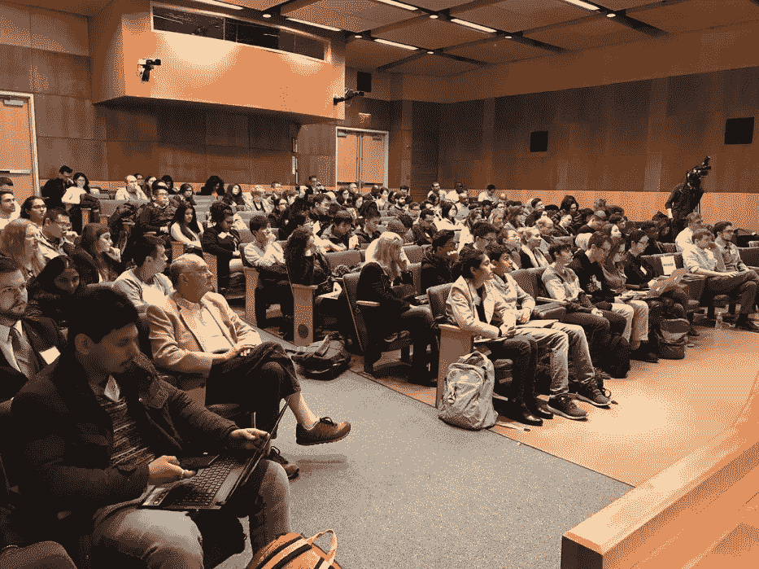
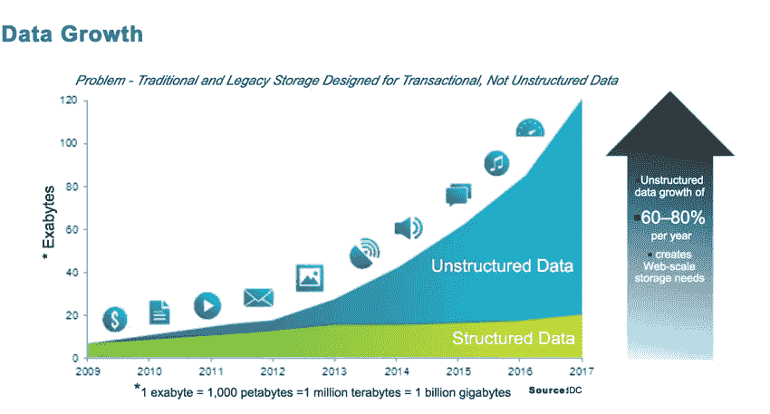

# 数据分析师与数据科学家

> 原文：<https://medium.datadriveninvestor.com/the-data-analyst-versus-the-data-scientist-abadc5d05253?source=collection_archive---------0----------------------->

数据科学家和数据分析师有区别吗？嗯，我认为，不完全相同的职业或技能组合，除了两个共同的属性，都召唤着一个好奇的头脑，这一切都始于数据，也许首先是 21 世纪不那么性感的工作，而是作为一个数据看门人辛苦工作，不管你的名字是什么头衔。

# 如果我说天空，你说……？

根据我在 IBM 的工作描述，我在大学举办与人工智能和数据科学相关主题的研讨会和讲座，每年机器学习和这样或那样的数据争论的交叉路口变得越来越明显。

在我登上讲台后不久，我告诉我的听众:“如果我说天空，你首先想到的会是什么？”他们经常回复，蓝。我继续说:“如果我说草，你会首先想到什么？”绿色很容易浮现在脑海中。然后我说:“机器学习”几个笨重的脸，很快我让他们自由，并宣布:“[预测机器](https://www.predictionmachines.ai/)”沉闷的凝视变成了一个难题，在半皱着的眉毛有机会休息之前，我问道:“当我说数据时，你马上会想到什么？”我给他们几分钟时间，一些人小声嘟囔着不温不火的回答让我思考，另一些人则满怀信心地大声说出名词短语，让我重新审视自己的计算。

# 数据的五个 v

在尘埃落定之前，我告诉他们:“在数量、种类、准确性、价值和速度上的 5 个 v。”

现在他们坐在后面。被捕时刻。他们可以看出讲座马上就要开始了。

© Copyright 2018 IBM Corporation

在这五个 v 中，变化是我最感兴趣的。这告诉我，数据并不只是愉快地驻留在列和行中，由 Hadoop 咀嚼并通过 SQL 调用提取…并不是表格数据量呈指数级增长，而是图像、视频、推文、核磁共振成像、CAT 扫描、电子邮件等非结构化数据。这就是我想从中推断洞察力的数据。知道你不知道的是什么是一回事…去问一个训练有素的聊天机器人…但是洞察我不知道甚至我自己都不知道的是什么是另一回事。这就是我所追求的。

在这一点上，我几乎察觉到坐在前面的人在微笑，坐在后面的人放下了他们的咖啡杯。短暂的停顿，沉默的向舞台的左边走，然后向右边走，我的微笑变得自信，所以我继续说:科学的起点是收集数据…因为我们好奇。我们收集动物和植物的数据，我们收集矿物、元素甚至恒星的数据。一旦我们收集了大量数据，我们就开始管理、净化和清理数据(真实性)，有人声称，作为数据看门人这种吃力不讨好的工作会消耗数据分析师或数据科学家工作的 85%以上。

# 勇敢和好奇

所以现在，我开始对我的数据进行分类。通常，大量的数据很难标记，所以我使用无监督的机器学习技术，如果与动物和植物有关，就将它们聚类成系统树，矿物被分组为晶体组，元素进入周期表，恒星被绘制在 [Hertzsprung-Russell 图](http://astronomy.swin.edu.au/cosmos/h/hertzsprung-russell+diagram)(温度对光度)中。模式开始出现。我现在需要推断、解释和想象我的发现。现在我戴着数据科学家的帽子。我的开发环境是 Jupyter 笔记本，编程语言是 Python。我使用 Pandas、matplotlib、Pixiedust、OpenCV 等开放、廉价、简单的库来渲染图表；Numpy 和 SciPy 来做统计，如果我正在使用支持向量机、回归、k-nearest neighborhood 或 Calculus II 构造等蛮力统计模型来研究偏导数和积分，在人工神经网络中发挥它们的魔力。

进化树让我想到，也许生命形式从原始海洋“跳跃”到陆地并不是因为，嗯，他们有一天决定跳跃，而是因为月亮引起的潮汐舞蹈，让一些生物暴露在空气中六个小时，然后又回到水中六个小时……这样做一千年，你会发现海洋生物知道如何利用空气而不仅仅是水进行氧化。

晶体群有助于结晶学的研究。

元素让我们近距离观察硅。在元素周期表中，它就在碳的下面。它们的电子价都是 4。硅比碳更具金属性，因为它更容易失去电子。地球上所有的生命形式都是以碳为基础的，DNA 是以碳为基础的。因此，也许在木星的云层中，在那些硅友好的条件下，可能存在基于硅的生命形式。

我们看着我们的太阳，已经过去了 45 亿年，大约还有 45 亿年。是 G 型星。它将首先变成一颗白巨星，在小行星带的中途吞没前三颗内行星(火星将再次变得非常适合居住)，并在氢燃料耗尽时坍缩成一颗红矮星。如果人类不首先毁灭地球，那么我们在这个星球上还有多长时间？好奇者想知道。

整个房间里鸦雀无声。我停顿了一下…我身后没有幻灯片。我正在学习 IBM Watson 和 Cloud 的老板大卫·肯尼的例子，他说:“Power Point 的问题是它缺乏能量，没有一个点。”

# 世俗的例子

是时候让他们做最后冲刺了。我举了一个例子，这个例子可能在更浅显的层面上描述了数据分析师和数据科学家之间的区别。

## 数据分析师

考虑下面的用例。一家在风景优美的乡村环境中拥有健康繁荣文化的优秀公司经历了惊人的员工流失率。不仅仅是人力资源部(呃，人才经理)注意到了，其他员工也注意到了。

不久，人力资源主管拍了拍一位数据分析师的肩膀，给了她一张巨大的电子表格，上面有一千行(员工)和数百列(属性，如年龄、性别、教育程度、离家远近等等)。根据目前的 GDPR 准则可以收集到的任何信息)。

分析师将电子表格输入黑盒(这是一个线性回归模型),然后输出彩色图表、散点图、条形图、帕累托分布图。她将无数的因变量应用于员工流失常数，很快发现住在离工作地点 20 英里以上的 30 岁以下的员工是最先离开的。他们似乎去了繁华城市里的公司，在那里他们可以在上下班途中“共享”一辆小型摩托车。

正如他们在马萨诸塞州(我居住的地方)所说，HR 们的“大理石头”上出现了曙光。让那些住在离办公室 20 多英里的地方，一周三天在家工作的年轻、大胆和好奇的人。但是很快，住在离农场环境不远的路上的一群人发现他们必须每天通勤是不公平的，即使只有 10 分钟。好吧，你们都可以在家工作…现在这栋楼成了鬼城。高管们通常会进来…但是房间是空的…嗯。预测性的，不完全是规定性的。

## 数据科学家

比如说，X 公司的大老板约翰，他开车去上班(对约翰来说没问题)，每当他到达主街和泥潭路的交叉口时，他就开始变得烦躁。因为他走的是泥潭路(假设其他路线更难走),他发现每天早上高峰时间他都要在那个红绿灯前，在十字路口坐两次，有时三次。汽车堆积了 12 层，当他到达绿灯时，它又变红了。

不高兴，有一天，他发现一个好奇的数据科学家，并要求她找出到底发生了什么。她自己开车去了几次，结果遇到了双重的红绿灯，甚至在回来的路上也是一样。每盏灯亮三分钟，所以她在 Main 和 Quagmire 交叉口的同一个灯上花了 6 分钟。

嗯，有相机比比皆是。街头摄像机和更多。在城市和供应商的许可下，她获得了两条街道的交通视频，并将它们上传到一个 Box 文件夹中。

她使用 CNN(卷积神经网络)和 LSTM(长短期记忆)模型，训练系统识别有 4 个或更多轮子的盒子状的东西。有三个或更少轮子的东西是友军的炮火，别管那些。

该算法建立模式(这是矢量图形上的所有色调饱和度值…不需要高清视频)。坦率地说，只是时间序列捕获中的图像就可以了。

好的，从下午 3:45 到 6:10，在泥潭路上有很多四轮以上的箱子，比大街上的还多。如果她调整了一些超参数(权重),从 3 分钟变成了 2 分钟，也许是 2:10 分钟。调整模型使它不是一个黑盒。变量是字典和列表中的元组……把它想象成一个数组……每个给定的时间框架预测一定数量的车辆堵在红灯前。事实证明，在交通拥挤的情况下，等待给定红灯的最佳时间是 2:23 分钟。这样的话，任何一个司机都有 3.5%的可能连续闯两次红灯。该算法必须在效率的顶点上运行，因为一组等待的时间越少，另一组等待的时间就越长，必须尽可能做到公平。

才华横溢；但是，周日的同一时间框架内，灯不一定是 2:23 分钟，也不一定是在工作日，碰巧是假日。没错亲爱的读者，这不是一个确定性系统，这是一个概率性系统。它学习并适应。很快，这位大胆而好奇的数据科学家将她的发现带到了市政厅，向他们展示了精美的图表，随后他们安装了“智能灯”她开始认为强化学习可能是一种更好的方法，并为她的代码申请了专利。离开 X 公司，并为她的创业公司获得一个联邦身份证号码。这是规定性的，而不仅仅是预测性的。

当我奔向我的酒店时，我开始想象一个识别“好奇”特征的认知系统。