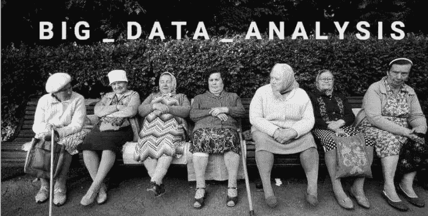

# 数据文化冲击？

> 原文：<https://medium.datadriveninvestor.com/the-data-culture-shock-5b77fe1f756e?source=collection_archive---------25----------------------->

您是否想知道数据文化冲击这一术语是否存在？我将做一个类似的例子，通过真正地观察一个组织的数据介绍，当一个人接触到一个新的地方时，可能会经历文化冲击。两者都缺乏对新“世界”的经验，缺乏足够的第一手经验，并且期望设定在某一水平，该水平将随着个人或组织经历的不同阶段而变化。当文化冲击经历 4 个完全不同的阶段时，那些完全相同的阶段完全适用于想要熟悉数据的组织。所以让我带你浏览一下:

1.蜜月阶段

> 这个第一阶段可以被描述为积极情绪的注入，当一个人经历新的宝藏，一种新的文化时。

我在整个社会中看到的和数据有关系的，是每一个人眼中的第一兴奋。我听说数据很棒，非常令人兴奋，这是未来，有大量的场景和方法来使用它。这往往会升级为:“加油！让我们使用它！让我们开始思考将扭转我们整个组织局面的案例！”

这确实是一个真实的时刻。这是实现这一目标的阶段，也是我们一起描绘数据梦想的阶段，同时也是提升对数据带来的创新的期望和想象的阶段。

2.挫折阶段

> 这是最困难的阶段，在这一阶段，你要努力面对这样一个事实:你不了解其他文化的细节，而且经常会遇到沟通不畅的情况。

在我们开始解释我们在前一阶段画的图画之后，许多问题将会开始。我们是否有必要的工具来完成这幅画。我们是否有能力添加细节，我们需要什么？在这个阶段，数据让我们困惑。通常我们可能不理解我们自己的来源，我们自己的数据，为什么事情会这样做，为什么我们不能管理它，当我们有这个惊人的图片时？

这是一个正常的阶段，每个处理数据的人都会经历，应该仔细分析，因为通常这正是我们会回到最初设定的目标并在循环中挑战它们的地方。

3.调整阶段

> 一旦第二阶段结束，随着一个人在新的地方和文化中获得更多的经验，一种安慰就会到来。在调整阶段，开始把你当成新环境的一部分是很常见的。

嗯，当我们确定了我们可能面临的所有挑战，并且我们仍然有我们的目标、想法和梦想时，调整期最终会到来。我们现在有好的一面和坏的一面，可能会考虑我们如何适应。如果我们遇到技术难题，我们能否雇佣额外的人员来帮助我们？我们需要增加存储吗？我们需要给我们的合作伙伴打电话寻求支持吗？在这个阶段，我们的创造力开始再次发挥作用，如何将自己置于数据文化冲击的曲线之中。

当我们谈论数据文化的创造时，这是一个美好的阶段，因为这正是你看到每个人一起思考和工作以共同应对挑战的时候。每个人又开始画画了！

4.接受阶段

> 在最后一个阶段，虽然不完全，接受阶段告诉我们，一个人已经意识到并接受了新的环境，并正在寻找使它更好，更容易和完善的方法。

最后，当我们找到了在照片上签名的方法后，我们可能会谈论接受和完美。这是冲击的最后阶段，它让我们认为它已经结束，现在数据文化的基础已经建立，我们需要维持它并与之共存。

你喜欢 stroopwafels 吗？你知道，它们在荷兰非常受欢迎。你很了解荷兰，可能，比如它在哪里，他们骑自行车，可能橙色是国家的颜色，但是如果你没有去过荷兰，有什么机会知道在他们的酒吧和咖啡馆给小费是不常见的？

数据是一种全新的体验，如果你是第一次接触它，就把它当成荷兰的例子。

请考虑一下，虽然您知道它就在那里，并且它必须提供一些东西，但当您实际接触它并开始与之交互时，兴奋和问题将导致沮丧，这将进一步导致您调整和重申您的目标，并最终接受新的数据文化、您在其中的角色以及您如何管理、扩展和存储它。

把画挂在墙上就行了！