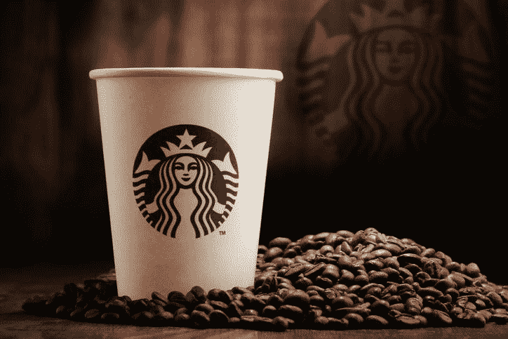
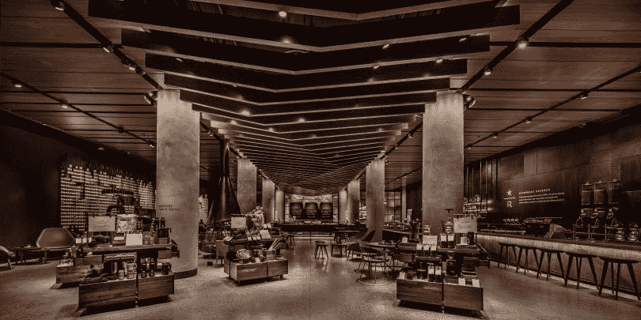
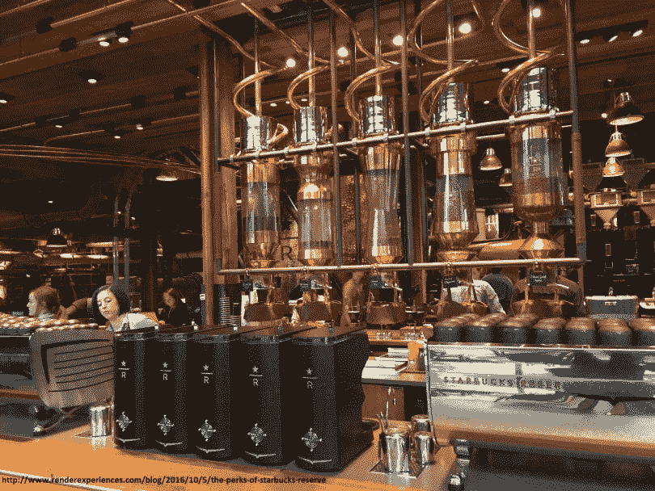

# 数据驱动的咖啡——分析星巴克的数据策略

> 原文：<https://medium.datadriveninvestor.com/the-data-driven-coffee-analyzing-starbucks-data-strategy-d59f06b616a?source=collection_archive---------28----------------------->

我们经常在生活中没有停下来思考作为我们日常生活一部分的事件或事情的幕后。当我又点了一杯“高杯拿铁咖啡”时，我记得读到过星巴克一直在投资数据驱动。但是我知道怎么做吗？我知道那杯拿铁的故事吗？我们认为这些日常事物是理所当然的，却从未意识到对我们来说可能只是“一杯咖啡”，实际上，这是一杯承载了许多我们不知道的决定和策略的咖啡。所以我回到家，开始挖掘那杯科技咖啡的细节。这篇文章背后的想法是与你分享这些见解，这样你也可以得到启发，做出数据驱动的决策。

虽然咖啡豆被用来酿造令人上瘾的咖啡，但星巴克使用**【数据豆】**主要是为了这些目的:**扩张、个性化和创新**。

# 膨胀

从失败中学习至关重要。2008 年，当星巴克首席执行官霍华德·舒尔茨面临关闭数百家门店的艰难决定时，他坚持认为他们应该采取更具分析性的方法——选择正确的地点对星巴克这样的企业的成功至关重要。因此，今天该公司使用一个名为 Atlas 的智能系统，该系统由一家名为 Esri 的位置分析公司开发。这种数据驱动的方法考虑了人口密度、平均收入和交通模式等特征，以评估新店的盈利能力和经济可行性。此外，它预测了对该地区现有星巴克的影响——与竞争对手竞争，不要搞垮自己的品牌。这意味着现在决策是由数据驱动的，而不仅仅是人的意见和直觉。当然，这并不意味着人类完全置身事外。至少现在还没有！

# 个性化

星巴克在全球 27，000 家门店中每周有 9，000 万笔交易，因此基于数据做出营销和商业决策是正确的。但是这些数据到底是从哪里收集的呢？

星巴克推出了一个**奖励计划**和一个**移动应用**，这样他们就可以获得**“用户进入和数据输出”**。通过奖励计划(超过 1300 万活跃用户)和移动应用程序(超过 1700 万活跃用户)收集的数据使咖啡巨头能够了解确切的用户行为——“你喜欢在雨天更放纵吗？你喜欢在羊角面包上放松饼配南瓜口味的茶吗？你会在工作日和周末点不同类型的咖啡吗？”

以下是收集的数据被用于创建个性化体验的一些方式。

无论你去世界上的哪家星巴克店，你通过应用程序收集的数据都可以让新店的智能系统知道你的订单偏好——你在“那一天”通常喝的饮料。此外，星巴克一直在试图利用人工智能的力量来提供建议。他们为奖励会员的账户启用了一个名为**数字飞轮**的程序。决定吃什么并不总是一个容易的决定，所以人工智能正被用来通过提供基于购买历史，天气，一天中的时间和生日等因素的建议来吸引顾客购买更多。同样的人工智能技术也被用来向消费者发送个性化的报价，并重新吸引他们，以防他们已经有一段时间没有*向星巴克*付钱了。

星巴克正试图通过部署语音和文本识别人工智能来最大限度地提高他们的人工智能采用率。**我的星巴克咖啡师**是手机应用程序中的虚拟咖啡师，可以通过语音或短信轻松下单，因为减少下单摩擦意味着潜在的更多销售。

如今，美国消费者使用手机应用支付 34%的订单。12%的订单是在 app 而不是柜台下单；在 3，600 个地点，这一数字在高峰营业时间为 20%或以上。这转化为显著的数据足迹，反映了投资面向客户的技术的**重要性**。我相信移动应用和他们的奖励计划是他们未来继续成功的关键。随着数据量的不断积累，AI 推荐会越来越好，满意的客户会不断回来。

这里需要注意的一件重要事情是，添加移动点餐服务不仅仅是创建一个移动应用程序。整个工作流程需要重新检查和调整，以补充这些新技术。星巴克不得不增加新的角色和资源，以防止顾客(在他们的应用程序上订购)离开，因为到达商店时会出现“移动队列”——我们生活在一个即时满足的时代。

# 创新ˌ革新

# 产品供应

当星巴克决定扩大业务，从杂货店提供产品时，他们让数据说话，决定提供什么产品。

例如，约 43%的饮茶者不在茶中添加糖，约 25%的饮茶者在家里喝饮料时不在冰咖啡中添加牛奶，这一分析导致星巴克创造了两种不加糖的冰茶 K 杯——芒果绿冰茶和桃子红茶。南瓜香料拿铁咖啡和不加牛奶或香料的冰咖啡是这种数据处理的一些其他成果。

从在特定地点提供酒精饮料到利用热浪推出特别的星冰乐促销活动，星巴克正在根据数据做出商业决策。

# 未来的星巴克

这家咖啡巨头最近升级了游戏。星巴克保留 SODO(西雅图)是“未来星巴克”的展示。从设计的角度来看，SODO 储备银行的概念不仅仅是戏剧性的，它也是由 IOT 和云服务推动的。

2018 年，星巴克进一步加强和深化了与微软的关系。它已经开始使用超过 50 个 **Azure 云服务**——以及 Power**BI analytics**——并且它还与微软密切合作规划新的计划。

未来商店中使用的一种尖端机械是 smart Clover X 咖啡机。智能咖啡机是未来商店中所有设备智能化的一个例子，并连接到云端进行数据收集和远程维护。虽然今天员工需要手动记录食物储存箱的温度，但在未来几年，这将通过传感器实现自动化。

重要的是，奥斯陆的杏仁羊角面包和纽约的味道一样。为了确保这一点，按照星巴克食品质量专家的指示，商店里的加热烤箱被设定为在特定的时间内加热物品。如今，每当菜单发生变化，这些烤箱的更新都会通过 USB 驱动器发送到所有商店。这是一个痛苦而缓慢的过程——没有那么超前。这里**[**Azure Sphere**](https://azure.microsoft.com/nb-no/blog/introducing-microsoft-azure-sphere-secure-and-power-the-intelligent-edge/)**将提供帮助，以便“未来的星巴克”可以由物联网驱动，物联网是指将连接到互联网的商业设备，但具有一些本地计算能力，以便它们即使在连接丢失的情况下也能保持不间断运行(微软的咒语**智能边缘**)。****

********

# ****结束注释****

****我希望你喜欢了解星巴克的数据战略。下次当你啜饮咖啡或品尝美食时，停下来想一想幕后复杂的智能表演！****

******感谢阅读！**随意点击鼓掌按钮👏帮助其他人找到它。:)****

****本文原载于我的 [**博客**](https://towardsml.com/2018/11/27/the-data-driven-coffee-analyzing-starbucks-data-strategy/) 。你可以在那里看看我的其他作品。如果想在我写新东西的时候得到通知，你可以注册一个低数量，但高质量的邮件列表 [**这里**](https://towardsml.com/) 。****

# ****参考****

*   ****[*https://www . fast company . com/40568165/Starbucks-brews-a-tech-infined-with-help-from-Microsoft*](https://www.fastcompany.com/40568165/starbucks-brews-a-tech-infused-future-with-help-from-microsoft)****
*   ****[*https://www . Forbes . com/sites/Bernard marr/2018/05/28/Starbucks-using-big-data-analytics-and-artificial-intelligence-to-boost-performance*](https://www.forbes.com/sites/bernardmarr/2018/05/28/starbucks-using-big-data-analytics-and-artificial-intelligence-to-boost-performance/)****
*   ****[https://digit . HBS . org/submission/Starbucks-secret-ingredient-data-analytics](https://digit.hbs.org/submission/starbucks-secret-ingredient-data-analytics/)****
*   ****[*https://www . zacks . com/stock/news/270022/Starbucks-digital-wheel-program-will-use-artificial-intelligence*](https://www.zacks.com/stock/news/270022/starbucks-digital-flywheel-program-will-use-artificial-intelligence)****
*   ****[*https://digit.hbs.org/submission/starbucks-grinding-data/*](https://digit.hbs.org/submission/starbucks-grinding-data/)****
*   ****[*https://www . CNBC . com/2016/04/06/big-data-Starbucks-known-how-you-like-your-coffee . html*](https://www.cnbc.com/2016/04/06/big-data-starbucks-knows-how-you-like-your-coffee.html)****
*   ****[*https://qz . com/925417/mobile-ordering-at-Starbucks-sbux-and-chipotle-CMG-stunts-save-time-it-just-creates-another-invisible-queue/*](https://qz.com/925417/mobile-ordering-at-starbucks-sbux-and-chipotle-cmg-doesnt-save-time-it-just-creates-another-invisible-queue/)****
*   ****[https://news . Starbucks . com/news/Starbucks-reserve-sodo-store](https://news.starbucks.com/news/starbucks-reserve-sodo-store)****