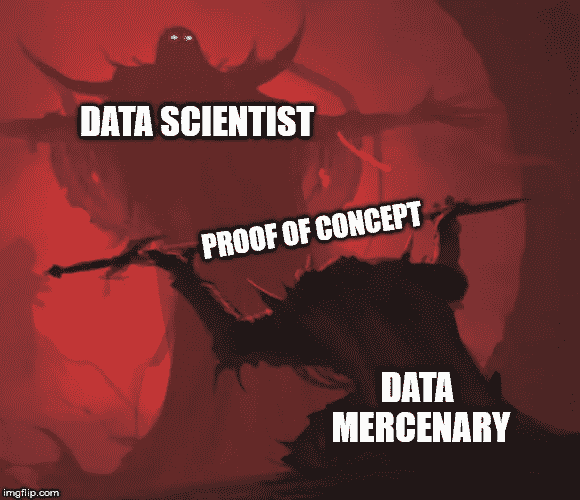

# 数据雇佣兵和重用艺术

> 原文：<https://medium.datadriveninvestor.com/the-data-mercenary-and-the-art-of-reuse-30631845f407?source=collection_archive---------19----------------------->

## 数据世界中的一个幻影位置

在数据科学和所有旨在改善任何与人工智能和深度、预先训练、未经优化、开箱即用的网络一起移动的项目的时代，一个新的、光荣的、令人质疑的邪恶工作职位被创造出来，这就是*数据雇佣军*。

伪装成普通的*数据科学家*,*数据雇佣兵*是概念证明搅拌器，吞噬科学论文，将开源代码转化为可用模型，并在创纪录的时间内创建解决方案。这个人负责启动工作流程、绘制图表，并能以一种懒洋洋的方式解释为什么 99%的工作都是数据清理和处理。他也是最不信任学院程序员的人，因为他费力地进行不可重复的研究，希望他能找到一块既有用又能理解的黄金宝石。

为了进一步了解这份工作是如何产生的，我们需要了解市场的需求。

人工智能已经成为所有困扰新兴公司的金子弹，这些公司在最近几年的技术发展中积累了数公吨的数据。客户流失率？客户分析与评估？预算支出优化？把它放到一个统计模型中，瞧，就有解决方案了。有时几乎不起作用。大多数时候不会。如果你依靠它来赚钱，你很可能会失败。但是在休息的时候，它确实起作用了，[人](https://itsfoss.com/netflix-open-source-ai/) [变](https://www.fastcompany.com/90246028/how-ai-is-helping-amazon-become-a-trillion-dollar-company) [富](https://www.forbes.com/sites/bernardmarr/2017/10/30/the-amazing-ways-spotify-uses-big-data-ai-and-machine-learning-to-drive-business-success/#4cd7961f4bd2)。

"但是，我们怎样才能把这些从学院来的好先生们吸引到我们的怀里呢？"，首席执行官问道。当然是用科学和金钱！因此，*数据科学家*这个术语被创造出来，并且[津津有味地](https://datasciencedegree.wisconsin.edu/data-science/data-scientist-salary/)发表出来。

但在受控环境中使用人工智能和将其应用到野外有一个主要区别。人们期望这位数据科学家从头到尾交付一个可供人们实时使用的设备！为什么，学院不关心这些琐事:他们感兴趣的是*的成绩*，而不是*的表现*！那是工程的工作，让他们去担心吧。好吧，一个新的工作向那些探索并行计算、神经网络基础设施、数据组织、计算优化和每当科学家打破测试床时重新安装 CUDA/CUDNN 的人开放:数据工程师*。*

*这两种命名结合在一起是到处可优化问题的祸根！科学家，更像一个工匠，编织网络结构来预测；作为铁匠，工程师打造出闪亮的解决方案来支持网络。然而，还是缺少了一些东西…*

*创造是好的，但是还有一个未开发的巨大科学成就宝藏，它每个月都会从世界各地的出版物和研讨会中涌现出来。这位科学家已经脱离了他的出身，与客户交谈并提高软技能来销售他的作品。与人打交道的确令人疲惫不堪。旧的致密层不再是未来…时代已经变了，知道如何手动反向传播突然不再那么有价值了。他需要新的灵感。*

*敲门声在数据大厅里回荡:一个从学院来的强盗需要住处、食物和牙科保险。*

*“也许我能读到你放在那里的所有废话，并给你一些想法，小家伙”，他假装是数据科学家实习生，在桌子对面喊道。人工智能的帝国是巨大的，这两个制造商看到了一个甚至更高的机会(管理):为什么不让他铲掉所有的污垢(公共 GitHub 库和 arXiv)以获得有用的废料，他们可以伪造，而不是自己做肮脏的工作？*

*这位土匪仍然被称为数据科学家，虽然他确实是一名科学家，但他也知道他的工作是不同的。他是克朗代克矿工和丝绸农民。他的概念证明是粗糙的，但他们是最先进的，他知道这一点。他涉足未知领域，是数据雇佣兵:定位、搜寻和回收资源，并将其转化为可销售的解决方案。*

**

*Artistic representation of sprint delivery*

*虽然不为市场和权力所知，但雇佣军从一家创业公司跳到另一家创业公司，用速度、科学和堆栈溢出来点燃新的想法和创新。有时候，一个团队配备最好的工具和技能是不够的，因为它们最终都会变得乏味:你需要一点火花来扰乱！*

*但是雇佣兵也有黑暗的一面…我们将在下一个故事中探索这些方面。*