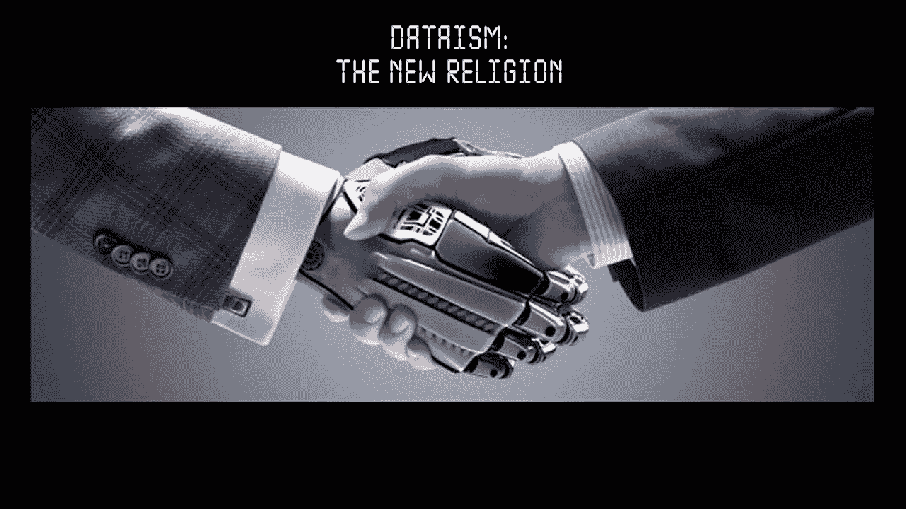
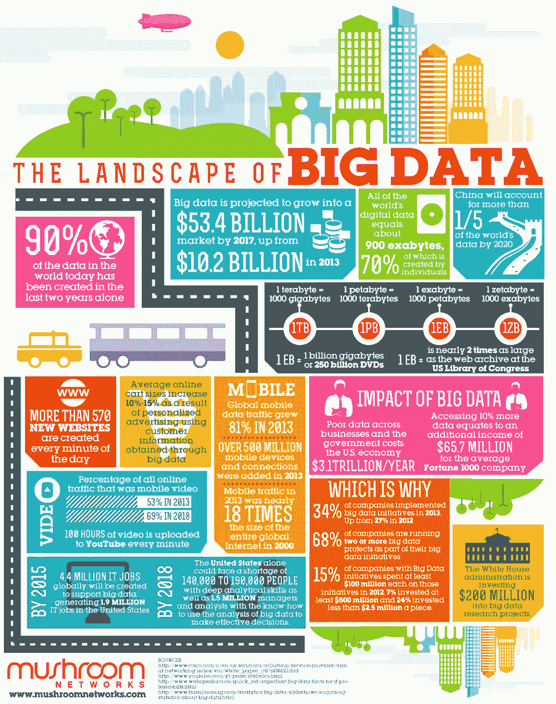
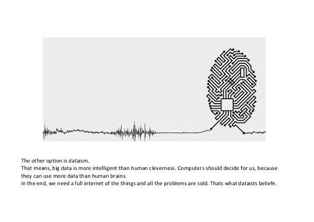

# 数据主义…你是数据主义者吗？

> 原文：<https://medium.datadriveninvestor.com/the-dataism-are-you-a-dataist-c102de049204?source=collection_archive---------15----------------------->

在谷歌上搜索“数据主义”一词，你会看到由超级聪明的人创作的文章，这些文章通常描述我们周围的数据世界，我们在其中的角色，以及对我们今天面临的未来流程和组织的影响——选举、选择、思考。它们很棒，但我们仍然会问这个问题:

> 这是什么意思？

数据主义基本上是对数据的痴迷…或者如果我说得更复杂一点，数据主义是指个人或一群人围绕蓬勃发展的大数据案例和应用而形成的思维模式。

> 我们为什么要谈论它？

这可能是最难的问题。“为什么”是我们行动背后的推理，是我们坚信的最高目标。数据主义为什么存在？，虽然这似乎是一个很容易回答的问题，可能是因为有大量的多维数据和许多感兴趣的方面，或者可能是因为它很有趣，可以用数据实现巨大的事情，或者可能是因为我们想用信息和最新技术的使用来标记我们未来的发展，用一些更“性感”的东西

每个人都有自己的答案，这也是他们玩数据游戏的原因。如果你问我，我会说数据是强大的，它可以带你到伟大的结果或一堆废话。

然而，可以肯定的是，有一种新的流动，一种炒作，围绕着它，正常的问题(伦理、未来、起源)开始出现，这使得它更加真实——数据主义。数据伦理现在成了一个问题。像个人的角色和个人与算法的匹配这样的问题占据了大量的信息。

> 听起来可能很奇怪，这个术语，这个新的“宗教”正在发生。

现在，将分析应用于分析！信徒是相信某事物存在的人。当我们谈到宗教话题时，我们可以把信徒定义为一个宗教或精神实践的追随者。在数据的背景下，我们当然都是数据信徒，因为我们确实生产内容，从而使其存在。但最大的问题是，我们是否相信这些数据的使用方式，以及这些数据产生的价值是否以某种方式被使用。在这里，我将画一条线来区分数据信徒和“数据主义者”。

> 你是数据学家吗？

现在，我们知道什么是数据主义。让我们发现我们如何适应，我们是“信徒”吗，我们是它的一部分吗。

*   你相信数据无处不在吗？
*   你认为未来的关键在于理解我们所拥有的信息吗？
*   为了更好地解释你得到的信息，你对不同的视觉化感到兴奋吗？
*   你想预测未来的行为吗？
*   你在用 Excel 吗？

如果你说“是”，那么你可能是一个数据主义者。如果你理解了下面的图片，你已经是下一级的数据专家了！

干杯，

叶卡捷琳娜·马里诺娃——数据学家