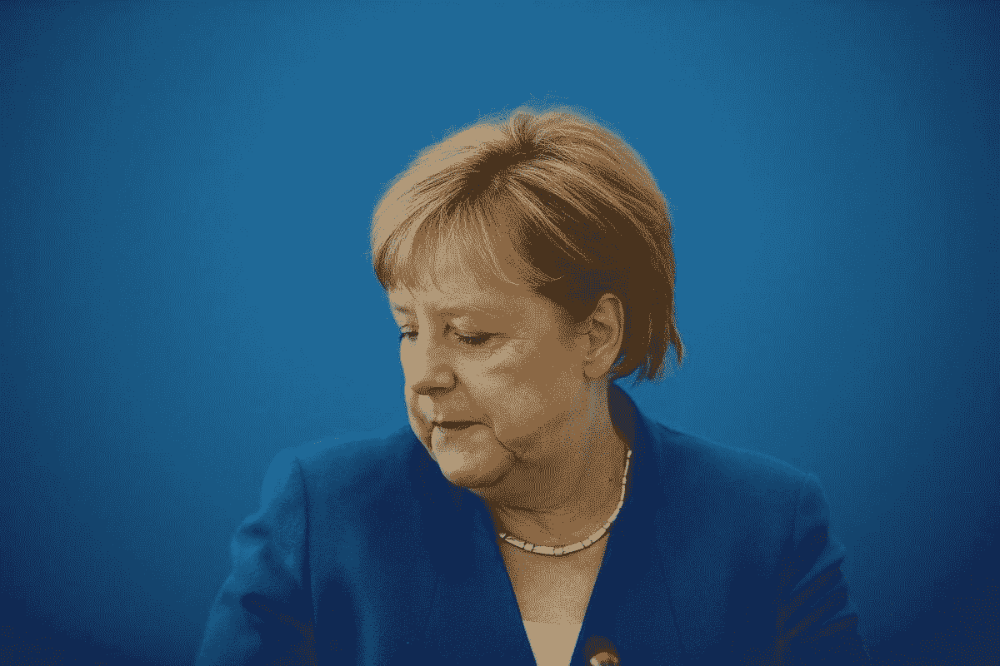
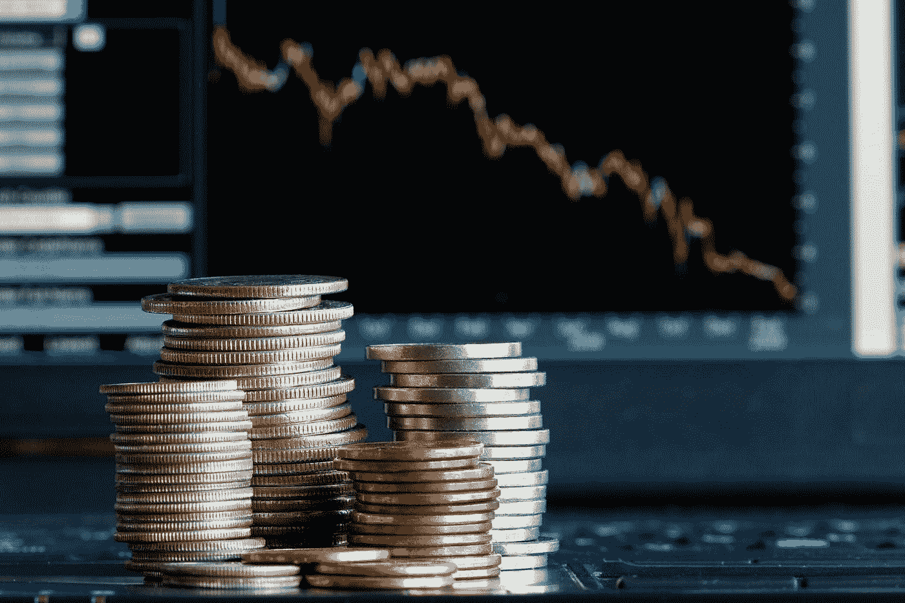

# 德国新一天的黎明

> 原文：<https://medium.datadriveninvestor.com/the-dawn-of-a-new-day-in-germany-1b1523707377?source=collection_archive---------19----------------------->

德国最近一直是世界各地的头条新闻，因为也许有些人对德国政治稳定的崩溃感到幸灾乐祸。在德国南部关键的巴伐利亚州，上周日的选举使一度至高无上的基督教社会联盟(CSU，安格拉·默克尔 CDU 的姐妹党，两党组成了德国众所周知的联盟)失去了绝对多数。基社盟现在必须在其他政党中寻找联盟伙伴，以组建下一届巴伐利亚州政府。

在一般的市场中，特别是在我专有的净正得分(NPS)机制中，它总是关于二阶导数和与预期相反的结果。以此衡量，周日的选举结果比已经被低估的结果要好。基社盟的表现超过了民调数字，尽管相对于历史和最近一次州选举，它的表现相当糟糕。

目前执政的德国所谓“大联盟”的另一个成员社民党(SPD)无论以何种标准衡量都表现不佳，导致越来越多的人齐声评论柏林现任国家政府的前景不佳。依我拙见，社民党在巴伐利亚州和全国民意调查中都遭到重创，鉴于其地位下降，它别无选择，只能留在原地，努力享受作为国家政府一部分的好处，在部长职位上占有过多席位。

许多专家说，安格拉·默克尔担任德国总理的日子屈指可数，就像国家足球队教练约阿希姆·洛的日子一样。尽管我认为这种类比是站不住脚的，但为了充分披露，我觉得我必须转述一个人在当地听到和读到的东西。

另一方面，坊间以及许多微观经济统计数据显示，似乎有很多好消息。我坚信，市场已经更多地低估了可能发生的恶化。首先，我不认为相对的政治不稳定会对经济活动产生有意义的影响。

据称的政治动荡至少可以追溯到 2017 年 9 月的大选以及随后组建新政府的历史性长期拖延。然而，预计 GDP 增长的下降可以说是归咎于全球贸易紧张局势，而不是国内政治发展。

通胀仍然温和，尽管货币政策对德国来说可能过于宽松，因为它反映了欧元区其他国家经济的疲软。劳动力市场非常强劲，如果说有什么变化的话，那就是继续增强，建筑业也在蓬勃发展。至少，该行业短期内任何潜在的放缓都必须来自供应约束，包括建筑劳动力短缺，而不是来自需求方面的任何放缓。

有趣的是，德国出现了消费热潮，今天世界经济论坛的新闻显示，德国在全球竞争力排名中上升了两位，位列第三。也许更令人惊讶的是，德国在“创新能力支柱”方面名列全球榜首，这是基于专利、顶级研究机构的研究出版物以及“非常高的买方成熟度……导致企业不断受到客户的创新挑战。”

此外，根据 WEF 报告:

*“创新者受益于充满活力的商业部门，将创新成果推向市场……德国强劲的整体竞争力表现进一步体现在非常坚实的基础上，如稳定的宏观经济环境和健康、受过良好教育和高技能的人口。*

*然而，该国在信通技术采用方面落后，在全球仅排名第 31 位，得分为 69.3。这一差距在移动宽带用户(第 53 位)和最新信通技术基础设施的提供方面尤其明显，特别是在家庭光纤连接方面(第 66 位)。”*

宽带质量和覆盖范围无疑是德国的一个弱点，更广泛的数字化也是如此。至少，普通民众、媒体和政府都很好地认识到了这些弱点，并有望最终得到解决，以免德国最终无助地落在后面。

德国有很多问题(任何实体、机构、国家等总是有问题。).然而，也有很多是正确的，这也是德国在净得分过程中表现相当好的部分原因，这是我投资哲学的一部分。

德国股市今年的表现令人失望。对全球贸易问题的担忧，以及许多其他因素，阻碍了德国股市的表现。指数构成(高度周期性)，缺乏国内股票投资文化，这在一定程度上与德国股票市场(更广泛地说，DAX 指数本身)缺乏德国工业中非常重要的“中小企业”(中型公司)部分的代表性有关，所有这些只是德国股票在全球市场表现不佳背后的几个因素。

不过，在我看来，这种负面情绪已经过头了。我仍然相信，从长远来看，德国股市将会回报参与其中的反向投资者。这种货币为以美元为基础的投资者提供了一个额外的(尽管很小)顺风，因为欧元相对于我估计的 1.20 美元的基本面公允价值仍然被低估。

就个人名字而言，我长期持有的对德国股票的推荐没有变化。我仍然非常喜欢 Vonovia (VONOY 是 ADR 的代号)。正如我在过去指出的那样，从短期来看，该股对利率非常敏感。因此，它对德国“债券”(主权债券)的价格波动反应相当剧烈。从根本上来说，强劲的经济对公司中长期财务业绩的好处大于利息成本的上升对它的伤害。不过，投资者应该意识到这一点。对于大多数散户投资者来说，一个很好的选择就是 iShares MSCI 德国 ETF (EWG)。

*原载于 2018 年 10 月 19 日*[*【www.datadriveninvestor.com】*](http://www.datadriveninvestor.com/2018/10/19/the-dawn-of-a-new-day-in-germany/)*。*