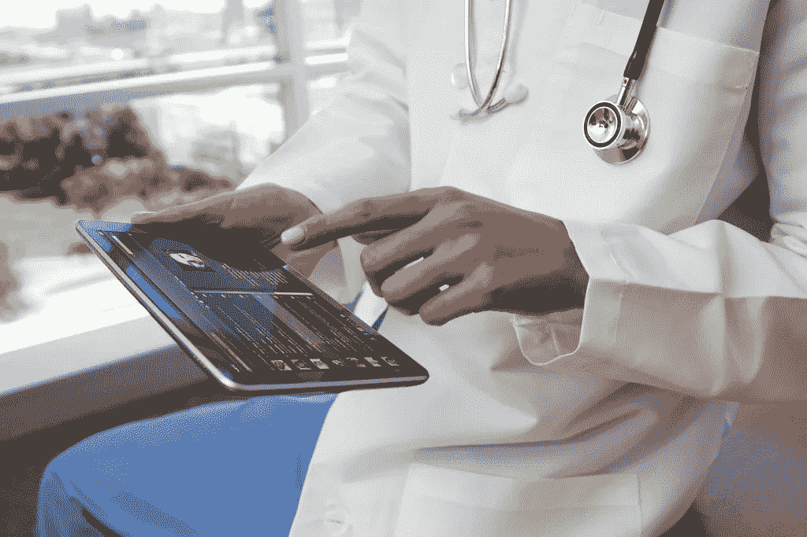
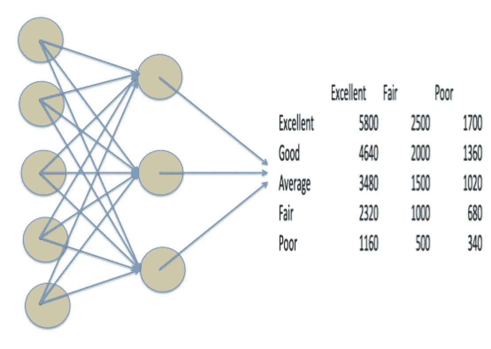

# 那天我把自己的健康控制权交给了 AI。

> 原文：<https://medium.datadriveninvestor.com/the-day-i-handed-control-of-my-health-to-ai-4c759443fe17?source=collection_archive---------11----------------------->

过去 12 周，我一直在探索人工智能(AI)的未来世界，并询问当我们“扩大”人工智能时会发生什么。那么什么是缩放 AI 呢？嗯，我很幸运有一位杰出的教授和未来学家吉纳维芙·贝尔博士在我们大师 ANU 之旅的第一天为我们解释它。回想一下 18 世纪欧洲的蒸汽机。发明这项技术是为了在矿井中使用，从矿井中抽水并拯救生命。它被称为“[大气发动机](https://en.wikipedia.org/wiki/Newcomen_atmospheric_engine)，因为它在大气压力下工作来抽水。

如果你告诉托马斯·萨弗里或托马斯·纽科门，它后来不是用来“泵”东西，而是用来在陆地和水上推动东西，他们会觉得难以置信。但历史告诉我们，这种大气蒸汽机后来为机车提供动力，并引发了“大众运输”和第一次工业革命。用贝尔博士的话来说，这是“缩放”蒸汽机，做超出其发明和预期手段的事情。

 [## 医疗保健的未来正在被一场巨大的技术入侵所塑造——数据驱动的投资者

### 过去十年，全球经济的所有部门都经历了大规模的数字颠覆，而卫生部门现在…

www.datadriveninvestor.com](https://www.datadriveninvestor.com/2018/11/02/the-future-of-healthcare-is-being-shaped-by-a-big-tech-invasion/) 

因此，如果我们将这种“缩放”原则应用于人工智能，我们会得到使用人工智能的系统。这些系统已经以这样或那样的方式存在于我们之中。图像识别软件、Siri & Alexa 等语音助手以及网飞等你最喜欢的流媒体平台上的推荐，都是人工智能系统的几个例子。所以在你不知道或者没有意识到的情况下，你已经把控制权交给了 AI。你可能会说，所有这些人工智能工具都在通过代表你做决定来帮助你“简化”你的生活。我也有同样的看法，直到我在硕士项目中接触到这项技术。

最近，我们邀请了澳大利亚总理和内阁秘书马丁·帕金森博士与我们谈论人工智能和澳大利亚的未来。帕金森博士谈到技术是价值中立的，而我们人类向技术灌输价值。这对我来说是完全有意义的，因为技术本身不会伤害或有利于我们，它完全取决于我们决定在哪里应用技术解决方案。这方面的一个例子是 3D 打印，它能够打印心脏植入物来挽救某人的生命，但同时，它也可以用来打印枪支来结束某人的生命。因此，当我们扩展人工智能以塑造我们的未来时，如何以及在哪里应用这项技术的意图绝对至关重要。

因此，当我们的团队被告知，我们必须设计和开发我们自己的系统，该系统使用至少一个需要人类交互的人工智能组件时，我决定创造一些既有可能受益又有能力进行有问题的应用的东西。所以对我来说，最私人最有价值的数据就是我的健康数据。我的健康数据不仅对我有价值，而且对保险公司、医疗设备、药品制造公司和许多其他利用这些信息赚钱的行业来说也有极大的价值。那么我们可以用这些数据做什么呢？嗯，美国的一些医院使用病人的健康数据和他们的信用卡信息来预测人们的健康状况。这听起来似乎无害，但是 ***病人们知道他们去当地快餐连锁店的行为被医院跟踪了吗？医院是否进一步向第三方出售该数据或使用该数据开发的产品？***

所以回到我自己的健康数据的故事。作为项目的一部分，我开始收集数据，包括定量信息，如心率、血压、心率变异性和体重。我也开始记录定性数据，如睡眠质量、食物摄入量、水摄入量和运动。我在两个月的时间里收集了这些数据，并开始使用回归和方差分析等统计工具分析趋势和相关性。利用这种分析和一些隐性知识，我开发了一种算法来得出一个数字健康指标(NHI)。

My personal algorithm and NHI

NHI 很好，但是你用它做什么呢？嗯，你的代码(播放戏剧音乐)。现在有一个问题，一个聚合物工程师和材料科学家不知道如何编码。然后我想起来，我们在 2019 年，有一个像互联网这样的东西，有时它可以非常足智多谋。所以我去了一些有用的网站学习如何用 python 编程，在同学们的帮助下，我能够理解一些 Python 的基础知识。所以我用我学到的基本算法的知识，把它编码成 python 来预测两个结果。如果我的 NHI 高于 3480，那么我的健康状况良好，但低于 3480，我就会被认为不健康。你可能会说这一硬性规定不应该被应用，但这正是问题所在。谁来决定什么是合适的，什么是不合适的？是你还是公司在做决定？

我用了基本的统计学知识，学了一点 python 代码，开发了一个算法。剩下的就是让这个系统成为一个自主的或规模化的人工智能系统，代表我或我的医生做出决定。所以我用我的基本 python 知识和基于云的电话服务来完成这个拼图的最后一块。如果我的 NHI 高于 3480，该代码将在早上 6 点在我的手机上播放闹钟，叫醒我，以表明我很健康，我需要去健身房(这是我的例行公事)。但如果我的 NHI 低于 3480，它就不会发出警报，而是会给我发一条无声短信。这条信息会说“你今天的健康不是 100%，所以你应该休息，顺便说一下，我已经给你的雇主发了一条信息，让他们知道你今天不会去上班。”所以本质上，我创造了一个虚拟医生，并给它自主权和代理权来代表我做决定。

所以你可能会问这有什么意义？嗯，有几个。在 12 周内，我已经建立了一个完全自主的人工智能系统，它拥有代表我做出决定的机构。我通过使用网上免费资源，在对编码或算法知之甚少或一无所知的情况下做到了这一点。我已经能够将这个系统连接到互联网，并使用(免费)试用将其连接到我的个人手机。所以这一切都是在我的业余时间，没有花一分钱，没有任何技术专长，最重要的是有开源信息的情况下实现的。

带着这个家，我有很多问题，通过我的经验，建立一个完全代理的自治系统。 ***谁拥有我的数据？我是否已经同意将其用于第三方？谁来决定，什么是健康的，什么不是？第三方可以代表我做决定吗？开源/免费获取信息是否让任何人都可以轻松地利用技术为自己谋利？是否有必要规范和限制个人电话号码的使用？***

最重要的是，我们是否已经走得太远，无法逆转这一切？我很乐观，因此我是 ANU 这个开创性项目的一部分。我相信我们都能确保技术对全人类都有积极的价值。我通过构建自己的规模化人工智能系统认识到了这一点，那么其他人如何才能认识到这一点呢？

**关于作者**

Hrishikesh Desai 是一名进步领袖，目前是澳大利亚国立大学 3A 学院的学生。赫里什克什在联邦政府的监管、知识产权方面有经验，你可以通过 [LinkedIn](https://www.linkedin.com/in/rishidesaii/) 和 [Twitter](https://twitter.com/ScalingAI) 与他联系。