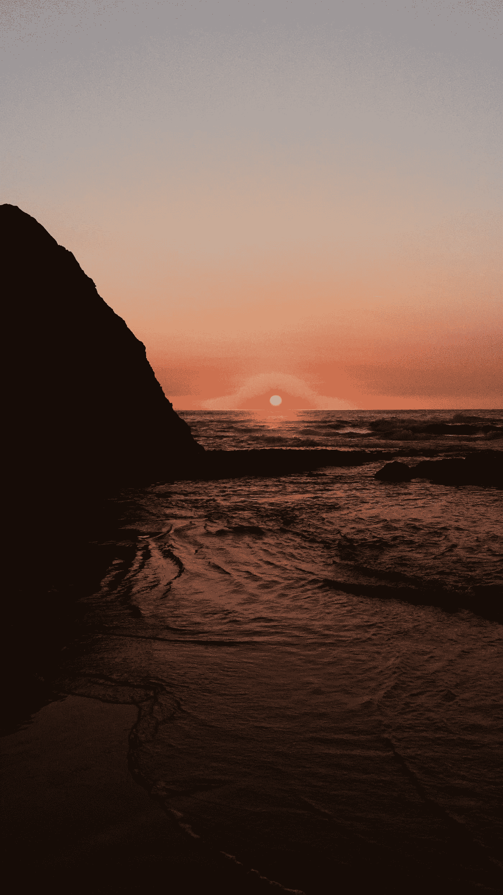
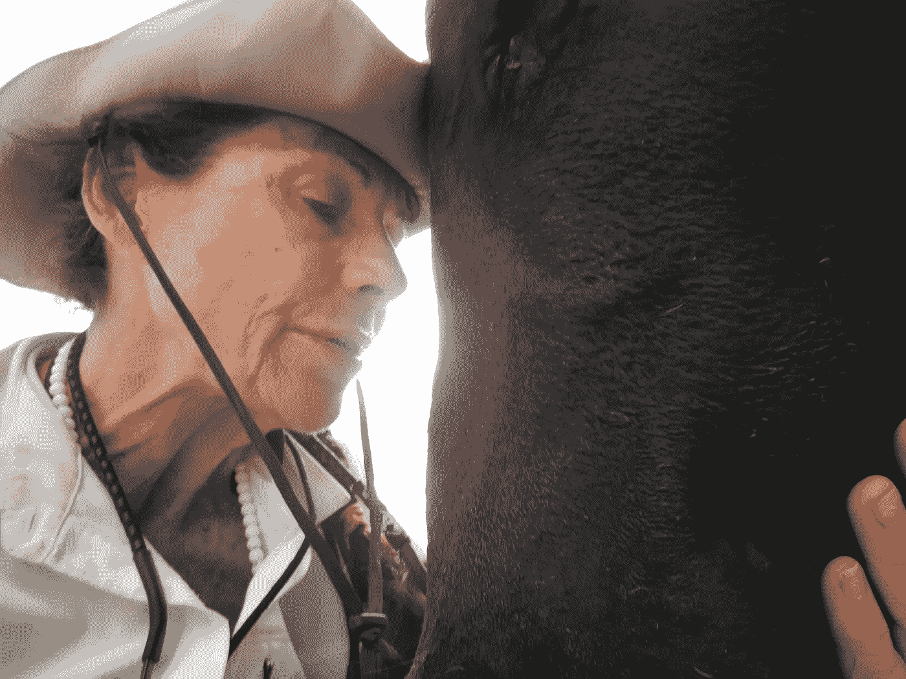

# 我知道我可以真正写作的那一天

> 原文：<https://medium.datadriveninvestor.com/the-day-i-knew-i-could-really-write-357a4ff72a46?source=collection_archive---------1----------------------->

Photo by [Helloquence](https://unsplash.com/@helloquence?utm_source=medium&utm_medium=referral) on [Unsplash](https://unsplash.com?utm_source=medium&utm_medium=referral)

## 当我摆脱了我的话语和内心的批评

那种绝对的、彻底的流动的感觉并不经常发生。当你静静地坐在自己的文字之河的岸边。你看着他们溜走。你既困惑又惊讶，如果不是高兴的话。

想知道那是从哪里来的吗？

多么伟大的**短语转换。**

*该死，我真的想到了吗？*

事实上，最后一个问题的答案很可能是*不，你没有。*

和我待在这里。很快就会有意义(或者至少我希望如此)。

十年前，我有了写一本书的想法。很快演变成一个标题，然后是手稿。当时我有一个图书教练(现在也是)。我几乎不记得清晨的会议，那时我会写下我的心声。

事实上，我一点都不记得了。

# 因为大部分时间我都不在。

让我解释一下。当我写作时，通常出现的“我”是一个唠叨的人，它担心单词、句子、上下文和语法。如果事情不完美，那个“我”就会慌张，想要重写，直到完美为止。永远不会。“我”，如果我给它充分的代理，将确保这本书永远不会完成。

 [## 成功人生的 25 种自我提升方式|数据驱动的投资者

### “我活得越久，学到的就越多。学的越多，体会的越多，知道的越少。”―米切尔·莱格兰德时间到…

www.datadriveninvestor.com](https://www.datadriveninvestor.com/2019/03/12/25-self-improvement-ways-for-a-successful-life/) 

可以说，这本书赢得了多个类别的三个奖项。

因为不是那个“我”写的。

我坐在我的河边，远离创作过程。我不确定我知道那是哪个“我”，但它不是管理我日常生活的那个。

换句话说，你可以合理地争辩说，我所描述的“我”是我的自我，而我所描述的另一个实体是纯粹的宇宙精神。我不在乎我们如何定义它。重要的是我们是否允许这种精致的智慧来指导我们的所作所为。

我有时会重新翻开那本获奖的书，读一读其中的部分内容，简直惊呆了。那是从我身上出来的？是也不是。更有可能是通过我。这才是重点。

作为一个同样以演讲为生的人，我在舞台上也会遇到这种情况。问问任何一个真正成功的演讲者，他们发现自己正在发表他们一生中最精彩的演讲。他们告诉我——我知道这是什么感觉——他们没有做演讲。*别的事情*被。他们只是躲开了。其他的东西充满了他们，提升了他们，有自己独特的声音。物理人只是一个容器，一个信使。

有好几次，我看了一个我发布的程序的视频。这是我在舞台上。那是我在说话。那是我的声音。但说话的人不是我。至少，不是那个通常干扰我生活的评判、紧张、自我专注的“我”。

这是一种地狱般的感觉。我把它描述为有*恩典*在我体内流动。

莫扎特也描述了这一点，音乐在他头上的空气中，已经创作好了。他只是把它转录下来。

在给他父亲的一封信中，他曾写道:

*我现在必须完成(写这封信),因为我必须以极快的速度写——一切都已准备好——但还没写。*

回到 10 月份，就在我去埃塞俄比亚之前，我花时间在车库里重新打包了几个大箱子。我知道我写了一些诗，但我完全被这么多震惊了。在我二十多岁和三十出头的时候，出于某种原因，我会进入一种奇怪的*赋格*状态，以极快的速度写下一首又一首诗有些韵律优美，以完美的形式出现在页面上。我不需要使用押韵词典。

他们中的几个*千个*

Photo by [Denchik](https://unsplash.com/@denchiik?utm_source=medium&utm_medium=referral) on [Unsplash](https://unsplash.com?utm_source=medium&utm_medium=referral)

然后，就像突然一样，我不再写诗了。那个特别的缪斯走了，我又回到了写日记和写故事的状态。我不知道发生了什么事。

我现在有了一个更好的主意。我所知道的是，在某个时候，这种情况比以前更常见，我换了一个档位。我把挡我路的那部分换下来。别的东西接管了。

我的第一匹马，反叛者罗伊，已经接受了佛罗里达 100 英里耐力赛的训练。他有一个额外的“齿轮”或步态，像巧克力牛奶一样平稳。我这辈子都没学会如何让他换上那个档位。它只是偶尔发生，我享受了一次极好的乘坐。这很像那个。我必须保持正确的心态，就像瑞博那样。如果我试图强迫它，我会得到一个刺耳的小跑。就像我试图强行写一篇文章或一个演示文稿时，我的下巴会因为压力而疼痛。

顺便说一句，精通不是那种感觉。你不能强迫它。它不断发展，直到在某一点上你感觉到有别的事情在发生。

格蕾丝。

当我在新地方安顿下来时(无论何时何地)，我打算梳理一下那些诗歌，看看是否有值得发表的。我记得有几部真的很好，其他人也很喜欢。其余的来得太快了，我一点都不记得了。它们只是流到已经写好的页面上。

我既不是天才也不是专家(善意地说，我对男人的糟糕品味充分证明了这一点)。写作不仅是我做的事情，也是我是谁。我无法开始一天不写作的生活，除非我在进行史诗般的冒险。即使那样，铅笔和纸也永远在身边。这就是我来这里的目的。我在国内的时候，每天至少会写两三篇文章。因为我*有*要写。这是当务之急。不是为了生存，不是为了赚钱，不是为了成名。而是因为文字是我神圣的艺术和责任。

动物也是，在我生命的另一部分，正如我在别处所写的。

My most recent buddy, a cow in Ethiopia Julia Hubbel

关于动物。这是另一个地方，在那里我的某些东西坐下来，这样其他的东西就可以出现。每次我给动物按摩，不管是马、狗、骆驼、老虎、大象，都会有一个“我”站到一边，一个更聪明、更冷静的“我”走上前做这件事。然后在我和那个没有名字的生物之间发生了一些事情。

我认为，这种神游状态是我们每个人都有的一种潜能。我指的不是消极背景下的[神游状态](https://en.wikipedia.org/wiki/Fugue_state)，而是一种非常特殊的状态，在这种状态下，我们放弃了自己认为自己是谁、我们的存在方式以及世界应该如何看待我们的身份认同。

有时我想这就是我们如何知道我们正在做我们来这里要做的事情。我们时常会遇到这样一种情况，我们所做的事情是如此完美，如此不费力，就像步入了一个不同的维度。

无论是跑道上的尤塞恩·博尔特，球场上的小威廉姆斯，还是巅峰时期的迈克尔·乔丹(今天的勒布朗·詹姆斯)。

这些人中的每一个人都有糟糕的日子，可怕的失败，尴尬，以及他们很难面对镜子中的自己。

当他们走出自己的路时，他们是伟大的。

我们不需要努力。纯粹是本能。平心而论，为了精英中的精英，它也来了又去。那是因为我们以我们自己的方式，我们所有人，不管我们是谁。我们就是这样被制造出来的。

在你声称我说你必须成为世界上最好的人才能实现这一点之前，请*坐下来*。正如我之前指出的，潜力存在于我们每个人身上。当你和我停止如此艰难的挣扎，当我们允许我们身上完美的东西展现出来，那么无论我们想做什么都会流出来。那可能是训练搜救犬，写下一部伟大的美国小说，或者像那个在戈尔登有一个小修理店的人一样，成为世界上最好的靴子修理员。毫无例外。

我不是在取笑道格，在金色的 B&B 修鞋店。我的教练让我喜欢上了这个人，他不仅非常好，而且非常擅长他所做的事情，永远都是快乐的，用靴子教育你，不会向你收取他不需要的东西，只是用他的态度让你开心。人是主人。当我离开镇上的时候，我会想念道格的。

你和我有时会错过的是，我们最好的作品不一定包含巨大的名声或财富。事实上，一些最有影响力的人过着非常安静、谦逊的生活。通过这样做，以及他们如何接触我们，他们比那些以自我为中心、自我陶醉的所谓影响者产生了更大的影响。

那些有影响力的人，如果你愿意，过着精心策划的公共生活，在许多情况下，后来你会发现没有一点是真实的。但它确实卖出了产品。

当我发现自己是一名作家的那天，我意识到“我”并没有在写作。另一件事是，我的非常聪明的部分经常被我的自我所阻碍。当我不再问我是否能卖出 X，或者人们会如何看待 X，或者我需要做些什么来营销 X，或者 X 是否足够或完美或可接受时，障碍就消失了。自我担心无关紧要的事情。他们会被及时处理的。

更重要的是，让这条河随心所欲地流向它想去的地方，然后离开这条该死的路。

