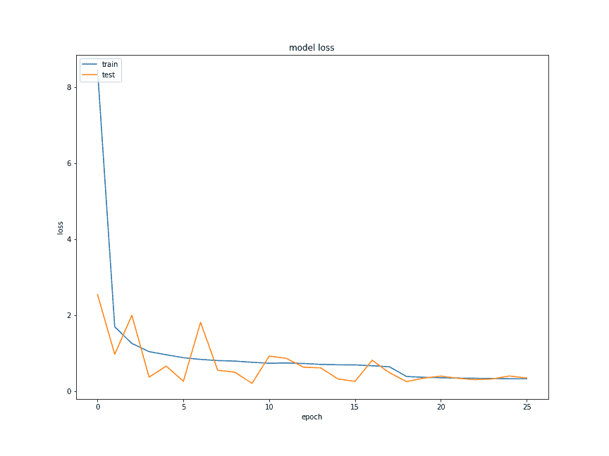
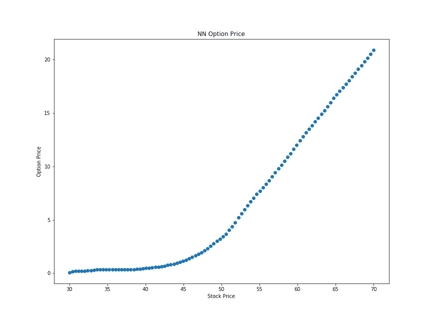

# 我的计算机获得诺贝尔奖的那一天(神经网络期权定价)

> 原文：<https://medium.datadriveninvestor.com/the-day-my-computer-won-the-nobel-prize-neural-network-option-pricing-d29b4379f1d2?source=collection_archive---------3----------------------->

我写过最受欢迎的文章是“[我教我的计算机久期是什么的那一天(神经网络债券定价)](https://www.linkedin.com/pulse/day-i-taught-my-computer-what-duration-neural-network-jacob-bourne/)”，在那里我训练了一个神经网络来给债券定价。我的 python 和机器学习技能变得更好了，所以我决定尝试一个更加非线性的定价函数，期权价格。换句话说，机器可以学习布莱克-斯科尔斯公式吗？

再说一次，除了因为我可以(或者我可以尝试)之外，没有更好的理由这样做，但很容易想象从期权价格中净学习如何支持波动微笑的模型，如果你有足够的期权数据，这不仅仅是插入值。另外，这很有趣，我不需要比这更好的理由。

把那些更令人兴奋和复杂的模型放在一边，让我们看看我们能否教会我们的神经网络希腊人的选择是什么。对于我们的网络，我们将使用一个输入层，两个隐藏层和一个输出层。

与之前我只创建 50，000 个债券不同，我将创建 1，000，000 个随机选项来训练网络。像之前一样，第一步是用 python 构建 Black Scholes 公式，这样我们就可以生成债券。这是一个不支付股息的股票公式的简洁版本

```
import numpy as np
import scipy.stats as sidef euro_vanilla(S, K, T, r, sigma, option='C'):
 *# S: spot price*
    *# K: strike price*
    *# T: time to maturity*
    *# r: interest rate*
    *# sigma: volatility of underlying asset* d1 = (np.log(S / K) + (r + 0.5 * sigma ** 2) * T) / (sigma * np.sqrt(T))
    d2 = (np.log(S / K) + (r - 0.5 * sigma ** 2) * T) / (sigma * np.sqrt(T)) if option == 'C':
        result = (S * si.norm.cdf(d1, 0.0, 1.0) - K *
                  np.exp(-r * T) * si.norm.cdf(d2, 0.0, 1.0))
    if option == 'P':
        result = (K * np.exp(-r * T) * si.norm.cdf(-d2, 0.0, 1.0) -
                  S * si.norm.cdf(-d1, 0.0, 1.0))return result
```

现在让我们创建我们的选项，请注意，在我的笔记本电脑上，创建 1，000，000 个随机选项大约需要两分钟

```
random.seed(42)
draws = 1000000
S = np.random.rand(draws) * 100
K = (np.random.randint(50, 150, draws) * .01) * S
T = np.random.randint(10, 300, draws) / 100
r = np.random.randint(1, 1000, draws) / 10000
sigma = np.random.randint(1, 50, draws) / 100
opt_type = np.random.choice(['C', 'P'], draws) *# generate option prices*
opt_price = []
for i in range(draws):
    p = euro_vanilla(S[i], K[i], T[i], r[i], sigma[i], opt_type[i])
    opt_price.append(p)
    if (i % 50000) == 0:
        print('Generated {} Options'.format(i)) *# create a dataframe*
options = pd.DataFrame({'S': S,
                        'K': K,
                        'T': T,
                        'r': r,
                        'sigma': sigma,
                        'type': opt_type,'price': opt_price})
```

最终，我们将得到一个包含 1，000，000 行的 pandas 数据框，每一行都包含所有的输入和期权的价格。我添加了一个小计数器，这样我就不会无聊地等待价格结束。

熟悉神经网络的人会立即意识到，网络很难使用带有 P 或 C 的列。幸运的是，我们可以使用虚拟变量将它们替换为两列(即 P 列和 C 列，其中包含 1 或 0)，非常适合这种架构。

```
options = pd.concat([options, pd.get_dummies(options['type'])], axis=1)
options.drop('type', inplace=True, axis=1)options.drop('type', inplace=True, axis=1)
```

我们现在做一个简单的训练/测试分割。由于这些都是随机选项，我用 10%进行测试，如果 100，000 个选项不够，我可以生成更多的随机选项。顺便说一下，看看 python 看起来有多干净，我已经变得更好了

```
X, y = options[options.columns.difference(['price'])], options['price']X_train, X_test, y_train, y_test = train_test_split(X, y, test_size=0.1)
```

现在我们只需要建立和拟合我们的模型，拟合需要一些时间，即使有 GPU 加速，但这是可行的。经过 25 个训练周期后，定价者做得相当不错。也许我会让它运行一整夜，看看我是否能让它适应得更好

```
model = models.Sequential()
model.add(layers.Dense(1024, input_dim=X.shape[-1], activation='relu'))
model.add(layers.Dropout(.25))
model.add(layers.Dense(2048, activation='relu'))
model.add(layers.Dropout(.25))
model.add(layers.Dense(1, activation='linear'))history = model.fit(X_train, y_train, epochs=100, callbacks=get_keras_callbacks(), validation_split=.1, verbose=1, batch_size=256)model.compile(loss='mse', optimizer='adam')
```

那么它是如何做到的呢，首先，它收敛得很好，曲线上出现的训练损失的下降是当我在它达到稳定状态时降低学习率，但你可以看到，随着更多的训练时间，我们应该能够获得更好的结果。



就我们的期权定价而言，这里有一个假设的一年期 50 美元的看涨期权，具有各种基础价格，我们应该会看到非线性这样的好期权，尽管该模型以前从未见过这种期权



你看看这个，一个经典的期权形状，如果这台电脑再老一点，它就能获得诺贝尔奖了(给定足够的数据，记得我用 1，000，000 个期权来训练它)