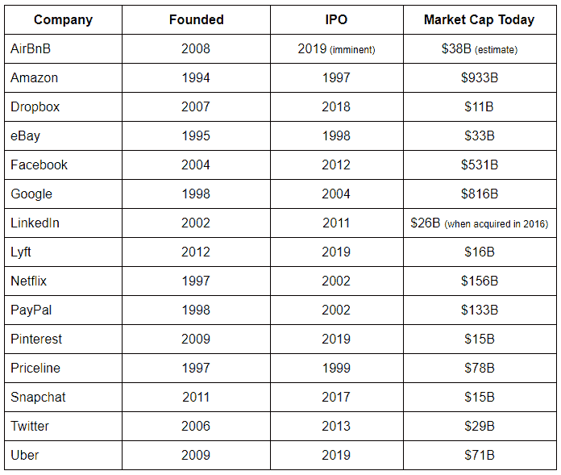
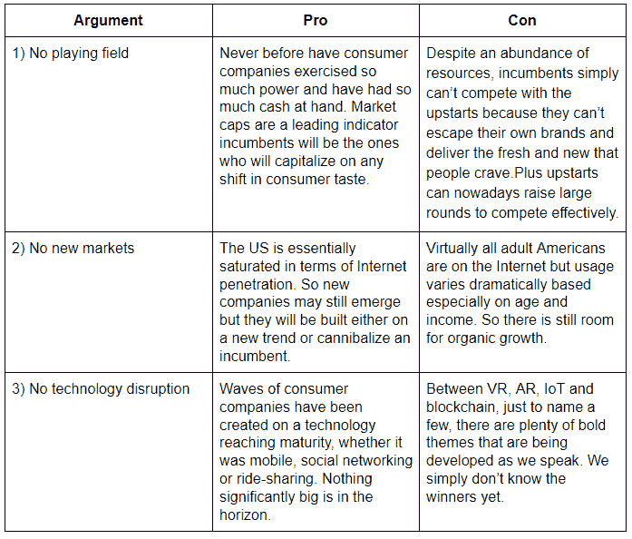

# 消费创业公司的死亡？

> 原文：<https://medium.datadriveninvestor.com/the-death-of-consumer-startups-4c07b214246a?source=collection_archive---------2----------------------->

投资者和企业家不时会谴责消费互联网行业——因为市场已经饱和，不可能出现新的巨头。这类似于所有必须被发明的东西都已经被发明了的观点。但历史已经表明，新的消费品公司不断涌现，反映了我们不断演变的品味。

2019 年，关于消费创业公司死亡的争论再起。让我们来看看美国的一些主要品牌。我们在这里将消费者定义为基于互联网的软件公司，其用户主要是作为个人的你和我，即使在某些情况下企业是主要买单者。

记住这一点，以下是双方的三个关键论点:

人们可以假设这场辩论有类似正弦曲线的波峰和波谷，即消费者的稳定期之后是中断的爆发。今天的观点最终被我们在这个周期中所处的位置所影响，但它是永无止境的。并且同一个例子可能被任何一个阵营采用。例如，YouTube(一家初创公司)打败了 Google(一家现任公司)，最终被收购，现任公司才是推动其发展的真正动力——说明了这一论点的正反两面。

 [## 波动迫使数据驱动的投资者冷静

### 自然界中很少有东西是直线行进的，尤其是经济。当投资者和消费者希望平静时…

www.datadriveninvestor.com](https://www.datadriveninvestor.com/2019/03/25/volatility-compels-calm-amid-the-storm/) 

你怎么想呢?我们是否打破了循环，消费者创业公司真的死了？还是下一件大事即将来临？

*这篇帖子的灵感来自与* [*Ed Yip*](https://www.linkedin.com/in/edwardyip/) *的一次对话。这些都是专注于实践见解的有目的的短文(我称之为 GL；dr —良好的长度；确实读过)。如果它们能让人们对某个话题产生足够的兴趣，从而进行更深入的探索，我会感到非常兴奋。这里表达的所有观点都是我自己的。如果这篇文章有对你有用的见解，请给个赞，任何想法请留言。*