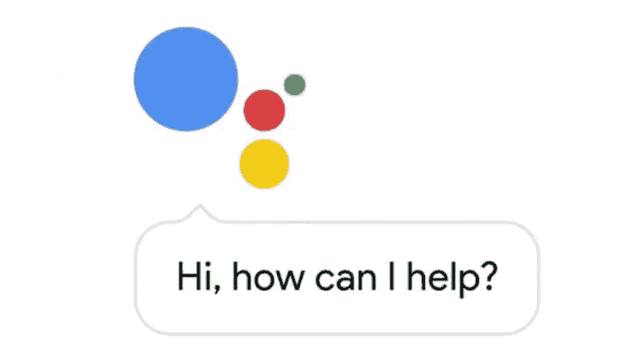

# 请与谢谢之死

> 原文：<https://medium.datadriveninvestor.com/the-death-of-please-and-thank-you-a7e8f34d1dc9?source=collection_archive---------13----------------------->

我想对你们所有的个人人工智能程序员，苹果、谷歌、微软的工程师，所有负责人类/人工智能交流迭代的人提出一个要求。

我希望能够对我的声控电脑说“请”和“谢谢”。

这似乎是一件小事，不是吗？一个古怪的美好事物在追求奇点的过程中半途而废了。但是你们忘记了，我的工程师们，当你们训练你们的人工智能和我们说话的时候，那些人工智能也在训练我们和它们说话。

很像猫，但脱落较少。

一个人的请求通常会形成一种闭环。这是我们学习的一种形式，大多数文化都有。一个 In，一个 An，一个 Request，一个 Confirmation，一个 Out。对普通人来说，这感觉很完整。事实上，打断这个序列感觉很粗鲁。没有完成这个顺序只会让人感觉不舒服，就像有人在挂电话前没有说“再见”一样。根据不同的人/文化，这种感觉可以从轻微的烦恼到需要回应的冒犯。

并不总是美好的。

举个例子，假设我们在一家餐馆吃晚餐，从一个助手(比如 Siri 或 Hey Google)那里点餐。交互可能是这样的:

就餐者:“嘿，服务员。”(英寸)

服务员:“你想点什么？”(确认)

食客:“请给我来份三文鱼慕斯。”(请求)

侍者:“一份鲑鱼慕斯，马上就来。”(确认)

就餐者:“谢谢。”(出局)

在你的一生中，你可能有过成千上万次这样的交流。最后，服务员从这场冲突中被释放出来，双方可以自由地继续其他事情。进进出出都很清楚，没有人被晾在一边，等待后续行动或新的请求。事实上，你可能有过一两次服务员提前离开交易所的经历，在第二次确认之前或出去之前。

这让你觉得有点被忽视了，不是吗？可能有点迷茫。肯定不太对，尽管你可能不明白为什么。

这种类型的交换进行得很顺利，我们头脑中有一个想法，知道它将如何进行。很舒服，很熟悉。它的成功执行引发了双方的满足感，类似于你在《部落冲突》中获得资源或在《糖果粉碎》中创造瀑布的感觉。

在语音识别技术的当前状态下，这种相同的交换被截短:

就餐者:“喂，服务员？”

服务员:“是吗？”

食客:“请给我来份三文鱼慕斯。”

服务员:“三文鱼慕斯配豌豆。”

嘣，你就完了。把对“请”这个词的误解放在一边，这里没有“出去”。用餐者必须相信他们会得到他们想要的。他们被晾在一边，当服务员把豌豆和鲑鱼慕斯一起端上来时，他们感到沮丧和恼火。在用户的心目中，交换失败了，这种支持被认为是不可靠的。

一旦你和你的助手进行了几次这样的次优交流，你就会停止使用自然语言。每一个“请”和“谢谢”,因为它们经常被误解或者被忽视，或者引起误解，被放弃。这些旨在从人类那里获得最佳可能反应的条件反应，在与人工智能交谈时成为一种负担。您的交易变成:

就餐者:“嘿，服务员。三文鱼慕斯，盘子，餐厅，额外的叉子。”

服务员:用额外的叉子把装在盘子里的三文鱼慕斯送到餐厅。

呀！这已经不是“自然语言”的要求了。就餐者已经开始简单地传递一串关键字，以获得他们正在寻找的最终结果。用户，这个等式中的人类部分，自然语言语音识别是专门为其设计的，在与他们的助手交谈时，已经完全放弃了自然语言。他们遇到了不可思议的声音之谷，并开始像对待普通的搜索引擎一样对待人工智能。

如果它只影响到 issant，那就不是问题了。事实上，它使事情运行得更加顺利。但是这些声音模式往往会持续下去。他们倒冲向常用的词汇(看看像 LOL 和 l33t 这样已经进入口语并在此停留的词汇，它们的存在只是因为技术的限制)。听一听习惯用语音发短信的人留下的语音信息。你会发现他们有一种自动大声说出标点符号的倾向，就像你听写电子邮件或文本信息时需要做的那样。

“请”和“谢谢”不再是谈话中的迂回曲折，而是成为绊脚石，是你的命令序列失败的地方。我们在口语中用来表达请求的这些细节开始被抛弃，不是因为没人教它们，也不是因为人类变得越来越粗鲁，而是因为它们在与有点害羞的人类助手的互动中被再次训练出来。

下一步就变得复杂了。我们是否将语言分为“对话”和“命令”两种形式？或者，我们最终会完全放弃对话形式，转而采用更有效(但交流性更差)的关键词串吗？看看我们是否在夜晚擦肩而过，人类和人工智能，这将是一件有趣的事情，随着人工智能语言识别软件在处理我们的自然说话方式方面变得更好，人类的语言模式变得更加人工智能友好。

无论哪种方式，请和谢谢，那些帮助保持请求表达在一个整洁的小包装中的自然地址，可能是第一批受害者之一。

*原载于 2018 年 7 月 13 日*[*【ungerink.com】*](http://www.ungerink.com/the-simple-exchange-of-please-and-thank-you/)*。*