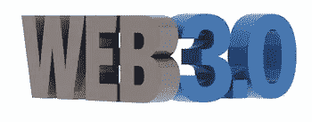

# 去中心化的互联网:HBO 的故事？

> 原文：<https://medium.datadriveninvestor.com/the-decentralized-internet-an-hbo-tale-1c4247efdb44?source=collection_archive---------13----------------------->

Photo by [Maik Jonietz](https://unsplash.com/@der_maik_?utm_source=medium&utm_medium=referral) on [Unsplash](https://unsplash.com?utm_source=medium&utm_medium=referral)

作者 Nick Roquefort-Villeneuve，全球营销总监— [Amalto Technologies](https://www.amalto.com/)

我不知道你是怎么想的，但我在硅谷生活和工作了十多年，看同名节目并不能真正满足我。可能是一个中情局特工在国土安全部面前的感觉或者是我那个一见钟情已婚的前妻。

HBO 电视台的电视剧《硅谷》(Silicon Valley)讲的都是去中心化互联网的创建，一个运行在区块链上的互联网。专家称之为“web 3.0”。正如我们今天所知，这确实是从 Web 2.0 的巨大飞跃，也就是强调用户生成内容(你知道，脸书上发布的法国斗牛犬满嘴薯条哼着《马赛曲》的视频)，可用性(是的，你的祖父母发布的)，参与文化(废话！)和最终用户的互操作性(爷爷甚至可以在 Twitter 上分享)。我甚至不会谈论 Web 1.0 及其无数的迷信。“如果你不让主页完全加载，那就不行。”来吧，承认吧…

那么，区块链如何创造一种完全不同的互联网形式呢？

# **Web 2.0:到底是个大骗局？**

当蒂姆·伯纳斯·李在 90 年代为网络编写源代码时，他的想法是创建一个平台，让用户可以以点对点(P2P)的方式参与进来。换句话说，愿景是建立一个分散的工具。

如果你诚实地看看今天的互联网是如何运作的，用户(你和我)毕竟没有多少权力。它们受制于谷歌、微软和脸书等极少数公司想要向它们展示或希望它们访问的内容。谷歌为美国约 85%的搜索提供动力，在搜索然后访问网站的过程中，它是一个几乎不可避免的中介。换句话说，谷歌根据向用户付费的客户公司来决定用户会看到什么样的搜索结果。如果客户需要与一个出售“真正的女人穿黑色”奥克兰袭击者 t 恤的供应商交易，现在亚马逊很可能成为买家和供应商之间的第三方。互联网的运作方式类似于寡头垄断。它由少数玩家主导，这些玩家集中了所有的行动，同时宣扬用户确实被赋予了权力和权力的信念，因为他们能够，例如，发布一个法国斗牛犬用装满薯条的鼠标哼法国国歌的视频，并几乎立即在众多社交媒体平台上分享。

这就是我毫不犹豫地称之为的大骗局。尤其是当你知道你的个人信息被卖给广告商，而你对此完全没有发言权，也看不到这些钱进入你的银行账户。

# **Web 3.0:** **把权力还给用户？**

创建一个运行在区块链上的互联网的目的很简单:建立一个工具，通过恢复对用户个人数据的控制和为他们提供利用互联网的能力，把权力还给用户，而不必依赖和支付中介(这个世界的谷歌和亚马逊)。点对点，去中心化。但这真的是一个运行在区块链上的互联网吗？不完全是。更重要的是构建去中心化的应用程序(或基于区块链的应用程序)，利用互联网实现访问目的。

我总是喜欢回忆 Napster，一个纯粹的 P2P 应用程序，它在很大程度上促成了我目前的非物质化的一次性奇迹目录。让我们面对它，多年来我在整个西方世界的跳蚤市场搜寻，试图找到银色公约的苍蝇知更鸟苍蝇乙烯基。多亏了 Napster，它仍然时不时地在我的 iPhone 上弹出(“向上，升到天空！”).你可以在网上下载 Napster，将应用程序安装在你的电脑硬盘上，然后运行它来连接其他 Napster 用户和他们的歌曲库。文件交换将发生在用户的硬盘驱动器之间。好吧，忘记 Napster 和它的非法文件共享系统，但是记住它的 P2P 交易方面，想象它现在发生在网上。接下来，假设每个交易都被验证并存储，以便所有参与者在任何时候都能看到。那就是 web 3.0。其广泛的区块链网络将为所有形式的 P2P 商务提供动力，而不是依赖易贝从加拿大购买假的 Cialis。

接下来，web 3.0 如何应用于与网站相关联的域名，在那里您可以阅读内容和/或进行交易。web 3.0 如何应用于互联网搜索？当你想建立一个网站时，你需要购买一个域名。互联网名称与数字地址分配机构(ICANN)授权 iPage 和 GoDaddy 等域名注册商处理(临时)收购事宜。Web 3.0 提供了 ICANN 的替代方案。由于星际文件系统(IPFS)，这是一个分散的网站索引系统，网站将根据其所有者的唯一区块链标识符(哈希)进行组织。IPFS 将依赖于一个庞大的个人电脑全球网络，作为对加密货币等财务激励的回报，其所有者将允许该系统使用所有者的免费硬盘空间来托管网站及其内容。个人搜索网站将不再使用谷歌，而是使用 IPFS 系统。

# **Web 3.0:用户的力量……**

…钱又回到了他们的口袋里。

消除像谷歌和脸书这样充当中间人的在线集中系统意味着:

个人数据不能出售给第三方企业

准消除数据泄露，因为区块链几乎是不可腐蚀的

加密货币支付将大幅减少向银行和信用卡公司的支付