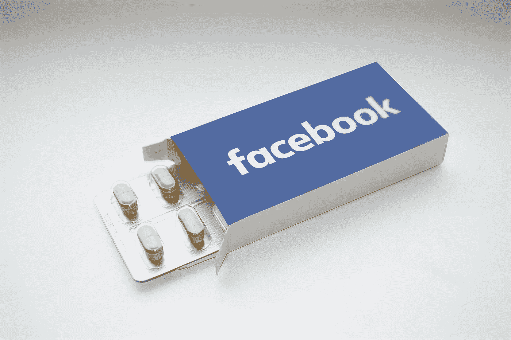

# 脸书的衰落和负责任的社交媒体的崛起

> 原文：<https://medium.datadriveninvestor.com/the-decline-of-facebook-and-the-rise-of-responsible-social-media-be00599520ec?source=collection_archive---------2----------------------->

自从我不再是脸书的每日活跃用户(DAU)以来，这篇文章已经在我脑海中酝酿了三年。这是一个专业术语，意思是“我不再每天查看我的订阅了”。现在，皮尤上周发布的一份新的[研究报告](http://www.pewresearch.org/fact-tank/2018/09/05/americans-are-changing-their-relationship-with-facebook/)显示，在我的年龄组(18-29 岁)中，几乎一半的人已经从他们的手机中删除了该应用程序。第二大删除应用的年龄组(30%)在 30-49 岁之间，几乎肯定是偏年轻的。大多数 18 岁以下的人不使用脸书，但他们仍然使用几个脸书公司的产品，如 Instagram。这篇文章是给你的。对于我们这一代人来说，当我们还是学生的时候，他们把脸书介绍给了我们的父母，没有意识到他们最终会比我们更多地使用它，没有意识到这是一种新的表达形式——一种新的信息形式——这将改变一切。在这里，我希望我们仔细看看我们已经做出的改变，并批判性地行动(不仅仅是思考)我们如何才能让我们的社交媒体对我们和社会更健康地使用。

就像在特殊场合打开美酒一样——考虑到最近围绕假新闻、国会听证会等事件和争议的转变——我认为我们已经准备好像成年人一样倒一杯酒，谈论我们作为历史上第一代精通互联网的一代人的*权力*和*责任*。作为已经塑造了现代历史的一代人，我们展示了我们的力量。我们以 70 年代以来从未有过的热情彻底改革了政治和社会。我们帮助选出了美国第一位黑人总统，他以积极、鼓舞人心的领导方式带领我们度过了有史以来最大的财富毁灭。经历了这些艰难的时刻，我们变得更加强大。尽管背负着债务和在晚年赡养现代史上最大的一代人(婴儿潮一代)的前景，我们还是迎接了挑战。

作为一代人，我们用我们的创造力来建立和支持有感染力的想法，这些想法产生了一些前所未见的最伟大的组织，如谷歌和脸书。他们的影响力可与大型政府相媲美，他们的市场价值超过了许多国家的国内生产总值。考虑到我们在过去 15 年中完成了大部分工作，我们才刚刚开始。尽管年轻人很少担任政治职务，但我们已经展示了我们作为选民、创造者和消费者的力量。现在我们有责任教育我们的父母、祖父母和彼此，让他们知道这种新的权力也可能被滥用——通常我们甚至没有意识到这一点。是时候面对我们行为的意外后果了。是时候面对我们自己创造的机器如何利用我们自己的力量来对付我们的可能性了。这不仅仅是脸书的事。这不仅仅是关于社交媒体。它是关于我们伪装成社交生活的最大嗜好之一是如何既不是社交生活也不是真实生活的。

在我们进一步讨论之前，区分脸书的*应用*和脸书的*公司*(在本文中称为**脸书公司**)也很重要。本文标题中提到的脸书指的是脸书的*应用*。脸书公司很有可能已经越过了永恒的门槛，并将在可预见的未来以某种形式或时尚继续存在，因为该公司不仅拥有应用程序脸书，还拥有几个竞争应用程序，如 Instagram 和 What's App，这两款产品正在从脸书转移注意力，并继续吸引和连接世界各地的用户。

在进入社交媒体、隐私和我们作为消费者的责任的核心之前，我将从为什么你会发现我是这个生态系统中关键利益相关者的同情和可靠的讲述者开始:用户、内部人员(脸书公司的高管和员工)和广告商。每个小组都有一套不同的兴趣，我们将探讨。在我人生的不同阶段，我曾戴过脸书用户的帽子，当过全职技术开发人员/高管，也在脸书做过广告，花了五位数的钱。郑重声明，我也不反对脸书作为一家公司。我认为他们的领导层有很多事情需要弄清楚，扎克伯格知道这一点。他臭名昭著的古怪新年决心是对他自己意志的考验，尽管他的 2018 年[决心](https://www.cnbc.com/2018/01/04/mark-zuckerbergs-personal-challenge-for-2018-fix-facebook.html)可能需要一年多的时间才能完成。

# 在脸书呆了 8 年后…

注意:这一部分讲述了我个人使用建筑技术产品的经历，以及我最终是如何脱离脸书的。如果你已经相信我对技术和社交媒体的描述是可信的，请随意跳过这一部分。

与#deletefacebook 活动的热情不同，我没有用标签或状态更新来宣布我转变为脸书壁花(双关语)。不过，刚开始把 app 从手机里删了，然后重装，再删几次，我确实有过一两个月的内心斗争。我在上瘾的两个极端之间转换(是的，就是这样):一边是从无形的数字连接链中解脱出来的解脱，另一边是对错过重要社交活动的恐惧(FOMO)。

我把我的隐私设置提高到了一个相当高的级别，这样每一个帖子都必须经过我的手动批准(我还没有拒绝过一个帖子，但是以防万一)。我会继续通过电脑定期查看网站，批准新朋友和新帖子。我删除了手机上的应用程序，但保留了 messenger，以防我的朋友想要联系我，但没有我的号码。我喜欢这样。在接下来的几个月里，我感觉很平静，因为我的手机不会再像以前那样嗡嗡作响了。然后，我还关闭了手机上大多数其他应用程序的通知。只有短信和信使通知。没别的了。

有时，因为我神奇地拥有了所有这些自由时间，我觉得我有一个空缺要填补，但这很快就消失了，因为我当时完全专注于我的创业。这是帮助我戒烟的一个重要原因。经过两年的产品开发，我们已经推出并开始产生收入。我和我的一些导师一起筹集了一笔资金，用我能找到的尽可能多的信息和创造性的工作填满了我现在异常专注的头脑。当然，其中一些非常官僚，许多会议都是浪费时间，但在我从手机上删除这个应用程序后的两年里，是我迄今为止生活中最有创造力和生产力的几年。

我和一个优秀的团队一起工作，为市场营销、筹资和产品开发做出贡献。我从不受干扰、通知和干扰的集中精力中学到的越多，我就对我们的世界越好奇，对技术及其对我们的心理和社会的影响越好奇。与此同时，在硅谷发展一家初创公司的过程中，我有机会结识了科技和教育行业中知识渊博、成就非凡的人——他们直接认识像埃隆·马斯克这样的高管。这让我保持谦虚和好奇，继续学习更多的知识，用技术做更多的事情。

在此期间，我还得到了有价值的导师，他们指导我无条件接受，这在任何导师-学员关系中都是一种非常罕见和值得尊敬的品质。这是我生命中最具形成性的几年，因为它们塑造了我对世界如何运转以及技术在进化中应该扮演什么角色的信念。虽然我偶尔会错过阅读朋友的反馈，但如果脸书还在我的生活中，我很怀疑我会不会像现在这样富有成效或快乐。我非常同意心流状态研究人员的观点，即使没有报酬，拥有创造性和满足感的工作也是幸福的关键之一——其他几个是有意义的友谊、定期锻炼和合理的经济保障。

# 脸书不是免费的——你只是用不同的货币支付

我们生活中最通用的三种货币是时间、金钱和能量。脸书需要关注，这会耗费精力和时间。大多数时候，我们会在休息的时候去脸书看看，所以时间和精力的成本*似乎*最小化了，但还是有成本的。更重要的是要记住，使用脸书还有第二个更大的成本。这是我们本可以做其他事情的成本——失去机会的成本([机会成本](https://www.econlib.org/library/Enc/OpportunityCost.html))。我们可以做很多其他的事情。就是做一件事的成本*可以用别的东西代替*。生活中我们为之付出的几乎所有东西都来自机会成本，尤其是免费的东西。那么，在放松的时候，我们还能注意些什么呢？

我们可以喝一杯葡萄酒或阅读(或两者都有！).我们也可以和朋友打电话聊天，或者和他们一起出去玩。我们可能在欣赏艺术，或者计划一个旅游目的地，或者在当地徒步旅行。我们可以做一些业余爱好修补。我们可以做一些改变生活的事情。基本上，与目前每周查看社交媒体十几个小时的版本相比，我们可以成为更好的版本，这比普通用户花在社交媒体上的时间高不了多少。困难就在这里，因为我们就是社会。我们是世界的消费者和创造者。我们有力量。然而，我们并没有以对我们有利的最佳方式使用我们的力量。技术已经成为一种趋势，一种时尚。我希望，就像许多时尚一样，我们在 50 年后回顾时会想，*那时的人疯了吗？*

# 注意力经济的副作用

互联网的兴起导致了以注意力为中心的经济，我们开始衡量一个网上冲浪者的时间和精力的价值。社交媒体平台上的广告技术已经设法通过向你展示你可以购买的产品来衡量你的休闲时间有多少价值。哦，这些产品与你极其相关。这种相关性是由高度复杂的自动统计算法计算出来的，基于你的偏好、位置、文字、标签、电子邮件、你的朋友、他们的位置、他们的话、你的喜欢、你的不喜欢、你愤怒的表情以及过去几个月你在平台上所做的一切。他们的算法什么都知道。我们甚至不要开始研究谷歌的算法。

一方面，这真的有助于发现新产品，并把我们作为消费者介绍给我们最喜欢的品牌。与此同时，其中大部分对脸书和我们 20 多亿人来说都是新的领域。大约 15 年前，互联网才变得足够快，可以大规模使用；大约 10 年前，互联网才变得足够快，可以处理视频。

另一方面，工业革命用了将近 100 年的时间给我们带来了冰箱、微波炉、大规模生产的汽车、可靠的电力等。以我们今天认为理所当然的规模和可用性。因此，我们也有责任教育自己使用互联网的隐性成本。否则，人们就很容易想当然地认为，今天的私营企业和许多政府一样强大，它们不会滥用权力；作为消费者，我们也要付出代价:我们的心理健康、我们的权利以及我们对世界的感知。对每个人来说，成本的权重是不同的，所以你要明白它们在多大程度上适用于你。让我们从我们从脸书获得的一些基本信息开始:

1.  **你的朋友分享的大部分东西都是偏向于你现有的信仰，因为他们是你的朋友**——上过同一所大学或同一所学校的人往往有相似的价值观，除非你接受过非常国际化的教育，去过几个国家(尤其是亚洲/非洲/东欧的国家)，或者有很多国际友人。然后你可能会在你的朋友和你的饲料中有不同的意见。然而，仅仅因为我们社会中教育系统的性质，你仍然不太可能和许多没有接受和你同样水平或质量的教育的人成为朋友。这自然会使你在 feed 上收到的信息产生偏差，并强化同样的想法。
2.  **你在脸书上收到的大部分信息都是你很有可能“喜欢”的东西**——除了从你信任的人(你的朋友)那里收到信息，脸书的算法直到最近还专注于向你展示基于你以前喜欢的信息的高度共享、非常受欢迎或非常个性化的信息。甚至张贴东西的行为也带有偏见，因为张贴者的动机是获得尽可能多的喜欢。再加上脸书只展示高度“受欢迎”信息的动机，你最终会得到一个随机但令人满意的熟悉信息流，让你觉得你所有朋友的生活都是完美的、冒险的、充满美食的。这不是现实。
3.  **你收到的信息质量或多或少是一般的**——根据定义，你可能从朋友那里收到的信息质量是一般的。除非你是一群名人和亿万富翁的朋友，否则你的 Feed 上的信息质量最多只是略高于平均水平。除了偶尔会收到关于朋友或爱人的重要信息，你可能会收到短信或电话，因为很少有人用他们的脸书帖子来讨论任务关键信息。这是我继续使用 Messenger 的最大原因，因为你知道消息只给你一个人，也许是一个小群体。为了获得更好的信息，使用不同的来源。最高质量的信息来自特殊和不寻常的来源。有时候是研究论文。通常，这是由行业专家写的非小说类书籍或文章，他们以一种精心编写的、有趣的写作风格回顾他们的经历。很少，是新闻媒体写了一篇关于它的文章。关注少数来源的高质量信息并几乎完全吸收要比对一般信息高度挑剔好得多。

# 谨慎负责地使用社交媒体的指导方针

在社交媒体和在线平台上谈论当前处理互动方式的问题非常容易。在网络的早期，我们使用假名和用户名来保护我们的身份是有原因的。现在我们已经过了这个阶段，互联网已经变得更像是现实之上的另一层，就如何负责任地使用社交媒体制定一些指导方针会有所帮助。以下是一些解决方案:

*   **限制花费时间**——这不仅适用于脸书，也适用于所有社交平台，包括 Instagram、Reddit、Snapchat、What's App，以及所有的中国同行。一个例外是知识平台(Reddit 属于这一类，但不是纯粹的知识平台)，如 Quora 或 Medium。
*   **线下与朋友联系** —线下交流，甚至是电话语音交流，都有很多微妙的情感信号，而我们在大部分在线交流中会忽略这些信号。一个笑脸不足以表达动态变化的面部表情的微妙之处，给每条信息附上一个笑脸(即使是皱眉)似乎有点过火。沟通是非常微妙的，经常是沟通不畅损害了关系。
*   **让你的社交数据多样化**——这不仅适用于谷歌，也适用于脸书。如果你使用脸书的所有媒体产品(Instagram、脸书和 What's App)，脸书现在知道你正在发送消息的所有朋友，你自脸书账户开始以来的生活故事，以及你拍摄的所有照片、自拍和食物。请记住这一点，因为如果你想象自己被包围在谷歌的生态系统中，这将变得更加疯狂。谷歌记录了你做过的每一次搜索——永远。如果你用的是安卓手机，谷歌也有实时 GPS 定位数据，显示你在手机开机的每一个瞬间所处的位置。谷歌也知道你访问过的几乎每一个网站，因为 75%的网站使用某种形式的谷歌跟踪 cookies 做广告。任何一个组织都不应该拥有任何人的这种信息，因为尽管这些公司目前是由善意的创始人和高管运营的，但很可能是一个白痴在运营这些组织，并将它们变成 1984 年老大哥的活生生的代表。
*   **培养一个爱好或目标**——对社交媒体的另一个批评是，它实际上并没有让人们更快乐，事实上[让你对自己和生活感觉更糟](https://hbr.org/2017/04/a-new-more-rigorous-study-confirms-the-more-you-use-facebook-the-worse-you-feel)。当你被一个虚假的数字世界所包围，在这个世界里，发布的所有东西都是为了“完美的图片”，你会突然觉得你的生活不如你朋友的生活有趣。拥有一个你可以不断努力的激情、爱好或目标是走出这个陷阱的最好方法。它可以带你进入一种[心流状态](https://mrsmindfulness.com/how-you-can-enter-mindfulness-in-4-simple-steps/)，释放大脑中负责快乐、警觉、注意力、满足感和能量的 5 种最重要的神经递质。

# 最后，记住脸书非常非常大

在注意力经济中，你作为消费者的注意力现在是最有价值的货币之一，养活着大大小小的组织。不幸的是，按照当今互联网的工作方式，大型组织可以访问您的所有数据，并以物理形式存储这些数据。你访问过的每一个页面，你喜欢的每一张图片和帖子，以及你在平台上做的每一件事通常都会被跟踪，以便进行分析。虽然通过一些新兴技术，这种情况正在开始改变，但目前任何具有基本权限的工程师、副总裁甚至首席执行官都可以访问你的数据，并出于任何原因对其进行检查。尽管我喜欢马克·扎克伯格这个人和他的领导，但是信任任何一个拥有如此多我们信息的大组织，我们会冒巨大的风险。虽然我是为数不多的欣赏被展示相关广告的人之一(甚至会故意点开一些！)，你不应该知道我 8 年来吃了什么，说了什么，感受了什么。