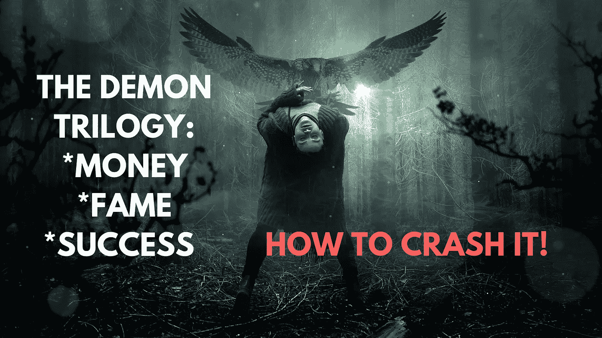
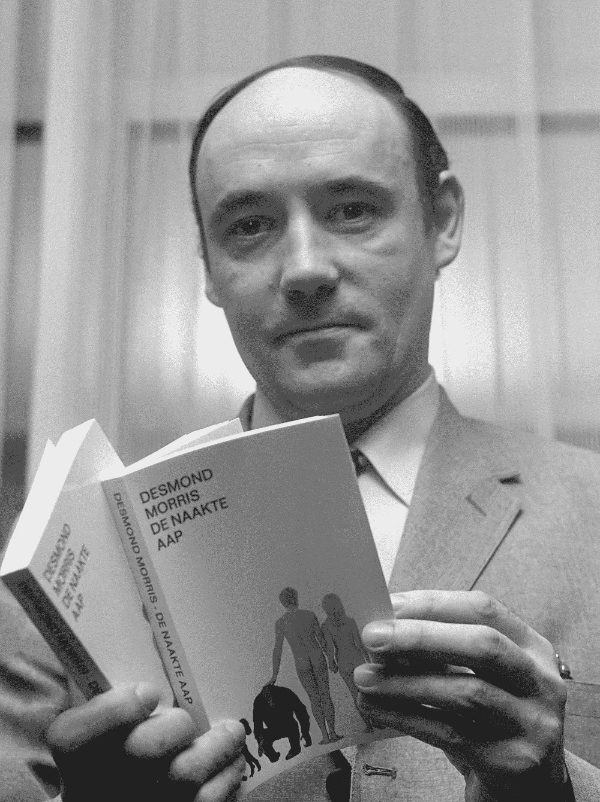
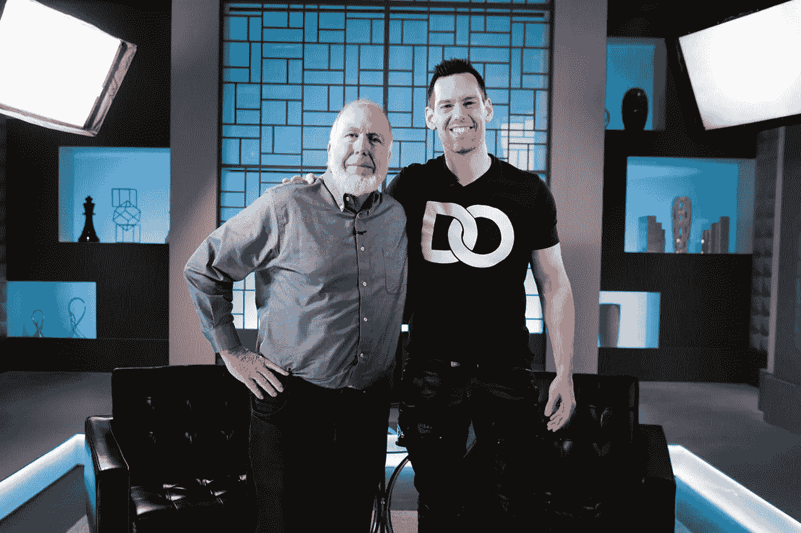
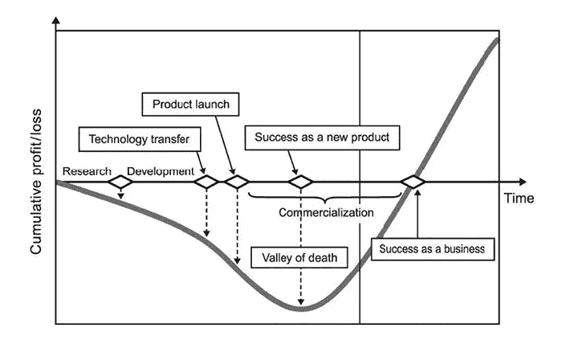

# 恶魔三部曲:金钱|名誉|成功——如何摧毁它！

> 原文：<https://medium.datadriveninvestor.com/the-demon-trilogy-money-fame-success-how-to-crash-it-e71e1bd30fe5?source=collection_archive---------6----------------------->

## 通往安全、充实的未来之路。

如果你今天在挣扎，停下来。

问问你自己:这辈子我该做什么？

请重新思考 ***成功*** ！

成功是用金钱和名誉来衡量的。这个定义极其**危险**。它是无数不快乐和大量悲伤和痛苦的来源。它导致人们抑郁，并在生活的许多方面做出错误的选择。

你需要一个策略来应对这种缺乏目的性的情况。这个策略应该导致对混乱的“掌握”,这反过来导致应对未知的轻松，并一步一步地引导找到方法。

首先是:

0- **混账恶魔三部曲！对自己和他人都没有价值的人生，不会有幸福的结局。相信我！不管你的年龄是多少，20 年、30 年都会过得很快。我不认为后悔过着充实的生活是一件很酷的事情。如果此时你还在阅读，我敢打赌你正在痛苦地寻找幸福。我有。糟透了。**

我们倾向于把自己投射到社会中某些模式的未来。那个未来不属于我们，但是我们被他们的成就所指引和“驱动”。在战场上，我们忘记了成功对我们意味着什么。

英国动物学家、动物学家和超现实主义画家德斯蒙德·莫里斯(Desmond Morris)在他的书《人类动物》(The *Human Animal* 中讲述了我们的整个生活是如何因对他人的反应而形成的。他非常残忍但直接地假设，在我们一天中每一秒钟的每一个微小的未被察觉的反应中，我们潜意识地认为我们的“行动”符合社会的大小形象。

这掩盖了我所关心的事情:塑造我们的生活！我们最好按照自己的方式塑造它，或者在生命的尽头寻求某种虚假的放松，试图对我们的存在感到平静。

1- **接受迷失:**不要乱斗。做水！迷失是一种巨大的力量。你增加了找到道路的机会。你开始接受机会，因为你能看到它们。

> 除非你去寻找，否则你永远找不到它。

《连线》杂志联合创始人凯文·凯利在接受汤姆·比尔尤的采访时谈到，拥抱迷失可以帮助你找到自己的声音，并引领创新。他说:

> 有一个机会，我真的很重视那种游手好闲，玩耍，尝试爱好，探索，只是因为你可以。如果你读了任何成功人士的传记，你会发现他们都有失落的时候。所以我拥抱那种迷失的感觉。

忘记别人对你的看法。每个人都有自己的生活，起点和节奏。

3-****呆在安全的地方。**先学会不沉，再学会游泳。学习安全坠落，然后表演“一本斯旺内奇”(柔道术语)。先学**停拳**再学打击(拳法)。**进攻前有一个向后的位置**(战争术语)。**

**许多企业家跳，然后试图在底部的路上建立一个降落伞。为什么没人说如果我们做不出降落伞，就有一根绳子可以系住？**

**在我们走向成功的路上，我们需要一个后备计划来拯救我们的心理和思想。你不需要沉下去，挨一拳。是的，生活如此艰难。**

> **但是知道如何逃避挨打总是一个很好的练习！**

**4- **开始某事:**有很多方法可以让好事发生在你身上。例如，你可以创造收入，开始做你喜欢的事情。你把收入来源作为主要来源，直到你的生活开始有所回报。继续做你已经拥有的事情，平稳地走向下一件事情。**

**4- **小心死亡谷**。当你在做某件事的时候:一项技能，一件产品，一件艺术品，或者生活中的*你将面对死亡谷。把它放在你的视野中有助于你应对它，让克服它变得更容易。***

******

***我希望这个图表不会分散你的注意力，因为它关系到一个产品的生命周期。然而，我假设:***

> ***每个人的生活都是最大的、无价的、最重要的产品，会受到动力下降的负面影响。***

***这个列表更长，包含了更多的细节，并且包含了许多非常实用的元建议。我会在第二天分享我写的战术，并链接以前的文章。***

***在 SouLiber 中，我建立了一个循序渐进的指南(Souliber 策略),让你像水一样向一个自由/负责的存在移动。我告诉人们什么能帮助他们摆脱困境。这就是我对自己所做的，也是我相信对那些缺乏目标、追逐金钱、名誉或“成功”的人有用的。我试着去发现是什么为自己和他人创造了价值，同时与自己保持一致与和平。***

***我将在我的网站[www.souliber.com](http://www.souliber.com)上更深入地分享这个策略，并在[时事通讯](http://www.souliber.com/subscribe)上分享更多技巧。到目前为止，这是我的工作。我希望你能加入我的旅程，让我了解你的人生。***

***如果你需要任何帮助，给我发电子邮件:souliber.team@souliber.com，我会非常乐意帮助你。这不是反对，这是我的人生使命。***