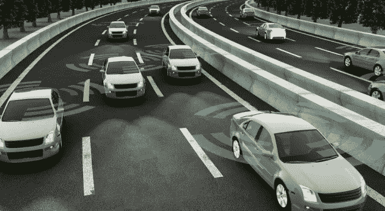

# 联网和自动驾驶汽车的发展及其伦理困境

> 原文：<https://medium.datadriveninvestor.com/the-development-of-connected-and-autonomous-vehicles-and-their-ethical-dilemma-a65dfe3d6b73?source=collection_archive---------4----------------------->

随着电气化、自动驾驶和互联的出现，汽车行业正在经历一场重大变革。这三个因素迫使汽车制造商和供应商重新思考未来汽车的功能和用途。自动驾驶和联网电动汽车的到来将改变我们的习惯，并扰乱交通运输行业。

每年，居住在城市地区的世界人口都在增长，导致交通堵塞、污染和能源消耗的增加。污染和气候变化部分是由目前柴油发动机排放二氧化氮、二氧化碳和细颗粒物的车辆造成的。面对这些问题，电动汽车很快被作为减少二氧化碳排放、改善空气质量的好办法。

在我参观世界车展期间，我可以看到电动汽车的这种趋势。事实上，大多数汽车制造商都在本次展会上展示了电动汽车，并展示了未来电动汽车无处不在的前景。

电动汽车具有某些优势:

1.  经济:发动机磨损很少，因此使用寿命长，电动车的维护费用低，因为运动部件很少。
2.  实用:更好用，无离合器，无变速箱。
3.  清洁:无声、无污染。

今天，一些车辆是半自动的，带有先进的驾驶辅助系统(ADAS ),简化了驾驶并提高了驾驶员的注意力。这些驾驶员辅助系统的主要目的是减轻驾驶员的任务并帮助驾驶员感知环境(检测碰撞、超速、行人、路标等)。).因此，它们可以拓宽驾驶员的视野，提醒驾驶员超速或越线。这些系统甚至可以提供与防撞系统的电子协作，例如，通过传感器测量可用空间来自动泊车。所以我认为，自动驾驶汽车的到来只是时间问题，在不久的将来就会见光。

自动驾驶汽车(无人驾驶汽车或自动驾驶汽车)是一种能够在没有驾驶员干预的情况下在道路上行驶的车辆。这是一种配备了许多传感器的车辆，如超声波传感器、摄像机和激光雷达，以感知其环境。传感器收集的数据由软件和处理器进行处理，以进行数据融合，从而观察其环境并检测其他车辆、障碍物、标志和路面限制。然后，人工智能算法将决定对车辆控制装置(方向盘、油门、刹车等)执行的操作。).

统计显示，90%的交通事故是由于司机的失误造成的。这强调了推广自动驾驶汽车的想法，以减少这些事故。

因此，许多汽车制造商和网络巨头、软件和电子产品都在从事自动驾驶技术，并开发自动驾驶汽车。

在网络、软件和电子产品公司中，我们可以谈谈苹果、百度、谷歌、微软和英伟达。

*   苹果正通过苹果汽车进军自动驾驶和联网汽车领域。该项目名为“Titan”，苹果公司在机器学习和汽车自动化技术方面投入大量资金，并希望在 2020 年前推出苹果汽车。
*   中国搜索引擎百度(Baidu)与宝马(BMW)联合发布了一款原型车，该车在 2015 年 12 月与一辆自动驾驶的宝马 3 系(BMW 3 Series)一起在北京周围行驶了 30 公里。百度打算在 5 年内实现自动驾驶汽车的商业化和量产。
*   谷歌正在继续完善他们的谷歌汽车项目，该项目分为两种自动驾驶汽车，分别是谷歌改装的标准汽车(丰田普锐斯、雷克萨斯、克莱斯勒)和完全由谷歌设计的自动驾驶电动汽车。
*   微软也希望为自动驾驶做出贡献，并正在与沃尔沃合作，为汽车改装他们的增强现实耳机 HoloLens。
*   Nvidia 开发了一款专用于自动驾驶汽车的车载计算机，在 CES 2016 上推出了 Nvidia Drive PX2。这台车载计算机的计算能力为 8 万亿次浮点运算，允许启动机器学习算法，并对自动驾驶汽车中嵌入的各种传感器进行数据融合。
*   优步已经从卡耐基梅隆大学招募了工程师来设置他们的自动驾驶汽车，并将在匹兹堡进行测试。

奥迪、宝马、博世、法雷奥、福特、本田、现代、奔驰、雷诺-日产、PSA、特斯拉、丰田和沃尔沃等汽车制造商和供应商正准备进入自动驾驶汽车领域。

*   宝马在拉斯维加斯举行的 CES 2016 上发布了 iNEXT 原型车。
*   奥迪已经开发了几款自动驾驶汽车的原型，并计划将其已经集成到高端轿车 A6、A7 和 A8 中的自动驾驶系统推向市场。
*   博世曾与特斯拉合作开发了两辆特斯拉 Model S 汽车，让它们实现完全自动驾驶。
*   法雷奥宣布，他们的“Cruise4U”系统将被嵌入汽车，并将在美国的不同城市进行测试，如旧金山和波士顿、洛杉矶、圣地亚哥、拉斯维加斯、圣安东尼奥、迈阿密、纽约、波士顿、底特律、芝加哥和西雅图。
*   福特继续通过联网汽车和自动驾驶汽车投资智能移动，并成立了福特智能移动子公司。福特在困难的条件下测试了自动驾驶汽车，例如在夜间和雪地上。
*   本田在加州测试他们的自动驾驶汽车，并在其思域车型上提供半自动功能(轨迹维护、自动制动和自动速度)。
*   现代继续致力于自动驾驶汽车，但认为自动驾驶汽车的到来将会推迟。
*   梅赛德斯·奔驰希望成为自动驾驶汽车的前沿，并计划在其豪华轿车中提供许多半自动功能。梅赛德斯-奔驰也将推出豪华轿车服务，与优步的高端服务“优步黑”展开竞争。
*   雷诺日产正在努力研发自动驾驶汽车，并于 2015 年底推出了下两款汽车。
*   PSA 继续投资自动驾驶汽车，并测试其原型。
*   特斯拉希望成为第一家销售 100%自动驾驶汽车的制造商。他们未来的车辆应该配备十五个超声波传感器，八个摄像头，以及 Nvidia Drive PX2 车载计算机。
*   丰田正在无人驾驶汽车上投资 10 亿美元，并与密歇根大学、斯坦福大学和麻省理工学院(MIT)合作，在其车辆上部署智能功能。
*   沃尔沃继续其在自动驾驶汽车方面的努力，甚至在矿井中展示了一辆自动驾驶卡车。

以下是自动驾驶汽车的一些预定发布日期:

*   2018:百度，特斯拉
*   2020 年:谷歌、日产、法拉第未来、沃尔沃、戴姆勒、本田、丰田、PSA 集团
*   2021 年:宝马、福特
*   2030 年:现代

对于行动不便的人(年龄、残疾)来说，自动驾驶汽车也是一种很好的交通工具，他们可以要求自己的车辆将他们从 A 点开到 b 点。自动驾驶汽车的发展甚至可以鼓励机器人出租车的发展，也就是说，自动驾驶汽车的车队。汽车行业将从商品行业转向服务行业，因为汽车仍将是运输公司的财产。自动驾驶汽车也将联网，并将有互联网连接。它们将通知用户和他的乘客关于天气、道路交通和交通堵塞的形成。他们还会给乘客时间，这将是谷歌和苹果引入嵌入式服务的机会，如自动驾驶汽车中的信息娱乐。

> 汽车行业将从商品行业转向服务行业，因为汽车仍将是运输公司的财产。

然而，自动驾驶汽车的到来将带来一个伦理困境。尽管自动驾驶汽车将减少污染，简化交通，避免 90%的道路事故，但有必要问一下，当自动驾驶汽车必须在拯救乘客生命或行人生命之间做出选择时，它们将如何编程？

为了说明这个伦理问题，我将描述以下情况:

一辆载有乘客的自动驾驶汽车在路上翻滚，然后在最后一刻突然出现十几个行人过马路，制造了一场不可避免的事故。自动驾驶汽车没有时间刹车，所以将不得不做出选择，这个选择就是自动驾驶汽车的伦理困境。自动驾驶汽车将有两种选择，通过撞到墙上牺牲乘客的生命来拯救行人的生命，或者通过继续碾压行人来拯救乘客的生命。

道德想要拯救尽可能多的人，这意味着购买的汽车可能会杀死乘客。有了这些信息，很多人就不会想买自动驾驶汽车了。因此，自动驾驶汽车的伦理困境导致了一种自相矛盾的情况:随着软件被编程为节省最大数量，自动驾驶技术的采用将会放缓，而其目标是减少事故数量。

目前，汽车制造商尚未就这一伦理困境发表意见，但制造商倾向于优先考虑自动驾驶汽车中乘客的安全。例如，梅赛德斯决定优先考虑乘客的生命，软件将以这样的方式编程，乘客的生存是第一位的。目前没有关于这一伦理困境的立法，也没有关于自动驾驶汽车道德的说明。

> 因此，自动驾驶汽车的伦理困境导致了一种自相矛盾的情况:随着软件被编程为节省最大数量，自动驾驶技术的采用将会放缓，而其目标是减少事故数量。

我认为，在未来，这些伦理问题的管理将不得不在三个群体之间解决，他们是购买这些自动驾驶汽车的客户，开发软件的汽车制造商，以及能够监管制造商将提出的不同算法的政府，消费者将能够选择这些算法。

简而言之，自动驾驶汽车将在日常生活中彻底改变交通部门和流动性。很难知道自动驾驶汽车何时会融入我们的生活方式，但我认为二十年后，自动驾驶汽车将成为我们日常生活的一部分。