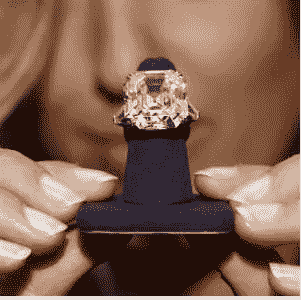

# 钻石生意让我觉得很奇怪

> 原文：<https://medium.datadriveninvestor.com/the-diamond-business-smells-funny-to-me-fa53b713be3d?source=collection_archive---------20----------------------->

8ct Asscher cut, diamond engagement ring

想象你正在购买一辆新车。你已经把选择范围缩小到一辆 5 系宝马。它速度快，时尚，相当节俭，并且有足够的空间容纳你的家人和各种各样的装备。你喜欢时尚的款式，决定买一辆配有黑色皮革、行驶里程约为 20，000 英里的深蓝色跑车。

您有 25，000 美元的预算，并注意到有几辆规格正确的汽车要出售。

现在，又有一辆车，规格与其他车一样，但根据销售人员的说法，这辆车很“特别”。他们向你提供无限量的香槟，同时与你讨论他们的“特殊”汽车，并提到他们将包括一个花哨的品牌车罩和一些昂贵的空气清新剂，他们将在车内喷洒这种特殊的“高级”气味。

然而，这辆“特别”的车有一个“特别”的价格，它的价格是 60，000 英镑，而其他车的价格是 25，000 英镑。它必须如此非常；你告诉自己很特别。

出售这款车的经销商有一个漂亮的展厅，里面有舒适的沙发，墙上有精美的艺术品。虽然他们需要一段时间来注意你，但一旦他们知道你对他们的“特别”汽车非常感兴趣，迷人的工作人员就无法为你做得足够多，也无法展示永久的、几乎是画在脸上的微笑。他们现在对你一心一意。

他们解释说它很“特别”,因为*他们*正在出售它。他们只卖符合他们所说的“严格标准”的汽车。这一定是真的。他们说，人们会知道你是一个有眼光、有选择性的人，只有“最好的”才适合你。“免费”香槟开始让你觉得有点头晕。

你决定买下它。毕竟，你只能活一次？

几年后是时候升级了。你决定找出它的价值，并有信心为你的“特别”汽车获得最高的销售价格？

然而，市场并不关心你从哪里购买的，他们只是想知道里程，服务历史和条件报告。他们一点也不觉得你的车‘特别’。事实上，它的价值与你几年前看到的所有其他车一样，那些显然不“特别”的车。

当你下一次去珠宝精品店时，问他们是什么让他们的钻石变得“特别”,以及当你升级时他们是否会从你那里买回来。

[一场变革即将到来。](https://londondiamonds.com)