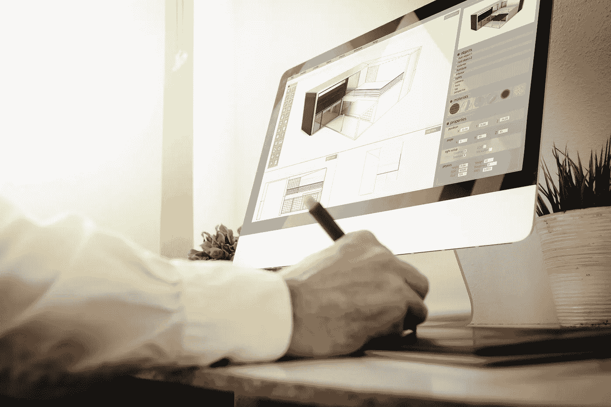
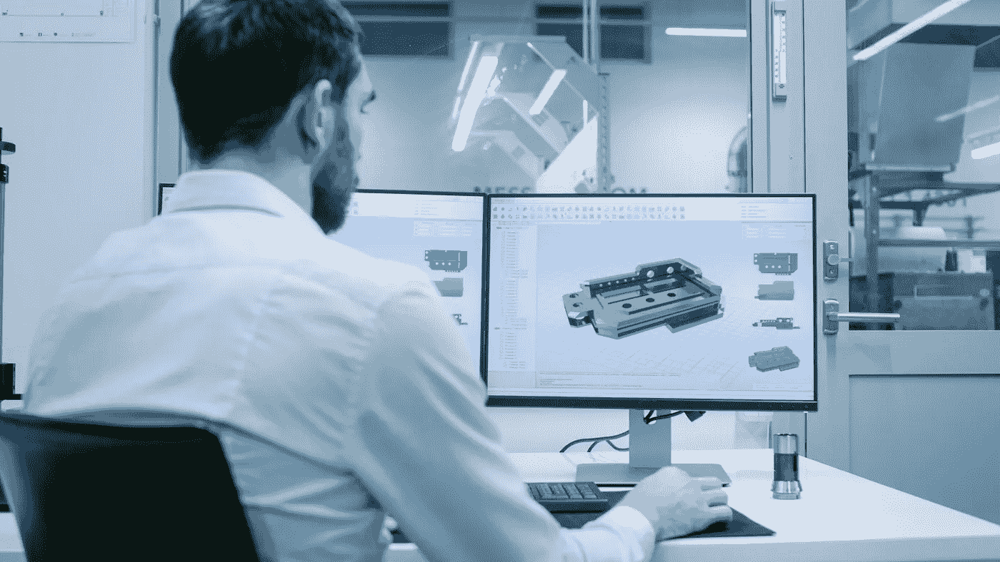
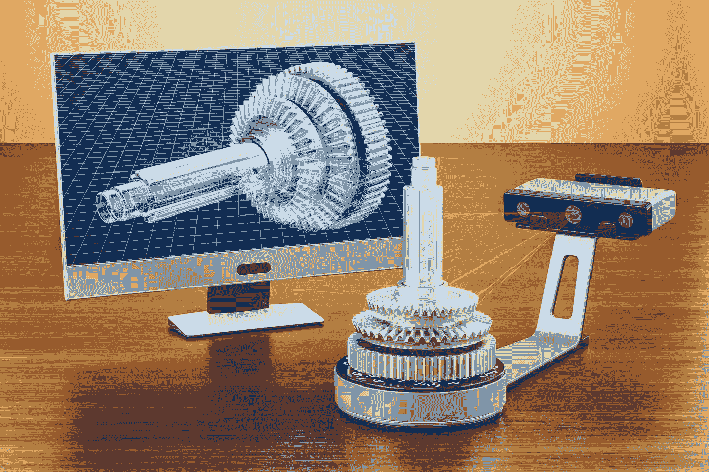

# 3D 建模和 3D 扫描的区别

> 原文：<https://medium.datadriveninvestor.com/the-difference-between-3d-modeling-and-3d-scanning-c0a88e707c86?source=collection_archive---------16----------------------->

尽管这两种技术看似相似，但它们之间还是有一些不同之处。为了更好地了解它们，让我们来看看它们的定义以及它们在实践中的一些使用方法。所以，你会知道 3d 扫描和 3D 模型的区别。

 [## 正在改变行业的 5 个真实世界区块链应用——数据驱动的投资者

### 除非你一直生活在岩石下，否则我相信你现在已经听说过区块链了。而区块链…

www.datadriveninvestor.com](https://www.datadriveninvestor.com/2019/02/13/5-real-world-blockchain-applications/) 

# 什么是 3D 建模？

3D 建模是一种使用计算机图形来创建任何对象或表面的 3D 表示的方法。这项技术在许多创造性活动领域发挥着关键作用。建筑师使用它来创建他们工作的 3D 表示，视频游戏创作者依赖它来赋予他们的角色生命，好莱坞依赖它来制作特殊效果。

就重建物理对象而言，这项技术非常有用，因为它不需要与对象进行物理接触，因为一切都由计算机完成。如果你想知道为什么这是一件大事，想象一下你是澳大利亚的一名室内设计师，你受雇于美国的一个项目。你可以跳上一架飞机来到客户所在地，也可以做一个客户内部的 3D 模型。除非你真的喜欢旅行，否则制作 3D 模型要容易得多。

就虚拟物体而言，我们可以使用 3D 建模来创建尚不存在的物体。例如，如果你是一名建筑师，你有一个尚未完成的建筑的惊人想法，那么通过 3D 向投资者展示设计的复杂性和美感要比在纸上容易得多。

[3D 扫描和建模服务](https://skywell.software/ar-vr-development/)正在开发的另一项有趣的技术应用是 3D 人体扫描，这为定制提供了一系列可能性。它可以用于服装制造商为每种体型制作合适的服装，定制运动服，甚至 3D 自拍。

3D 建模的最大优势是:

*   你可以创建一个不存在的模型
*   不需要去任何地方收集数据
*   你可以测试对一个产品的需求，而不用实际生产它
*   设计机会涵盖了所有领域

# 3D 扫描

3D 扫描是用激光照射物体或表面。这通常是用激光扫描仪完成的，它有一个特殊的传感器，可以捕捉物体或表面的所有轮廓信息。它最适合用于创建具有非常复杂几何体的环境。使用 3D 扫描，您可以重新创建当前的设计，并对其进行测试以进行改进。比如说你需要搞清楚一个建筑在地震情况下的容错能力。你可以使用 3D 扫描来重建这座建筑，并在模拟地震条件下进行测试。

3D 扫描的优势在于:

*   更快的数据收集
*   简单的信息收集流程
*   极其精确

3D 扫描和 3D 建模的区别在于，它们用于不同的事情。例如，如果您需要收集关于复杂对象的数据，3D 扫描会更有用。如果您想要研究的对象尚不存在，那么 3D 建模将是正确的选择。就节省时间而言，这真的取决于你的项目、你所在的行业以及你希望从完成项目中得到什么。激光扫描将在很短的时间内为你收集大量信息，但正如我们在上面提到的例子中看到的，它可以为你节省潜在旅行的时间。最后，如果您需要帮助决定，请记住，为了使用 3D 扫描，您必须有一个要扫描的物理对象。如果这样的对象不可用，那么您别无选择，只能使用 3D 建模。

*最初发表于*[*sky well . software*](https://skywell.software/blog/the-difference-between-3d-modeling-and-3d-scanning/)*。*