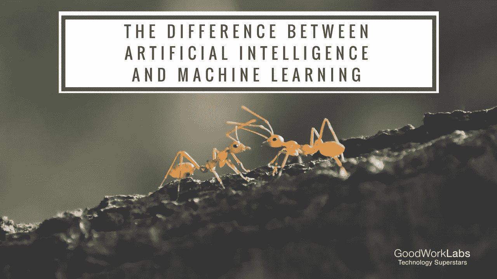

# 从蚂蚁理论看人工智能和人工智能的区别

> 原文：<https://medium.datadriveninvestor.com/the-difference-between-ai-and-ml-using-the-ant-theory-aa274c6727eb?source=collection_archive---------0----------------------->

AI 代表人工智能，其中智能被定义为获取和应用知识的能力。

ML 代表机器学习，其中学习被定义为通过经验、学习或被教导获得知识或技能。

想象一下，我们想要创造一种可以在二维空间中爬行的人造蚂蚁。然而，这个世界存在着危险:如果一只蚂蚁遇到了有毒的区域，它就会死去。如果蚂蚁附近没有毒药，蚂蚁就会活下来。

# 用蚂蚁理论解释人工智能和人工智能的区别

Difference between Artificial Intelligence and Machine Learning

怎样才能教会蚂蚁避开有毒区域，让这些蚂蚁想活多久就活多久？让我们给我们的蚂蚁一个简单的指令集，让它们可以遵循；它们可以在二维空间中自由移动，一次一个单位。我们的第一个尝试是通过生成随机指令让蚂蚁四处爬行。

然后我们调整这些蚂蚁，让它们再次在世界各地爬行。我们重复这一过程，直到蚂蚁成功避开世界上的有毒区域。这是一种整体性的 [**机器学习的**](https://www.goodworklabs.com/best-machine-learning-solutions/) 方式来处理问题。

我们通过使用一些任意的规则使蚂蚁适应配置。这是可行的，因为在每一次迭代中，我们删除了一组不合适的蚂蚁。最终，我们被推向更适合的蚂蚁。

现在，如果我们改变有毒区域的位置，你认为会发生什么？蚂蚁会经历一场巨大的危机，因为它们再也无法在这个世界上生存了；他们不能简单地知道有毒区域在哪里，因此无法避开它们。

但是为什么会这样，我们能进一步改进吗？

蚂蚁能以某种方式知道区域在哪里，并调整它们的行为以使它们更成功吗？

这就是 [**人工智能**](https://www.goodworklabs.com/artificial-intelligence-solutions/) 发挥作用的地方。我们需要一种方法给蚂蚁这些信息，给它们环境知识。我们的蚂蚁需要一种感知世界的方式。直到现在，他们一直生活在完全的黑暗中，没有任何办法感知周围的世界。

例如，我们可以让蚂蚁留下其他蚂蚁能感觉到的短痕迹。然后我们可以让蚂蚁沿着这条路走，如果它们感觉不到这条路，它们就会随机地四处爬行。

现在如果有多只蚂蚁，大部分都会撞上毒区死掉。但也有蚂蚁不会死，因此在无毒区域爬行，并留下踪迹！其他蚂蚁可以盲目地沿着这条路走，并且总是知道自己会活下来。

这是因为蚂蚁可以接收周围的一些信息。他们无法感知有毒区域(他们甚至不知道什么是毒)，但他们甚至可以在完全新的环境中避开它们，无需任何特殊学习。

*这两种方法有什么不同？*

*   *机器学习的方式试图找到一种蚂蚁可以遵循并成功的模式。但这并没有给蚂蚁做出局部决策的机会。*
*   *人工智能的方式让蚂蚁做出局部决策，成为整体上的成功。在自然界中，我们可以用人工智能的方式来解决问题。*

因此，总而言之，人工智能是由机器展示的人类智能，而机器学习是实现人工智能的一种方法。

# 人工智能学习

人工智能可以指任何东西，从玩象棋的计算机程序，到像亚马逊的 Alexa 解释和响应语音的语音识别系统。技术可以大致分为三类:

*   狭义 AI，
*   人工通用智能(AGI)
*   超级智能的 AI。

IBM 的深蓝在 1996 年的比赛中击败了国际象棋特级大师加里·卡斯帕罗夫，或者谷歌 [DeepMind](https://deepmind.com/) 的 AlphaGo 在 2016 年击败了李·塞多尔(Lee Sedol)，这些都是狭义人工智能的例子，即擅长一项特定任务的人工智能。这与人工通用智能(AGI)不同，人工智能被认为是执行一系列任务的人类水平

超级智能 AI 让事情更进一步。正如尼克·博斯特罗姆所描述的那样，超级智能人工智能是“在几乎每个领域，包括科学创造力、一般智慧和社交技能，都比最优秀的人类大脑聪明得多的智力。”换句话说，这是一个机器比我们聪明的场景。

# 数据挖掘和机器学习

机器学习是人工智能的一个子领域。

这里的核心原则是，机器获取数据，并为自己“学习”。这是目前商业人工智能套件中最有前途的工具。ML 系统可以快速应用来自大型数据集的知识和训练，以擅长面部识别、语音识别、对象识别、翻译和许多其他任务。

不同于用特定指令手工编写软件程序来完成任务，ML 允许系统自己学习识别模式并做出预测。

虽然深蓝和 DeepMind 都是人工智能的类型，但深蓝是基于规则的，依赖于编程，所以它不是 ML 的一种形式，而 Deep mind 是。

因此，本质上这两个实体之间存在巨大的差异，但它们相互依赖。

***要不要用 AI 和 ML 打造一个产品？然后，只需发送一条简短的消息，告诉我们您的需求！***

*原载于 2017 年 11 月 3 日*[*www.goodworklabs.com*](https://www.goodworklabs.com/the-difference-between-artificial-intelligence-machine-learning/)*。*

## 来自 DDI 的相关故事:

 [## 用 7 个步骤解释深度学习——数据驱动投资者

### 在深度学习的帮助下，自动驾驶汽车、Alexa、医学成像-小工具正在我们周围变得超级智能…

www.datadriveninvestor.com](https://www.datadriveninvestor.com/2019/01/23/deep-learning-explained-in-7-steps/)  [## 数据科学和软件工程哪个更有前途？-数据驱动型投资者

### 大约一个月前，当我坐在咖啡馆里为一个客户开发网站时，我发现了这个女人…

www.datadriveninvestor.com](https://www.datadriveninvestor.com/2019/01/23/which-is-more-promising-data-science-or-software-engineering/)