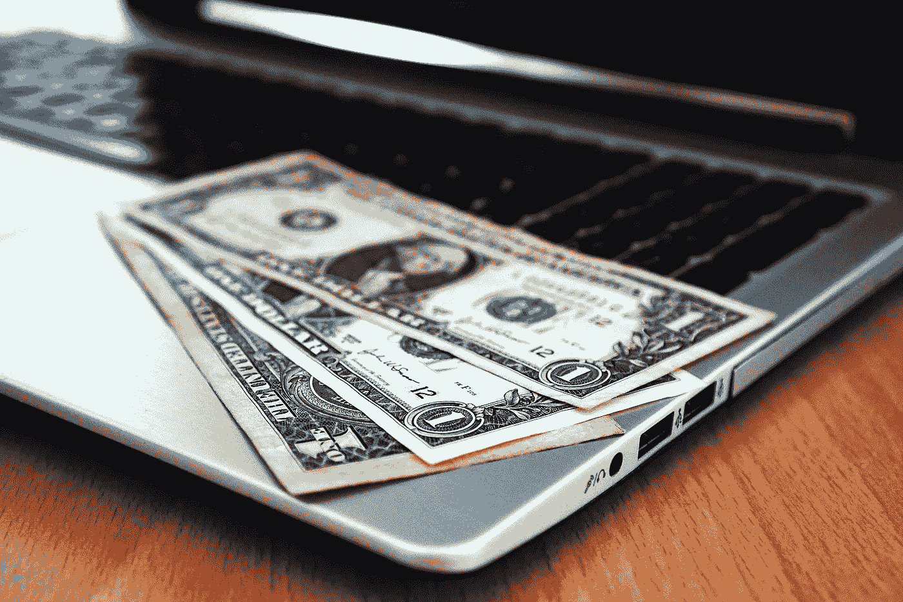

# 节俭和廉价的区别

> 原文：<https://medium.datadriveninvestor.com/the-difference-between-being-frugal-or-cheap-d6970d809425?source=collection_archive---------12----------------------->

说到预算，可能会有一种误解，认为那些靠预算生活的人很“小气”。

这个错误的标签经常来自那些从来没有靠预算生活过的人，他们不知道需要什么。他们不知道如何有意识地管理好你的钱。

我和许多人交谈过，他们甚至羞于告诉别人他们在精打细算地生活，因为害怕被人认为“小气”。这一直困扰着我，因为小心使用你的钱永远不应该被以消极的方式看待。

 [## 外汇投资如何帮助偿还债务|数据驱动的投资者

### 外汇是对外汇市场的投资，不同国家的货币在外汇市场上进行兑换

www.datadriveninvestor.com](https://www.datadriveninvestor.com/2019/02/13/how-forex-investment-helps-to-repay-your-debts/) 

但是，节俭和节俭是有一定区别的。

我们努力工作赚钱，为此放弃了很多空闲时间。我们应该谨慎对待我们的财务，分析我们的支出。

然而，有一个合适的方法来做到这一点，这就是所谓的节俭。

所以让我们来分析一下节俭和 T2 之间的区别。

## **节俭**

节俭是对你的钱是如何被花费的一个完整的意识和策略。节俭的人看待财务的方式与大多数人不同。

节俭的人不会关注他们在生活中想要什么，而是更关注他们需要什么。然后，他们分解每一个需求，并想办法让他们生活中的每一个领域都更加经济高效。

节俭的人不会自发地购买汽车。他们将进行研究，找出哪些产品具有最佳转售价值。哪种发动机能够持续运行最长时间，机械故障最少？

他们将调查车辆的燃油里程和在某些极端天气条件下(冰、雪等)的性能。).他们的购买并不是基于他们想要什么，而是基于他们的血汗钱的最佳用途。

精打细算也差不多。世界上最成功的预算是那些专注于使每一笔开支尽可能高效的预算。这些预算的重点是让你的钱发挥最大价值。

我要再说一遍。

***“节俭的人专注于让他们的钱获得最大/最好的价值。”***

他们的购买不是被欲望或偏好所说服的。他们货比三家，寻找交易，尽可能买二手的。

一本伟大的书更进一步地表达了这一点:

> ***隔壁的百万富翁***
> 
> ***作者托马斯·j·斯坦利&威廉·d·丹科***

这是一本绝对伟大的书，它展示了当今有多少百万富翁是通过过着节俭、自律的生活而获得财务成功的。

节俭是一种很好的做法，在大多数情况下，它可以改变许多人的财务困境。

看看你生活中的这些方面，如果可能的话，想办法变得更加节俭。

## 便宜的

一个吝啬的人是不愿意为一项服务或产品支付真实价值或公平份额的人。

寻找交易和努力让你的钱发挥最大价值是一回事。

但是，小气更糟糕，否认某人或某物的真正价值是另一回事。

一个吝啬的人会尽最大努力去乞讨并得到免费的东西。他们是那些去任何一家餐馆都抱怨的人，希望得到一顿免费的饭。

雇佣某人提供服务，然后延迟付款的人希望这个人最终会放弃，不再要求付款。

这就是为什么当我看到一个节俭的人被贴上“廉价”的标签时，我总是很困扰。

一个吝啬的人会关注他们想要的，而不是他们的需求。然后在逃避支付或尽量减少支付上耗尽所有精力。这反过来导致其他人要么赔钱，要么卖空自己。

他们想要他们的蛋糕，也想吃掉它。

节俭的人不应该陷入这种消极情绪。

节俭没有错。意识到你的支出，尽最大努力使你的财务最大化，这是值得努力的事情。

如果你正在建立你的第一个预算，并希望获得成功，集中精力节俭。专注于用你的钱做出最好的决定，但永远不要吝啬。

*   布兰登·亨德森
*   创始人[狮穴高手](https://www.lionsdenmastery.com)