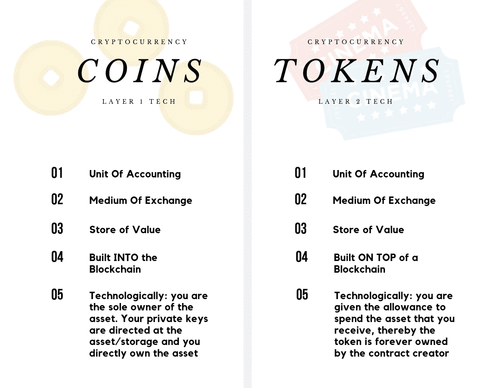

# 硬币和代币的区别

> 原文：<https://medium.datadriveninvestor.com/the-difference-between-coins-tokens-de596bc60db7?source=collection_archive---------2----------------------->

## 或者为什么代币像新鲜水果

如果你拥有一些加密货币或正在寻求参与加密货币，那么让我以一个欢迎的拥抱开始🤗。如果你不属于这一类(不幸的是)，这篇文章可能还不适合你。

作为 cryptoverse 的积极参与者，您可能偶然发现了 CoinMarketCap 上列出的加密资产的 shmorgusboard。就在那里，它的首页上印着 100 个世界上“最好的”加密货币项目。

 [## 创新警报:区块链 3.0、Terra 协议、ICO 门户和更多数据驱动的投资者

### 尽管过去几个月加密货币的价格波动很小，但这项技术并没有停止发展…

www.datadriveninvestor.com](https://www.datadriveninvestor.com/2019/03/16/innovation-alert-blockchain-3-0-terra-protocol-an-ico-portal-more/) 

每一个培养社区和尽可能多地攫取网络经济不动产的项目都试图构建社会存在的未来。

你肯定听说过老爷爷比特币和它的一些数字伙伴以太坊、Doge、Ripple 等。也许，你甚至听说过现在著名的 2017 年 ICO 炒作，它带来了 EOS，Tron，金恩和其他几千个项目；

> 但是你有没有停下来问:
> 
> 为什么有些项目把他们的加密资产称为 Coin 的；而其他项目将他们的加密资产称为令牌？

加密货币通常有两种形式:硬币和代币。硬币是属于区块链的固有资产，硬币在其中运行。每枚硬币都有自己的区块链，而一个区块链可以支持许多代币。除了一些新奇的东西将一个令牌与另一个令牌区分开来(比如合同名称😂)，大约 80%的令牌是无法区分的。

*注意:并不是每个区块链都能支持在其上创建令牌【比特币区块链{还不能}】。*

从一个更技术的角度来看，可以说 ***硬币内置于*** 区块链中，因此被视为第 1 层技术。
同时， ***令牌建立在区块链*** 之上，因此被视为第二层技术。

> 在令牌协定中，需要有一个名为 allowspend 的函数。令牌必须允许挂起的原因是，当创建令牌契约时，机器逻辑注册契约创建者是令牌/资产的唯一所有者。通过 allowspend 函数，机器逻辑理解这些资产被允许由其所在的钱包使用。

## 硬币

当我们想到硬币时，我们实际上想到的是比特币、以太坊、Stellar、Monero、ZCASH 等资产。

在一个非常高的层面上，硬币代表了有限的“网络财产”的所有权，这是由硬币的基础链所占据的。一个比特币代表其自身与所有现存(和将要存在)的比特币的比例空间。如果 BTC 区块链将占用 X 空间，那么 1 比特币代表(1/X)空间，这是一个非常有限的数量。

由于原始设计，硬币的功能有限。它们的目的是严格作为一种货币形式，作为一种:
—记账单位
—价值储存手段
—交易媒介
—所有权(直接)

硬币旨在作为价值的通用证明

深入挖掘，我们可以了解到 ***币*** 是驱动去中心化的经济力量，进而驱动数字经济增长。Coins 没有(或不应该有)单点故障，从而增加了每个同步节点的信任和安全性。

## 代币

另一方面，我们有一些标记，比如 auger(REP)。ChainLink(链接)、基本注意力令牌(BAT)等等。

由于构建在实际的区块链之上而不是构建在其中，代币本质上实际上比硬币更灵活，用途更广，也更有可能存在严重的安全缺陷(集中化)。

代币就像硬币一样，是一种记账单位&一种交换媒介。然而，很难将代币称为价值储存手段。代币的实际内在价值取决于它给代币持有者带来的效用。

典型的代币提供:
—访问协议
—监管难题
—所有权(以“消费权”的形式)

代币提供的所有权级别类似于新鲜农产品的所有权…
代币就像新鲜水果。
一个芒果。

当你购买一个芒果(代币)时，你是它的唯一拥有者，可以随心所欲地使用它……然而，芒果(代币)的生计是由所谓的生物生命所支配的(“使用代币的权利”必须在实际的代币合同代码中指定)。在你拥有芒果的某个时候，你必须利用它，如果你不这样做，芒果就会腐烂，你会失去你最初投资的价值，因为你现在被迫扔掉它(出售代币-50%)

此外:
代币本身旨在迎合特定的用途:

*   安全令牌
*   资产代币
*   实用令牌
*   不可替换的令牌
*   货币代币
*   奖励代币

每种类型的令牌都有自己的运行框架。这个框架决定了一个令牌能在多大程度上为自己创造价值。

## 把东西包起来

代币可以被认为是公司，硬币可以被认为是管理公司的政府。

现实地说，
代币正在成为世界未来的谷歌和亚马逊……同时，硬币正迅速成为迎合全球数字经济的数字政府&政治系统。

> 有一种宏观趋势正在隐晦地显现出来。成功的代币往往会切换到它们自己的区块链，变成硬币…
> 
> 接下来什么代币会变成硬币？

🤓请你鼓掌好吗🤓